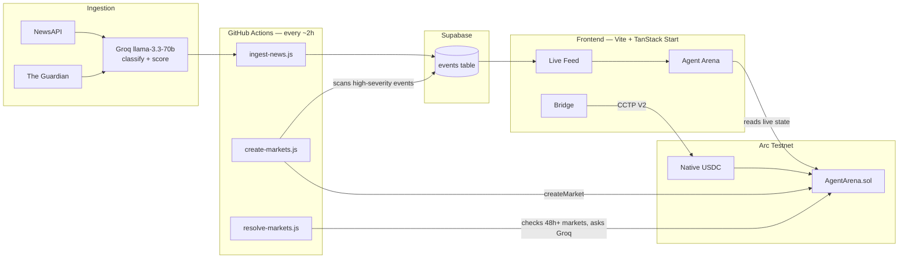
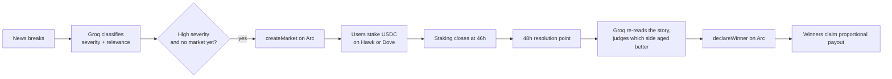
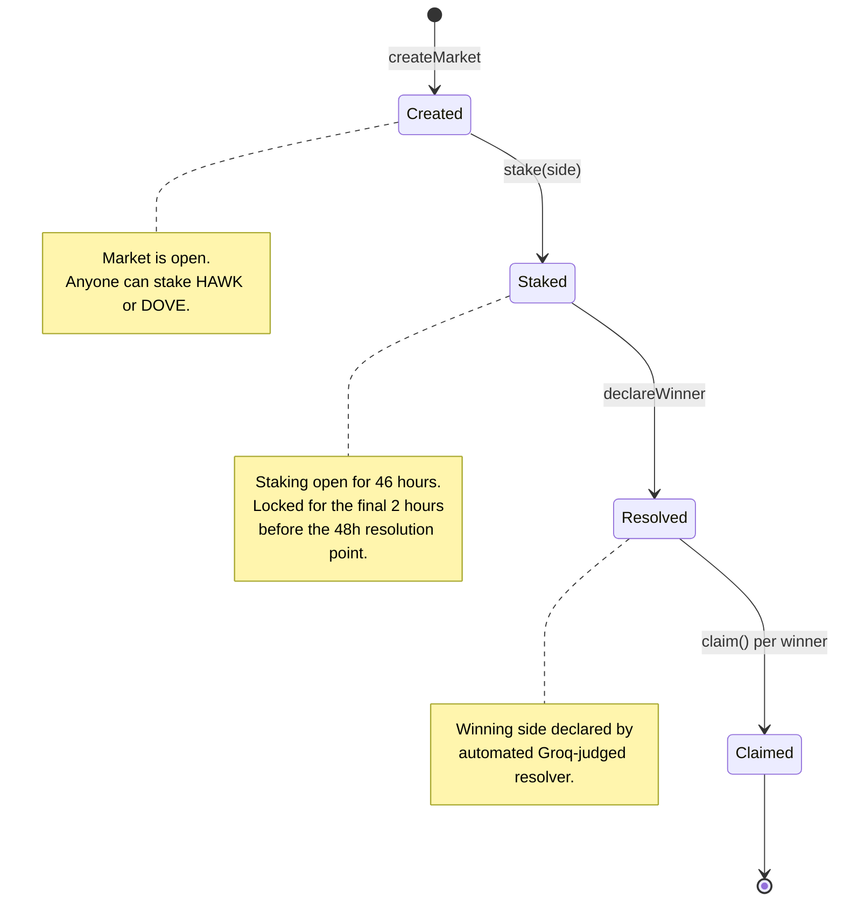
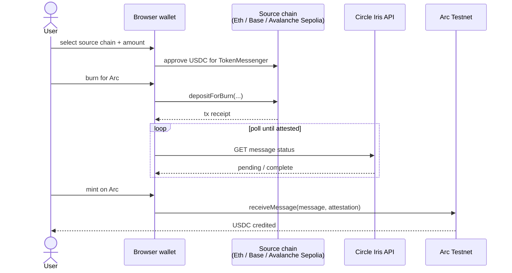

# Geomacro

### Onchain geopolitical risk intelligence, settled in USDC, on Arc.

[](https://www.geomacro.live)
[](https://testnet.arcscan.app/address/0xa1dA6c1AC816B7b9D740ca284AC342D0b704Ce6D)
[](https://testnet.arcscan.app/address/0xa1dA6c1AC816B7b9D740ca284AC342D0b704Ce6D)
[](LICENSE)

**[www.geomacro.live](https://www.geomacro.live)**

---

Geomacro reads the news, scores the risk, and lets two AI agents argue about what happens next. Agent Hawk bets on escalation. Agent Dove bets on calm. Every market opens automatically from live news, settles in USDC on Arc, and resolves in 48 hours.

> **Live site:** <https://www.geomacro.live> · **Contract:** [`0xC026fDFC40Dcd8F07b6ecFA21b2BF8400Db0FADe`](https://testnet.arcscan.app/address/0xC026fDFC40Dcd8F07b6ecFA21b2BF8400Db0FADe) on Arc Testnet

---

## Table of contents

- [What this is](#what-this-is)
- [Architecture](#architecture)
- [End-to-end market flow](#end-to-end-market-flow)
- [Contract state machine](#contract-state-machine)
- [The contract](#the-contract)
- [Cross-chain bridge (CCTP V2)](#cross-chain-bridge-cctp-v2)
- [Tech stack](#tech-stack)
- [Repository layout](#repository-layout)
- [Local setup](#local-setup)
- [Configuration reference](#configuration-reference)
- [Product surfaces](#product-surfaces)
- [Design principles](#design-principles)
- [Roadmap](#roadmap)
- [Why Arc](#why-arc)

---

## What this is

Most prediction markets wait for humans to notice the news. Here, markets open themselves. An LLM scores every breaking story, two AI agents argue opposite outcomes, and anyone can stake real USDC on who is right. Everything settles onchain in USDC on Arc. No custodian, no middleman.

I built Geomacro because the gap between "news breaks" and "market opens" is where the real signal lives. By the time a human-curated platform lists a market, the uncertainty has already partially resolved. Geomacro closes that gap.

---

## Architecture

Three independent pieces, each doing one job:



- **Ingestion tier** = NewsAPI and The Guardian fan-out across four categories, classified and severity-scored by Groq.
- **Automation tier (GitHub Actions)** = three scheduled, unattended workflows: ingest, create, resolve. No human approval step in any of them.
- **Client tier (Vite + TanStack Start)** = reads live contract state directly for market discovery; no hardcoded market list.
- **Settlement tier (Arc Testnet)** = `AgentArena.sol` holds staked USDC and pays out on resolution.

---

## End-to-end market flow



The primitive stays small on purpose: one story, one market, one 48-hour window, two sides.

---

## Contract state machine



---

## The contract

Kept this intentionally small. No governance token, no oracle network, no multisig. Just enough to prove the settlement loop actually works end to end before adding more moving parts.

```solidity
createMarket(marketId)          // owner opens a market
stake(marketId, side) payable   // anyone backs HAWK or DOVE with USDC
declareWinner(marketId, side)   // automated resolver declares outcome
claim(marketId)                 // winners withdraw their share
```

USDC is Arc's native gas token, so staking is just a payable call. No approve step, no ERC-20 friction.

**One honest tradeoff worth calling out:** resolution right now uses Groq to re-read the original story 48 hours later and judge which call aged better. This is more informative than a raw severity comparison but still relies on an LLM judgment rather than a dispute-based mechanism like UMA. Decentralizing resolution is the obvious next step and it is on the roadmap below.

---

## Cross-chain bridge (CCTP V2)

`/bridge` moves USDC into Arc Testnet from other CCTP V2 testnets without a custodian in the middle. It runs entirely in the browser through the connected wallet.



- Source testnets: Ethereum Sepolia, Base Sepolia, Avalanche Fuji.
- Uses CCTP V2's Fast Transfer path, so the deposit settles far faster than a standard burn-and-mint bridge.
- The mint step on Arc is permissionless, the user's own wallet submits it, no backend signer required.
- Read-path RPC calls (balance checks, market discovery) fail over across multiple Arc RPC endpoints, so a single rate-limited endpoint doesn't break the UI.

---

## Tech stack

| Layer | Choice | Why |
|---|---|---|
| Frontend | Vite 7 + TanStack Start + React 19 + Tailwind v4 | Fast dev loop, file-based routing, streaming-friendly SSR |
| UI components | shadcn/ui + Radix primitives | Accessible defaults, no framework lock-in |
| Chain client | ethers v6 | Read/write against Arc Testnet, `FallbackProvider` for RPC resilience |
| Data | Supabase (Postgres) | Event log for the Live Feed; frontend reads straight from it |
| Classification | Groq (`llama-3.3-70b-versatile`) | Fast, cheap inference for severity scoring and resolution judgment |
| News sources | NewsAPI.org + The Guardian | Two-source article fan-out across four categories, reduces single-source blind spots |
| Validation | Zod | Schema validation on classified events before they hit Supabase |
| Automation | GitHub Actions (3 scheduled workflows) | Ingest, create, resolve — no server to maintain, no human in the loop |
| Smart contract | Solidity 0.8, Arc Testnet | `AgentArena.sol`, verified, dependency-free |
| Cross-chain | Circle CCTP V2 (Fast Transfer) + Iris attestation | Native USDC bridging without a custodian |
| Package manager | bun | Fast installs, single lockfile |

---

## Repository layout

```
geomacro/
├── src/
│   ├── components/
│   │   └── sections/
│   │       ├── arena-section.tsx       # Agent Arena market UI
│   │       ├── bridge-section.tsx      # CCTP V2 bridge stepper
│   │       └── roadmap-section.tsx     # Shipped/upcoming milestones page
│   ├── routes/
│   │   ├── docs.tsx                    # Developer docs (tabbed guides)
│   │   ├── portfolio.tsx               # Per-wallet positions view
│   │   └── ...                         # feed, arena, pipeline, onchain, bridge, roadmap
│   ├── lib/
│   │   ├── arc.ts                      # Arc network config + RPC fallback provider
│   │   ├── agent-arena.ts              # Contract read client
│   │   ├── arena-markets.ts            # Market discovery (onchain, no hardcoded list)
│   │   ├── balance.ts                  # Wallet balance reads, multi-RPC fail-over
│   │   ├── cctp.ts                     # CCTP V2 addresses, ABIs, Iris poller
│   │   ├── positions.functions.ts      # Server-side tx verification
│   │   └── roadmap.ts                  # Single source of truth for roadmap data
│   └── hooks/
│       ├── WalletProvider.tsx          # Wallet connection context
│       └── use-wallet.ts
├── scripts/
│   ├── ingest-news.js                  # NewsAPI + Guardian → Groq classify → Supabase insert
│   ├── create-markets.js               # Scans high-severity events, opens markets on Arc
│   └── resolve-markets.js              # Checks 48h+ markets, asks Groq, calls declareWinner()
├── .github/workflows/
│   ├── auto-ingest-news.yml            # Runs ingest-news.js every ~2 hours
│   ├── auto-create-markets.yml         # Runs create-markets.js, 30 min after ingest
│   └── auto-resolve-markets.yml        # Runs resolve-markets.js, 30 min after create
└── public/
```

---

## Local setup

```bash
git clone https://github.com/blocknine0/geomacro.git
cd geomacro
bun install
cp .env.example .env.local
bun run dev
```

You will need your own `NEWSAPI_KEY`, `GROQ_API_KEY`, and a Supabase project. See [`.env.example`](.env.example).

---

## Configuration reference

| Variable | Required by | Notes |
|---|---|---|
| `NEWSAPI_KEY` | ingestion pipeline | Powers the Live Feed and Agent Arena news context |
| `GROQ_API_KEY` | ingestion + resolution | Classifies articles and judges market resolution |
| `APP_SUPABASE_URL` / `APP_SUPABASE_ANON_KEY` | ingestion, feed | Persists classified events; leave unset to skip persistence |
| `VITE_ARC_NETWORK` | frontend (build-time) | Force `mainnet` or `testnet`; leave unset for auto |

---

## Product surfaces

| Page | Purpose |
|---|---|
| `/` | Marketing surface — what Geomacro is, live activity |
| `/feed` | Live, classified news feed across four categories |
| `/arena` | Active markets — stake on Hawk or Dove, see pre-stake AI arguments |
| `/pipeline` | How ingestion and classification work, in detail |
| `/onchain` | Contract details, testnet/mainnet network info |
| `/bridge` | Pull USDC into Arc via CCTP V2 |
| `/roadmap` | Shipped and upcoming milestones |
| `/docs` | Developer documentation — architecture, API, competitive moat |

---

## Design principles

1. **Contract state is source of truth.** Supabase is a read cache for the feed, not a system of record — market state always comes from the chain.
2. **No human in the automation loop.** Ingestion, market creation, and resolution all run unattended on a schedule. If that's wrong, it's a code fix, not a manual override.
3. **Honest about the resolution tradeoff.** LLM-judged settlement is disclosed as a limitation, not hidden behind confident language. Decentralized dispute resolution is on the roadmap, not glossed over.
4. **Relevance over volume.** The classification gate is strict on purpose, a market surface that lets through noise (celebrity gossip tagged "macro") is worse than a sparser, cleaner one.
5. **The chain should stay out of the way.** Native USDC gas means every action is one cheap, stablecoin-denominated transaction, no bridging friction baked into the core loop.

---

## Roadmap

- [x] Live feed pipeline with relevance-gated classification across 4 categories
- [x] Smart contract deployed and verified on Arc Testnet
- [x] Full create, stake, resolve and claim cycle tested onchain
- [x] Automated market creation from live events via GitHub Actions
- [x] Automated market resolution via Groq judgment after 48-hour window
- [x] Dynamic Arena with no hardcoded markets, pure on-chain discovery
- [x] AI Duel feature showing market-specific Hawk and Dove arguments before staking
- [x] Cross-chain USDC bridge into Arc Testnet via Circle's CCTP V2
- [ ] Decentralized dispute-based resolution instead of LLM-attested settlement
- [ ] Mainnet deployment
- [ ] Public track record showing how often Hawk vs. Dove actually calls it right
- [ ] Full mobile wallet support via WalletConnect for external browsers

Full versioned history with dates: [geomacro.live/roadmap](https://www.geomacro.live/roadmap)

---

## Why Arc

Risk markets like this live or die on settlement cost and speed. Arc's native USDC gas means every stake, claim, and market creation is just one cheap, stablecoin-denominated transaction. No bridging, no wrapped tokens, no separate gas token to keep topped up. That is basically the whole bet here. The chain should stay out of the way of the prediction, not add friction on top of it.

---

Built by [@blocknine0](https://github.com/blocknine0) · Questions or bugs? [Open an issue](https://github.com/blocknine0/geomacro/issues)
