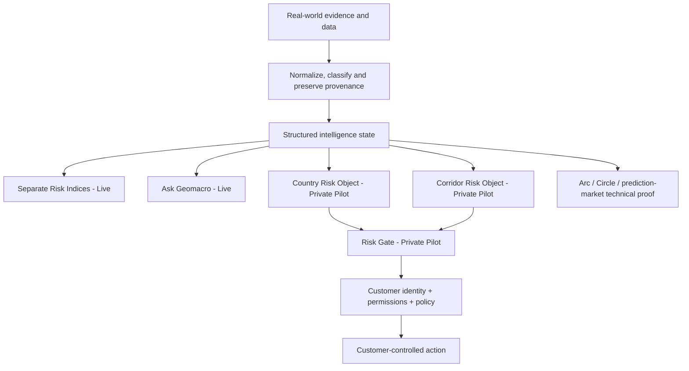

# Geomacro

**Explainable geopolitical, macroeconomic and critical-mineral risk intelligence for human and machine decisions.**

[](https://geomacro.live)
[](https://testnet.arcscan.app/address/0x2F874FB07084a22D2bB314D0762Af57Cb1856868)
[](https://www.circle.com/usdc)
[](LICENSE.txt)

**Live product:** https://geomacro.live  
**Documentation:** https://geomacro.live/docs  
**Security policy:** [SECURITY.md](SECURITY.md)

Geomacro turns real-world geopolitical, macroeconomic and strategic-resource developments into structured, explainable risk intelligence. The primary product is the intelligence layer: live event intelligence, separate verified Risk Indices, grounded research, machine-readable Risk Objects and bounded Risk Gate decision context.

The current public product presents three independent risk domains: **Geopolitical Risk Index**, **Macroeconomic Risk Index** and **Critical Minerals Risk Index**. They preserve the audited `gri-v1.2.0` parent methodology and `gri-proof-v1.2.0` proof lineage. Historical combined-GRI snapshots remain versioned audit records rather than a second live headline product.

Prediction markets, Arc Testnet contracts, USDC, Circle CCTP and swap flows are **secondary technical-proof and application layers**. They demonstrate how Geomacro intelligence can connect to programmable-finance workflows, but they are not the primary company identity.

---

## Permanent user-facing data boundary

Geomacro has a repository-level permanent rule for every current and future live product surface.

**User-facing output MUST be structured, concise and limited to approved product fields.**

The following MUST NEVER be exposed to users or external systems through a Geomacro product surface:

1. raw source URLs;
2. raw article, document, feed or source content;
3. internal search or retrieval payloads;
4. provider names, provider/API implementation details or internal search infrastructure details;
5. internal provenance, retrieval metadata, scoring metadata or other internal implementation metadata that is not part of the approved public product contract.

This applies across the website, UI, Ask Geomacro, APIs, Risk Intelligence, Risk Indices, Risk Objects, Risk Gate, agent interfaces, paid delivery and all future live capabilities.

Internal evidence and retrieval may be used to produce verified intelligence, but the external boundary is always:

`Raw/Internal Evidence -> Retrieval/Verification/Processing -> Approved Structured Intelligence -> User/External System`

A feature that violates this boundary is not production-ready. See [docs/USER_FACING_DATA_BOUNDARY.md](docs/USER_FACING_DATA_BOUNDARY.md).

---

## Current product status

| Surface | Status | Product truth |
|---|---|---|
| Risk Intelligence | **LIVE** | Public scored event intelligence with evidence context and timestamps |
| Geopolitical Risk Index | **LIVE** | Separate verified geopolitical risk reading with audited GRI v1.2 lineage |
| Macroeconomic Risk Index | **LIVE** | Separate verified macroeconomic risk reading with audited GRI v1.2 lineage |
| Critical Minerals Risk Index | **LIVE** | Separate verified critical-minerals risk reading with audited GRI v1.2 lineage |
| Ask Geomacro | **LIVE** | Grounded query interface over stored Geomacro intelligence and verified risk context |
| Research / methodology | **LIVE** | Public methodology, provenance and technical documentation |
| Risk API | **PRIVATE PILOT** | Controlled machine-readable country/corridor risk delivery |
| Risk Gate | **PRIVATE PILOT** | Signed risk context plus fail-closed bounded advisory evaluation |
| Professional intelligence packaging | **PLANNED COMMERCIAL DIRECTION** | Deeper history, alerts, exports and professional workflows as validated and shipped |
| Prediction markets / Arc / CCTP / Bridge & Swap | **TECHNICAL PROOF** | Testnet application and programmable-finance implementation |

`LIVE`, `PRIVATE PILOT`, `TECHNICAL PROOF`, `PLANNED` and `LEGACY` are intentionally distinct status labels. Code existence alone does not imply general availability, a production SLA, independent methodology validation, external security certification or customer adoption.

---

## Product architecture


```mermaid
graph TD;
    SOURCES["Real-world evidence and data"] --> STRUCTURE["Normalize, classify and preserve provenance"];
    STRUCTURE --> EVENTS["Structured intelligence state"];
    EVENTS --> INDICES["Separate Risk Indices - Live"];
    EVENTS --> ASK["Ask Geomacro - Live"];
    EVENTS --> COUNTRY["Country Risk Object - Private Pilot"];
    EVENTS --> CORRIDOR["Corridor Risk Object - Private Pilot"];
    COUNTRY --> GATE["Risk Gate - Private Pilot"];
    CORRIDOR --> GATE;
    GATE --> POLICY["Customer identity + permissions + policy"];
    POLICY --> ACTION["Customer-controlled action"];
    EVENTS --> TECH["Arc / Circle / prediction-market technical proof"];
```

The architecture separates **risk intelligence** from **transaction execution**:

- public Risk Intelligence, Risk Indices, Ask Geomacro and research do not require a wallet;
- Geomacro Risk Gate provides external risk context and a bounded advisory response rather than custody or autonomous transaction authorization;
- customer identity, permissions, compliance policy, funds and downstream execution remain customer-controlled;
- `execution_authorized=false` remains the current external Risk Gate boundary;
- stale, incomplete, expired or unverifiable risk context must fail closed rather than become implicit approval;
- Arc contract state remains authoritative only for the financial state of the secondary onchain technical-proof layer.

Data & API is an access and delivery surface over the same governed intelligence foundation. Payment rails do not create a second risk engine or widen the underlying entitlement.

---

## Public Risk Indices and audited GRI v1.2 lineage

The public product now exposes the three risk domains independently. The historical combined GRI remains the audited parent methodology and proof lineage used to preserve reproducibility and historical verification.

The persisted parent contract is **`gri-v1.2.0`** with proof lineage **`gri-proof-v1.2.0`**. Historical v1.0/v1.1 code is retained only where explicitly labelled for compatibility, replay or audit reproducibility.

GRI v1.2 is deterministic **after event classification and current-contract story assignment**. Severity and confidence are upstream model-produced inputs with versioned provenance; the numeric aggregate contains no discretionary manual adjustment and no LLM call.

### Parent scoring domains

The audited parent methodology uses exactly three base domains:

```text
geopolitics = 1/3
macro       = 1/3
rare_earth  = 1/3
```

The public naming for the third standalone index is **Critical Minerals Risk Index** while the historical storage category remains `rare_earth` to preserve proof compatibility.

If an eligible domain has no verified evidence, missing evidence is not converted into zero risk. Public risk-index presentation is fail-soft: a previously verified reading may remain visible during a refresh problem, while a cold read uses a neutral loading/refreshing state rather than fabricating a replacement score.

### Evidence weighting

For eligible observation `i`:

```text
confidenceWeight = confidence_i / 100
decayWeight      = 2 ^ (-ageHours_i / 24)
rawWeight_i      = confidenceWeight * decayWeight
```

Canonical parent controls include:

- trailing **72-hour** lookback;
- **24-hour** exponential half-life;
- per-source evidence concentration cap;
- immutable story grouping;
- story-level evidence concentration cap;
- versioned classification and story-correlation provenance;
- fail-closed current-contract eligibility checks.

### Proof and change attribution

Published proof lineage retains, where available and verified:

- methodology version and methodology hash;
- input, evidence, calculation and proof hashes;
- current and previous raw scores;
- contribution-level change attribution and reconciliation residuals;
- event, independent-story and source counts;
- evidence coverage and weighted confidence;
- immutable snapshot verification URLs.

These indices are **risk-intelligence signals**, not prediction-market probabilities, investment recommendations or guarantees of future outcomes.

---

## Ask Geomacro

Ask Geomacro is a public grounded-research interface over Geomacro's stored intelligence.

The answer boundary is **structured-only**. Internal retrieval may use source material, but the public response must not expose raw source URLs, raw article/source content, internal search payloads, provider/API details or internal provenance/retrieval metadata.

The current answer engine:

- retrieves and ranks relevant intelligence;
- requires evidence to clear relevance thresholds;
- withholds interpretation when evidence is weak;
- can use verified current risk context while keeping historical lineage explicit;
- does not silently manufacture a fallback risk score;
- returns only approved structured answer fields.

---

## Geomacro Risk Object and Risk Gate

Risk API and Risk Gate are **Private Pilot** capabilities for current country and directional-corridor workflows.

The repository implements a commercial backend foundation including:

- versioned Geomacro Risk Objects (GROs);
- Ed25519 issuer signing and signature verification;
- persisted objects and read-back verification;
- fail-closed pre-flight evaluation;
- authenticated external requests;
- database-backed per-client rate limiting;
- immutable decision audit records;
- customer-controlled downstream action after the Geomacro response.

Geomacro does not represent Risk Gate as a wallet custodian, autonomous transaction signer, sanctions-screening replacement or generally available production service. The customer retains identity, permissions, policy, funds and final execution control.

### Current corridor scope

The current corridor methodology is a **directional endpoint-composed pilot**. It composes signed origin and destination country risk context and adds direct bilateral evidence only when eligible evidence explicitly links the pair.

It does **not** claim full modelling of maritime routes, ports, intermediary jurisdictions, vessels, counterparties, correspondent banks, transaction-specific sanctions exposure or complete logistics paths.

Commercial source eligibility is a launch gate. Research-only, restricted or license-review-pending evidence must fail closed and remain outside paid machine delivery until permitted use is confirmed.

---

## Data, API and commercial delivery

Free Explorer is the public website/dashboard experience, not a free structured API.

Commercial machine delivery is entitlement-controlled. The entitlement defines the permitted capability, subject scope, history depth and response limits. A payment provider cannot widen the payload.

Paid agent/x402 production activation remains **PRE-LAUNCH**. Production real-money provider activation and mainnet activation remain disabled until the coordinated launch gates and explicit owner authorization are satisfied.

---

## Evidence, data and provenance

Geomacro separates raw evidence, structured intelligence, scoring eligibility and commercial eligibility.

Core product principles:

1. preserve source and calculation provenance internally;
2. expose only approved structured intelligence at user-facing boundaries;
3. distinguish repeated reporting from independent underlying developments;
4. fail closed on incompatible methodology/provenance states;
5. never manufacture missing data for presentation;
6. keep commercial source rights separate from technical ingestability.

---

## Dated controlled coverage evidence

A controlled four-module Risk Gate census completed on **2026-09-16** evaluated **194** enabled sovereign countries under that workflow. **114** passed every required current module and **80** remained fail-closed. Every accepted result preserved `execution_authorized=false`.

This is a dated workflow-coverage result, not an all-country product guarantee, institutional deployment claim, production SLA or promise that every product/request shape is deliverable for all accepted countries.

---

## Secondary Arc / Circle technical proof

Geomacro retains a substantial testnet application layer showing how intelligence can connect to programmable financial workflows.

These surfaces are explicitly secondary to the intelligence product and must not be interpreted as production mainnet, real-money institutional settlement or independent security certification.

### Current Arc Testnet deployment

| Component | Value |
|---|---|
| Network | Arc Testnet |
| Chain ID | `5042002` |
| V2 proxy | `0x2F874FB07084a22D2bB314D0762Af57Cb1856868` |
| V2 implementation | `0x96DDb29e27bdc3edf0c27bf885840Ebf8151DA7c` |
| V2 deployment block | `56797869` |
| V1 legacy contract | `0xC026fDFC40Dcd8F07b6ecFA21b2BF8400Db0FADe` |

New market creation uses the V2 proxy. V1 remains a legacy compatibility path for historical markets and claims. Do not introduce a V3 naming scheme unless a deliberate protocol generation is actually created.

---

## Security and resilience boundaries

Geomacro's launch standard is evidence-based. Repository tests and engineering controls are useful proof, but they are not substitutes for an independent review or production operating history.

Before external Early Access is represented as production-ready, the relevant system must pass the planned security and resilience gates. Do not claim "unhackable", independent certification, third-party audit, production SLA or institutional validation unless it has actually been obtained and documented.

Security reports: `security@geomacro.live` or the process documented in [SECURITY.md](SECURITY.md). Never submit seed phrases, private keys or production secrets through public product surfaces.

---

## Documentation

Start with https://geomacro.live/docs and the repository contracts below:

- [User-facing data boundary](docs/USER_FACING_DATA_BOUNDARY.md)
- [Risk Indices architecture](docs/RISK_INDICES_ARCHITECTURE.md)
- [Commercial intelligence](docs/COMMERCIAL_INTELLIGENCE.md)
- [GRI methodology v1.2 lineage](docs/GRI_METHODOLOGY.md)
- [GRI transparency requirements](docs/GRI_TRANSPARENCY_REQUIREMENTS.md)
- [Risk Gate](docs/RISK_GATE.md)
- [Canonical delivery architecture](docs/CANONICAL_DELIVERY_ARCHITECTURE.md)
- [Structural data commercial package](docs/STRUCTURAL_DATA_COMMERCIAL_PACKAGE.md)
- [Database schema ownership](docs/DATABASE_SCHEMA_OWNERSHIP.md)
- [Website information architecture](docs/WEBSITE_INFORMATION_ARCHITECTURE.md)
- [Security policy](SECURITY.md)

---

## Commercialization and launch gates

Geomacro is early-stage and pre-revenue. The objective is a production-grade global risk-intelligence product, not a one-off hackathon artifact.

Current priorities are:

1. keep website, docs and implementation on one source of truth;
2. harden Risk Indices/data reliability and commercial source eligibility;
3. harden Risk Object/Risk Gate security, privacy and operations;
4. complete scoped security and resilience testing before external Early Access launch;
5. validate narrow country/corridor workflows with real design partners;
6. finalize Early Access pricing, support boundaries and customer terms;
7. activate production payment/mainnet rails only after coordinated launch gates and explicit owner approval.

Service levels, quotas, customer logos, revenue, independent validation and security certification must be represented only when supported by real evidence.

---

## Disclaimer

Geomacro provides information and risk-intelligence decision-support tooling. It does not provide financial, investment, legal, trading or sanctions-screening advice.

Risk scores, interpretations and machine-readable advisory decisions are not guarantees of future outcomes. The user or customer remains responsible for identity, permissions, compliance obligations, policy and final action.

Testnet technical-proof functionality must not be interpreted as production real-money availability.

---

Built by [@blocknine0](https://github.com/blocknine0) · [Live product](https://geomacro.live) · [Issues](https://github.com/blocknine0/geomacro/issues)
