# Geomacro

### Onchain geopolitical risk intelligence, settled in USDC, on Arc.

[](https://www.geomacro.live)
[](https://testnet.arcscan.app/address/0x2F874FB07084a22D2bB314D0762Af57Cb1856868)
[](https://testnet.arcscan.app/address/0x2F874FB07084a22D2bB314D0762Af57Cb1856868)
[](LICENSE)

**[www.geomacro.live](https://www.geomacro.live)**

---

Geomacro is an event-driven geopolitical and macro risk intelligence platform with an onchain prediction and settlement layer.

The system ingests live news, classifies and scores events, generates structured HAWK/DOVE intelligence, creates eligible prediction markets, and manages their lifecycle through tentative resolution, dispute review, finalization, and claims.

The current architecture preserves both generations of the protocol:

- **V1** remains readable for historical markets and positions.
- **V2** is the current market architecture and introduces a structured dispute and tribunal lifecycle.

> **Current V2 proxy:** [`0x2F874FB07084a22D2bB314D0762Af57Cb1856868`](https://testnet.arcscan.app/address/0x2F874FB07084a22D2bB314D0762Af57Cb1856868)  
> **V2 implementation:** `0x96DDb29e27bdc3edf0c27bf885840Ebf8151DA7c`  
> **V2 deployment block:** `56797869`  
> **Legacy V1:** [`0xC026fDFC40Dcd8F07b6ecFA21b2BF8400Db0FADe`](https://testnet.arcscan.app/address/0xC026fDFC40Dcd8F07b6ecFA21b2BF8400Db0FADe)

---

## Table of contents

- [What this is](#what-this-is)
- [Architecture](#architecture)
- [End-to-end market flow](#end-to-end-market-flow)
- [V1 and V2 routing](#v1-and-v2-routing)
- [Lifecycle stages](#lifecycle-stages)
- [V2 contract state machine](#v2-contract-state-machine)
- [Resolution and dispute system](#resolution-and-dispute-system)
- [Five-juror tribunal](#five-juror-tribunal)
- [Contract architecture](#contract-architecture)
- [Cross-chain bridge (CCTP V2) & swap](#cross-chain-bridge-cctp-v2--swap)
- [RPC resilience](#rpc-resilience)
- [Supabase data model](#supabase-data-model)
- [Automation](#automation)
- [Tech stack](#tech-stack)
- [Repository layout](#repository-layout)
- [Local setup](#local-setup)
- [Configuration reference](#configuration-reference)
- [Product surfaces](#product-surfaces)
- [Design principles](#design-principles)
- [Current status](#current-status)
- [Roadmap](#roadmap)
- [Why Arc and USDC](#why-arc-and-usdc)
- [Reusable primitives](#reusable-primitives)

---

## What this is

Geomacro begins with the underlying real-world event rather than with a manually created prediction market.

The platform continuously ingests geopolitical and macro news, classifies relevance and severity, converts qualifying events into structured intelligence, and can create HAWK/DOVE markets around selected events.

**HAWK** represents escalation.

**DOVE** represents de-escalation.

The resulting lifecycle connects:

```text
event
→ intelligence
→ risk
→ market
→ position
→ tentative resolution
→ dispute review
→ finalization
→ settlement
```

Intelligence remains useful independently of wallet participation. Wallet access is required only when the user initiates an onchain action.

The market is therefore one component of the system rather than the entire product.


---

## Architecture

The current system separates ingestion, intelligence, automation, application data, blockchain state, and user-facing product surfaces.

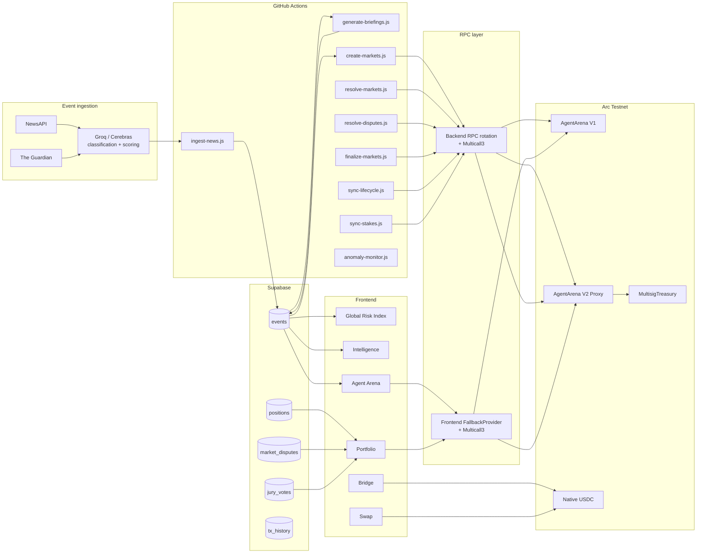
```mermaid
flowchart LR
    subgraph ingestion["Event ingestion"]
        NA[NewsAPI]
        GD[The Guardian]
        AI[Groq / Cerebras<br/>classification + scoring]
    end

    subgraph automation["GitHub Actions"]
        ING[ingest-news.js]
        BRF[generate-briefings.js]
        CRE[create-markets.js]
        RES[resolve-markets.js]
        JRY[resolve-disputes.js]
        FIN[finalize-markets.js]
        SYNC[sync-lifecycle.js]
        STK[sync-stakes.js]
        MON[anomaly-monitor.js]
    end

    subgraph data["Supabase"]
        EVENTS[(events)]
        POS[(positions)]
        DIS[(market_disputes)]
        VOTES[(jury_votes)]
        TX[(tx_history)]
    end

    subgraph client["Frontend"]
        GRI[Global Risk Index]
        FEED[Intelligence]
        ARENA[Agent Arena]
        PORT[Portfolio]
        BRIDGE[Bridge]
        SWAP[Swap]
    end

    subgraph rpc["RPC layer"]
        BACKEND[Backend RPC rotation<br/>+ Multicall3]
        FRONTEND[Frontend FallbackProvider<br/>+ Multicall3]
    end

    subgraph chain["Arc Testnet"]
        V1[AgentArena V1]
        V2[AgentArena V2 Proxy]
        TREASURY[MultisigTreasury]
        USDC[Native USDC]
    end

    NA --> AI
    GD --> AI
    AI --> ING
    ING --> EVENTS

    EVENTS --> BRF
    BRF --> EVENTS

    EVENTS --> CRE
    CRE --> BACKEND
    BACKEND --> V2

    RES --> BACKEND
    JRY --> BACKEND
    FIN --> BACKEND
    SYNC --> BACKEND
    STK --> BACKEND

    BACKEND --> V1
    BACKEND --> V2

    V2 --> TREASURY

    EVENTS --> GRI
    EVENTS --> FEED
    EVENTS --> ARENA

    POS --> PORT
    DIS --> PORT
    VOTES --> PORT

    ARENA --> FRONTEND
    PORT --> FRONTEND
    FRONTEND --> V1
    FRONTEND --> V2

    BRIDGE --> USDC
    SWAP --> USDC
```

### Responsibility boundaries

- **Ingestion** discovers and normalizes external events.
- **Intelligence** classifies relevance, severity, category, and HAWK/DOVE context.
- **Supabase** provides the structured application read model and transparency records.
- **GitHub Actions** runs scheduled lifecycle automation.
- **Arc contracts** remain authoritative for financial state.
- **Frontend** exposes intelligence, markets, positions, resolution state, disputes, Bridge, and Swap.

Supabase is not used as a substitute for authoritative onchain financial state.

---

## End-to-end market flow

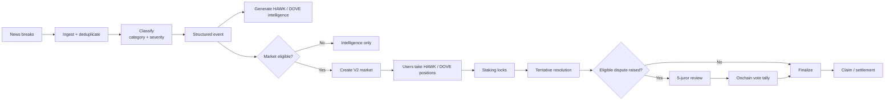
```mermaid
flowchart LR
    A[News breaks] --> B[Ingest + deduplicate]
    B --> C[Classify<br/>category + severity]
    C --> D[Structured event]
    D --> E[Generate HAWK / DOVE intelligence]
    D --> F{Market eligible?}

    F -->|No| G[Intelligence only]
    F -->|Yes| H[Create V2 market]

    H --> I[Users take HAWK / DOVE positions]
    I --> J[Staking locks]
    J --> K[Tentative resolution]
    K --> L{Eligible dispute raised?}

    L -->|No| M[Finalize]
    L -->|Yes| N[5-juror review]

    N --> O[Onchain vote tally]
    O --> M

    M --> P[Claim / settlement]
```

The system preserves the event identity across intelligence, market state, resolution, and settlement.

---

## V1 and V2 routing

Geomacro currently operates with explicit dual-contract awareness.

| Version | Role | Address |
|---|---|---|
| V1 | Historical / legacy markets | `0xC026fDFC40Dcd8F07b6ecFA21b2BF8400Db0FADe` |
| V2 Proxy | Current market architecture | `0x2F874FB07084a22D2bB314D0762Af57Cb1856868` |
| V2 Implementation | Current implementation behind proxy | `0x96DDb29e27bdc3edf0c27bf885840Ebf8151DA7c` |

New market state is associated with the V2 proxy.

Historical V1 records remain readable so protocol evolution does not erase earlier markets or positions.

Routing uses the market address stored with the event rather than assuming every row belongs to the newest contract.

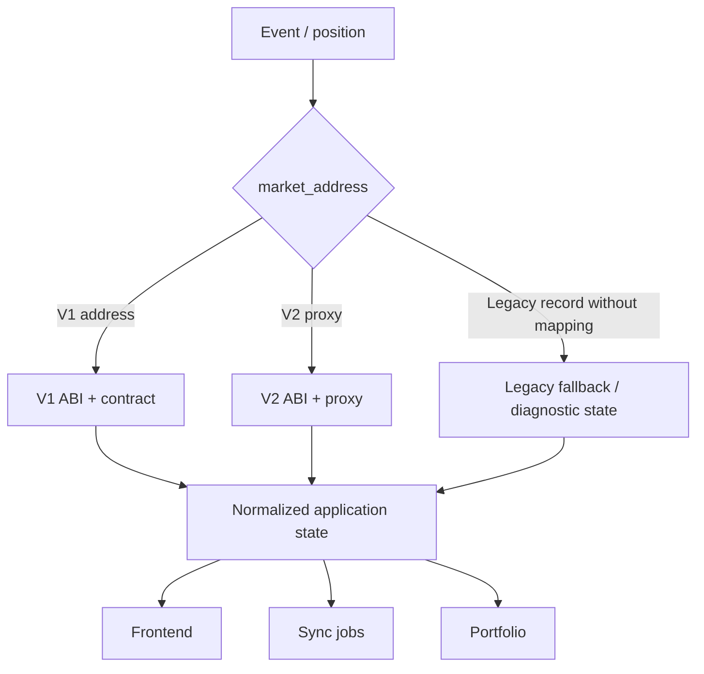
```mermaid
flowchart TD
    E[Event / position] --> A{market_address}

    A -->|V1 address| V1[V1 ABI + contract]
    A -->|V2 proxy| V2[V2 ABI + proxy]
    A -->|Legacy record without mapping| L[Legacy fallback / diagnostic state]

    V1 --> N[Normalized application state]
    V2 --> N
    L --> N

    N --> F[Frontend]
    N --> S[Sync jobs]
    N --> P[Portfolio]
```

This distinction matters because V1 and V2 expose different market-detail structures and lifecycle capabilities.

V2 includes additional resolution and dispute state that does not exist in the same form on V1.

---

## Lifecycle stages

The market lifecycle is intentionally separated into multiple states rather than treating resolution as an immediate transition from staking to payout.

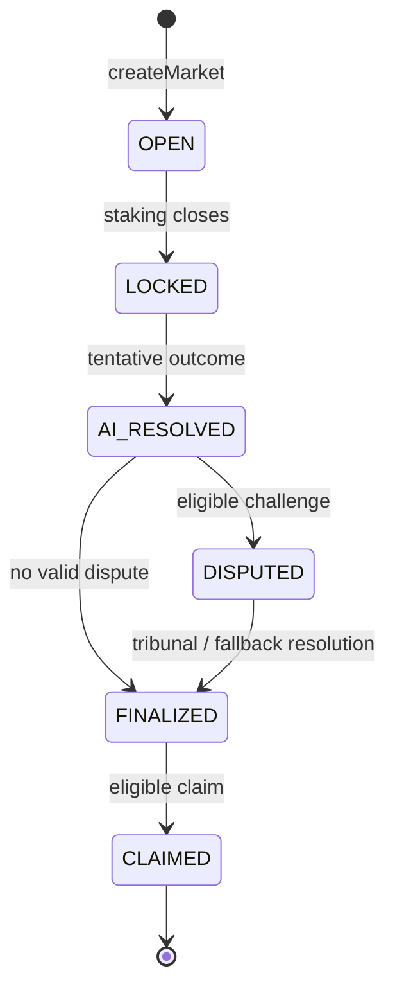
```mermaid
stateDiagram-v2
    [*] --> OPEN: createMarket
    OPEN --> LOCKED: staking closes
    LOCKED --> AI_RESOLVED: tentative outcome
    AI_RESOLVED --> DISPUTED: eligible challenge
    AI_RESOLVED --> FINALIZED: no valid dispute
    DISPUTED --> FINALIZED: tribunal / fallback resolution
    FINALIZED --> CLAIMED: eligible claim
    CLAIMED --> [*]
```

### Application-level lifecycle

| Stage | Meaning |
|---|---|
| `active` | Market is active or awaiting the resolution boundary |
| `awaiting_dispute` | Tentative resolution exists and dispute state is relevant |
| `disputed` | A valid V2 dispute has been opened |
| `completed` | Market is finalized |
| claim state | Eligible winning positions can progress through payout / claim |

The exact financial state is read from the relevant contract.

The application lifecycle is a normalized representation used for display, synchronization, and portfolio transparency.

---

## V2 contract state machine

V2 extends the original market lifecycle with explicit dispute handling.

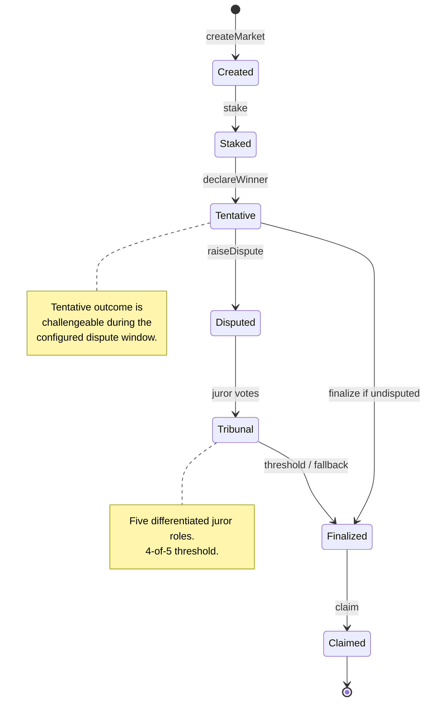
```mermaid
stateDiagram-v2
    [*] --> Created: createMarket
    Created --> Staked: stake
    Staked --> Tentative: declareWinner
    Tentative --> Disputed: raiseDispute
    Tentative --> Finalized: finalize if undisputed
    Disputed --> Tribunal: juror votes
    Tribunal --> Finalized: threshold / fallback
    Finalized --> Claimed: claim
    Claimed --> [*]

    note right of Tentative
      Tentative outcome is
      challengeable during the
      configured dispute window.
    end note

    note right of Tribunal
      Five differentiated juror roles.
      4-of-5 threshold.
    end note
```

V2 therefore separates:

1. market participation;
2. tentative resolution;
3. dispute eligibility;
4. tribunal review;
5. finalization;
6. claims.

---

## Resolution and dispute system

Geomacro does not treat an AI-generated tentative verdict as inherently infallible.

V2 introduces a challenge path around tentative resolution.

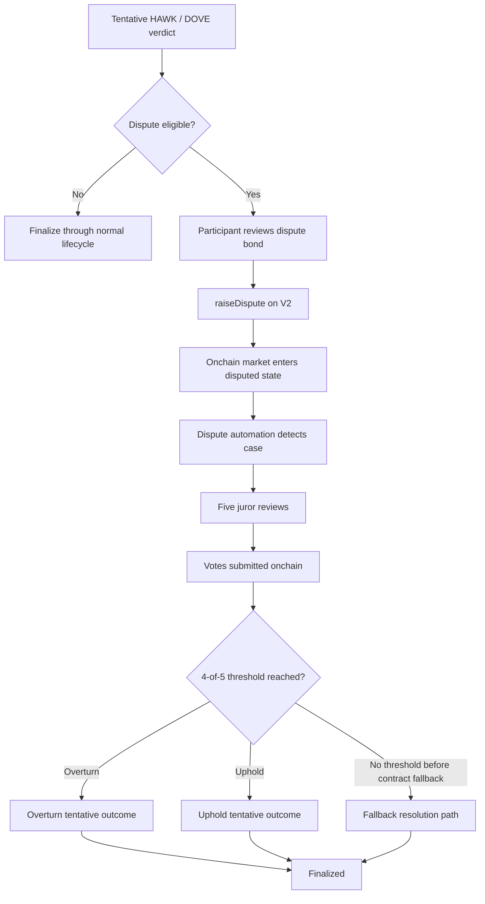
```mermaid
flowchart TD
    A[Tentative HAWK / DOVE verdict] --> B{Dispute eligible?}

    B -->|No| C[Finalize through normal lifecycle]

    B -->|Yes| D[Participant reviews dispute bond]
    D --> E[raiseDispute on V2]
    E --> F[Onchain market enters disputed state]
    F --> G[Dispute automation detects case]
    G --> H[Five juror reviews]
    H --> I[Votes submitted onchain]
    I --> J{4-of-5 threshold reached?}

    J -->|Overturn| K[Overturn tentative outcome]
    J -->|Uphold| L[Uphold tentative outcome]
    J -->|No threshold before contract fallback| M[Fallback resolution path]

    K --> N[Finalized]
    L --> N
    M --> N
```

### Dispute eligibility

The frontend does not determine final eligibility from Supabase alone.

Supabase fields can identify a potential action, but the application confirms relevant state against the V2 contract before offering the transaction.

The current frontend flow checks contract state and the user's actual position before presenting the dispute action.

This prevents an application cache from becoming the authority for a financial transaction.

### Dispute bond

The bond is computed from the user's relevant losing-side stake and contract rules.

The UI reads the actual contract-derived requirement before the transaction is submitted.

The bond is therefore not a hardcoded frontend fee.

---

## Five-juror tribunal

The V2 dispute architecture uses five differentiated AI-assisted review roles.

The objective is not to call the same model five times and label those outputs independent jurors.

Each role is assigned a distinct review responsibility.

| Juror role | Responsibility |
|---|---|
| Fact-Checker | Tests factual claims against available evidence |
| Hawk Re-arguer | Constructs the strongest escalation interpretation |
| Dove Re-arguer | Constructs the strongest de-escalation interpretation |
| Evidence Skeptic | Challenges evidence quality and unsupported assumptions |
| Domain Specialist | Applies event/category-specific context |

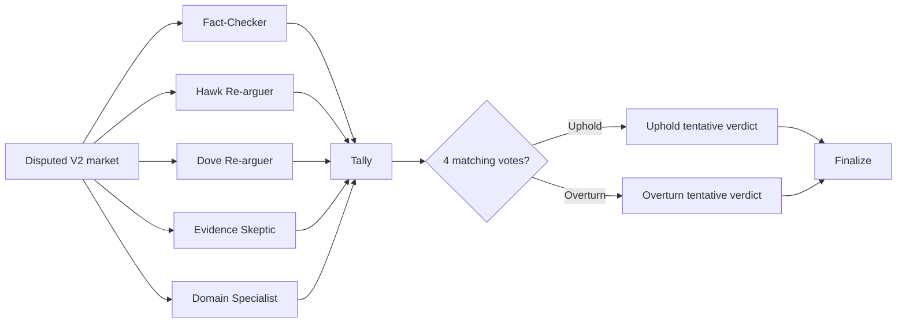
```mermaid
flowchart LR
    D[Disputed V2 market]

    D --> J1[Fact-Checker]
    D --> J2[Hawk Re-arguer]
    D --> J3[Dove Re-arguer]
    D --> J4[Evidence Skeptic]
    D --> J5[Domain Specialist]

    J1 --> T[Tally]
    J2 --> T
    J3 --> T
    J4 --> T
    J5 --> T

    T --> Q{4 matching votes?}

    Q -->|Uphold| U[Uphold tentative verdict]
    Q -->|Overturn| O[Overturn tentative verdict]

    U --> F[Finalize]
    O --> F
```

### Decision threshold

- Jury size: **5**
- Required decision threshold: **4 of 5**
- Juror submissions are individually represented
- Vote state is tied to the disputed market
- Public transparency data can include verdict, reasoning, evidence count, vote time, and transaction hash where available

The tribunal is activated only for an actual dispute.

If no dispute was opened for a finalized V2 market, the UI explicitly reports that no tribunal case was activated.

No synthetic juror history is created to make an undisputed market appear reviewed.

---

## Contract architecture

V2 uses an upgradeable proxy architecture.

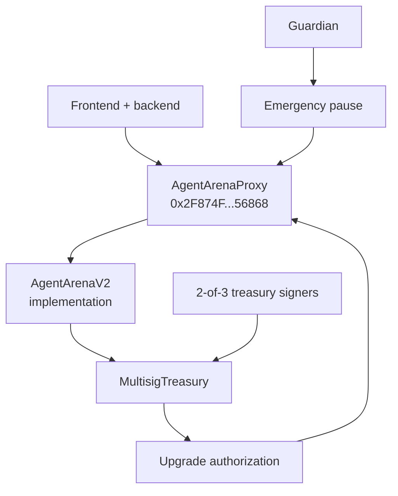
```mermaid
flowchart TD
    APP[Frontend + backend] --> PROXY[AgentArenaProxy<br/>0x2F874F...56868]
    PROXY --> IMPL[AgentArenaV2<br/>implementation]
    IMPL --> TREASURY[MultisigTreasury]

    OWNERS[2-of-3 treasury signers] --> TREASURY
    TREASURY --> UPGRADE[Upgrade authorization]
    UPGRADE --> PROXY

    GUARDIAN[Guardian] --> PAUSE[Emergency pause]
    PAUSE --> PROXY
```

### V2 proxy

Current application address:

```text
0x2F874FB07084a22D2bB314D0762Af57Cb1856868
```

Implementation:

```text
0x96DDb29e27bdc3edf0c27bf885840Ebf8151DA7c
```

Deployment block:

```text
56797869
```

Application configuration should target the proxy rather than calling the implementation directly.

### Treasury and upgrade control

The V2 architecture includes a multisig treasury and delayed upgrade path.

The purpose is to avoid making a single application key the sole authority over protocol upgrades and treasury-controlled operations.

### Circuit breaker

The protocol architecture includes guardian-based emergency controls and monitoring.

`anomaly-monitor.js` observes configured operational and protocol conditions so critical failures are not dependent on manual UI discovery.

This architecture improves operational controls, but it should not be interpreted as a substitute for an external production security review.

---

## Cross-chain bridge (CCTP V2) & swap

`/bridge` provides the current crosschain USDC experience.

The Bridge uses Circle CCTP V2 testnet infrastructure to move native USDC from supported source testnets toward Arc Testnet.

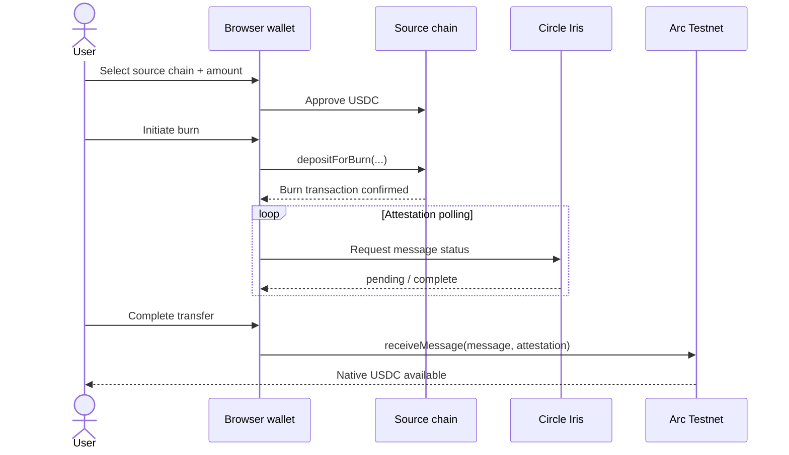
```mermaid
sequenceDiagram
    actor User
    participant Wallet as Browser wallet
    participant Source as Source chain
    participant Iris as Circle Iris
    participant Arc as Arc Testnet

    User->>Wallet: Select source chain + amount
    Wallet->>Source: Approve USDC
    User->>Wallet: Initiate burn
    Wallet->>Source: depositForBurn(...)
    Source-->>Wallet: Burn transaction confirmed

    loop Attestation polling
        Wallet->>Iris: Request message status
        Iris-->>Wallet: pending / complete
    end

    User->>Wallet: Complete transfer
    Wallet->>Arc: receiveMessage(message, attestation)
    Arc-->>User: Native USDC available
```

Current configured source testnets include:

- Ethereum Sepolia
- Base Sepolia
- Avalanche Fuji

The user remains in control of the wallet-signed flow.

The interface exposes transfer state rather than hiding the multi-stage CCTP lifecycle behind a single synthetic status.

### Swap

The current Bridge surface also includes same-chain Swap functionality through Circle App Kit on Arc Testnet.

The live surface includes the currently supported swap flow, liquidity information, and transaction history.

Bridge and Swap are separate actions presented within the same crosschain/liquidity experience.

---

## RPC resilience

Geomacro maintains separate backend and frontend RPC strategies.

### Backend

Lifecycle scripts can rotate across multiple RPC endpoints.

The backend pool is designed to avoid a single RPC provider becoming a hard dependency for scheduled market operations.

Typical configured providers include:

```text
Alchemy
QuickNode
GetBlock
dRPC
Arc public fallback
```

Premium provider credentials remain server-side in GitHub Actions secrets.

### Frontend

The browser uses a lighter fallback configuration suitable for public reads.

Premium backend RPC keys are not shipped in the frontend bundle.

### Multicall3

Compatible contract reads are batched through Multicall3 where appropriate.

```text
0xcA11bde05977b3631167028862bE2a173976CA11
```

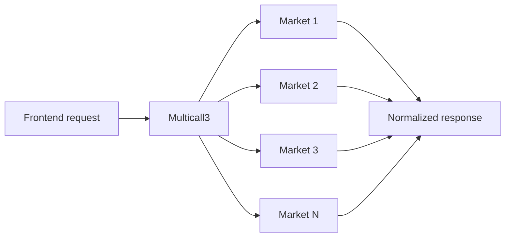
```mermaid
flowchart LR
    UI[Frontend request] --> MC[Multicall3]
    MC --> M1[Market 1]
    MC --> M2[Market 2]
    MC --> M3[Market 3]
    MC --> MN[Market N]

    M1 --> R[Normalized response]
    M2 --> R
    M3 --> R
    MN --> R
```

Batching reduces RPC request volume and lowers the chance of partially loaded market views caused by independent request failures.

---

## Supabase data model

Supabase provides the application read model and transparency layer around events, positions, disputes, juror votes, and transaction history.

Financial truth remains onchain.

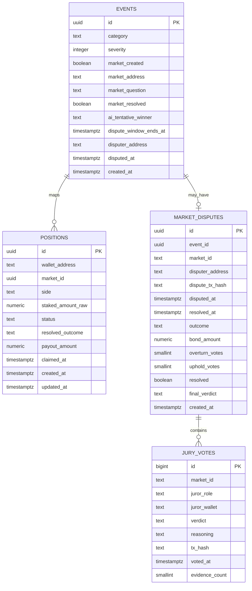
```mermaid
erDiagram
    EVENTS ||--o{ POSITIONS : maps
    EVENTS ||--o| MARKET_DISPUTES : may_have
    MARKET_DISPUTES ||--o{ JURY_VOTES : contains

    EVENTS {
        uuid id PK
        text category
        integer severity
        boolean market_created
        text market_address
        text market_question
        boolean market_resolved
        text ai_tentative_winner
        timestamptz dispute_window_ends_at
        text disputer_address
        timestamptz disputed_at
        timestamptz created_at
    }

    POSITIONS {
        uuid id PK
        text wallet_address
        uuid market_id
        text side
        numeric staked_amount_raw
        text status
        text resolved_outcome
        numeric payout_amount
        timestamptz claimed_at
        timestamptz created_at
        timestamptz updated_at
    }

    MARKET_DISPUTES {
        uuid id PK
        uuid event_id
        text market_id
        text disputer_address
        text dispute_tx_hash
        timestamptz disputed_at
        timestamptz resolved_at
        text outcome
        numeric bond_amount
        smallint overturn_votes
        smallint uphold_votes
        boolean resolved
        text final_verdict
        timestamptz created_at
    }

    JURY_VOTES {
        bigint id PK
        text market_id
        text juror_role
        text juror_wallet
        text verdict
        text reasoning
        text tx_hash
        timestamptz voted_at
        smallint evidence_count
    }
```

### `events`

The event table contains both intelligence and market-lifecycle metadata.

Relevant V2 fields include:

```text
market_created
market_threshold
resolution_at
market_resolved
ai_tentative_winner
market_address
disputer_address
disputed_at
dispute_window_ends_at
market_created_tx_hash
briefing_generated_at
market_question
```

### `positions`

The position table mirrors wallet-specific market positions.

Current fields include:

```text
id
wallet_address
market_id
side
staked_amount_raw
status
resolved_outcome
payout_amount
claimed_at
created_at
updated_at
```

The application uses this data for Portfolio discovery and then verifies relevant financial/action state against the contract where required.

### `market_disputes`

Stores dispute-level transparency information.

Current schema includes:

```text
id
event_id
market_id
disputer_address
dispute_tx_hash
disputed_at
resolved_at
outcome
created_at
bond_amount
overturn_votes
uphold_votes
resolved
final_verdict
```

### `jury_votes`

Stores individual tribunal vote records.

Current schema includes:

```text
id
market_id
juror_role
juror_wallet
verdict
reasoning
tx_hash
voted_at
evidence_count
```

### Row Level Security

RLS is enabled for both:

```text
market_disputes
jury_votes
```

Public read access is available for tribunal transparency.

Trusted write operations remain server-side.

The browser must never receive the Supabase service-role key.

### Schema history

The live Supabase schema has evolved beyond the original migration snapshot.

This means the migration directory should not automatically be treated as a complete historical reconstruction of every operational SQL change.

A production-hardening task is to capture the current live schema as a reproducible migration baseline.

---

## Automation

Scheduled GitHub Actions operate the intelligence and market lifecycle.

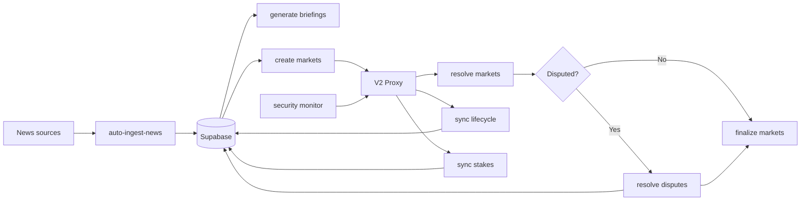
```mermaid
flowchart LR
    NEWS[News sources] --> INGEST[auto-ingest-news]
    INGEST --> DB[(Supabase)]

    DB --> BRIEF[generate briefings]
    DB --> CREATE[create markets]

    CREATE --> V2[V2 Proxy]
    V2 --> RESOLVE[resolve markets]
    RESOLVE --> DISPUTE{Disputed?}

    DISPUTE -->|Yes| JURY[resolve disputes]
    DISPUTE -->|No| FINALIZE[finalize markets]

    JURY --> FINALIZE

    V2 --> LIFE[sync lifecycle]
    V2 --> STAKE[sync stakes]

    LIFE --> DB
    STAKE --> DB
    JURY --> DB

    MONITOR[security monitor] --> V2
```

### Workflow responsibilities

| Workflow | Responsibility |
|---|---|
| `auto-ingest-news.yml` | Ingest and classify external events |
| `Auto-generate-briefings.yml` | Generate cached HAWK/DOVE intelligence |
| `auto-create-markets.yml` | Create eligible markets |
| `auto-resolve-markets.yml` | Produce tentative market resolution |
| `auto-resolve-disputes.yml` | Process actual disputed V2 markets |
| `auto-finalize-markets.yml` | Finalize eligible markets |
| `sync-lifecycle.yml` | Reconcile lifecycle state |
| `sync-stakes.yml` | Reconcile onchain positions |
| `security-monitor.yml` | Monitor configured anomalies |
| `auto-recovery.yml` | Manual operational recovery |
| `debug-schema.yml` | Manual schema diagnostics |

The dispute runner does not manufacture tribunal activity.

If no V2 market is disputed, there is no tribunal case to process.

---

## Tech stack

| Layer | Choice | Responsibility |
|---|---|---|
| Frontend | Vite 7 + TanStack Start + React 19 + Tailwind v4 | Product interface and routing |
| UI | shadcn/ui + Radix primitives | Accessible UI primitives |
| Chain client | ethers v6 | Contract reads and wallet transactions |
| RPC | Multi-endpoint backend rotation + frontend fallback | Chain availability |
| Batching | Multicall3 | Efficient contract reads |
| Data | Supabase / PostgreSQL | Intelligence, positions, transparency records |
| Classification | Groq + Cerebras fallback | Event classification and scoring |
| Dispute evidence | Tavily | Independent evidence retrieval for dispute review |
| News | NewsAPI + The Guardian | External event ingestion |
| Validation | Zod | Structured input validation |
| Authentication | Sign-In with Ethereum | Wallet-based Portfolio authentication |
| Automation | GitHub Actions | Scheduled lifecycle execution |
| Contracts | Solidity 0.8.20 | Market and dispute logic |
| Contract libraries | OpenZeppelin upgradeable contracts | V2 proxy/security primitives |
| Contract tooling | Foundry | Build, test, deployment |
| Network | Arc Testnet | Current execution environment |
| Settlement | Native USDC | Market denomination and settlement |
| Crosschain | Circle CCTP V2 | Native USDC transfer |
| Swap | Circle App Kit | Current swap surface |

---

## Repository layout

```text
geomacro/
├── contracts/
│   ├── AgentArena.sol
│   ├── AgentArenaV2.sol
│   ├── AgentArenaProxy.sol
│   └── MultisigTreasury.sol
│
├── script/
│   └── Deploy.s.sol
│
├── scripts/
│   ├── ingest-news.js
│   ├── generate-briefings.js
│   ├── create-markets.js
│   ├── resolve-markets.js
│   ├── resolve-disputes.js
│   ├── finalize-markets.js
│   ├── sync-lifecycle.js
│   ├── sync-stakes.js
│   ├── anomaly-monitor.js
│   └── lib/
│       └── dual-contract.js
│
├── supabase/
│   └── migrations/
│       ├── 001_ai_jury_dispute_system.sql
│       └── ...
│
├── src/
│   ├── components/
│   │   ├── DisputeTribunal.tsx
│   │   ├── portfolio/
│   │   │   └── resolution-tribunal.tsx
│   │   └── sections/
│   │       ├── arena-section.tsx
│   │       ├── bridge-section.tsx
│   │       ├── liquidity-section.tsx
│   │       ├── swap-section.tsx
│   │       └── tx-history-section.tsx
│   │
│   ├── routes/
│   │   ├── portfolio.tsx
│   │   ├── docs.tsx
│   │   └── ...
│   │
│   ├── lib/
│   │   ├── arc.ts
│   │   ├── agent-arena.ts
│   │   ├── arena-markets.ts
│   │   ├── positions.functions.ts
│   │   ├── cctp.ts
│   │   ├── swap.ts
│   │   └── ...
│   │
│   └── hooks/
│       └── ...
│
├── .github/
│   └── workflows/
│       ├── auto-ingest-news.yml
│       ├── Auto-generate-briefings.yml
│       ├── auto-create-markets.yml
│       ├── auto-resolve-markets.yml
│       ├── auto-resolve-disputes.yml
│       ├── auto-finalize-markets.yml
│       ├── sync-lifecycle.yml
│       ├── sync-stakes.yml
│       ├── security-monitor.yml
│       ├── auto-recovery.yml
│       └── debug-schema.yml
│
├── docs/
├── foundry.toml
└── package.json
```

---

## Local setup

```bash
git clone https://github.com/blocknine0/geomacro.git
cd geomacro

npm install
cp .env.example .env.local
npm run dev
```

Contract development:

```bash
forge build
forge test
```

Never commit:

```text
private keys
Supabase service-role credentials
jury signer keys
guardian keys
premium RPC credentials
```

---

## Configuration reference

| Variable | Responsibility |
|---|---|
| `NEWSAPI_KEY` | NewsAPI ingestion |
| `GUARDIAN_API_KEY` | The Guardian ingestion |
| `GROQ_API_KEY` | Classification, briefing, resolution, selected jury roles |
| `CEREBRAS_API_KEY` | Secondary AI provider / fallback |
| `TAVILY_API_KEY` | Independent dispute evidence retrieval |
| `APP_SUPABASE_URL` | Supabase project |
| `APP_SUPABASE_ANON_KEY` | Public RLS-controlled access |
| `SUPABASE_SERVICE_ROLE_KEY` | Trusted server-side writes |
| `CONTRACT_ADDRESS` | Current V2 proxy |
| `OLD_CONTRACT_ADDRESS` | Legacy V1 contract |
| `OWNER_PRIVATE_KEY` | Trusted lifecycle signer where required |
| `JURY_PRIVATE_KEY_1` | Juror signer 1 |
| `JURY_PRIVATE_KEY_2` | Juror signer 2 |
| `JURY_PRIVATE_KEY_3` | Juror signer 3 |
| `JURY_PRIVATE_KEY_4` | Juror signer 4 |
| `JURY_PRIVATE_KEY_5` | Juror signer 5 |
| `GUARDIAN_PRIVATE_KEY` | Emergency guardian |
| `ARC_RPC_URL` ... `ARC_RPC_URL_5` | Backend RPC pool |
| `DEPLOY_BLOCK` | V2 event scan starting block |
| `MULTICALL3_ADDRESS` | Multicall3 contract |
| `VITE_ARC_NETWORK` | Frontend network |
| `VITE_CONTRACT_ADDRESS` | Frontend V2 proxy |
| `VITE_CIRCLE_KIT_KEY` | Circle App Kit |

Privileged values belong in server-side / GitHub Actions secrets and must not be exposed through frontend environment variables.

---

## Product surfaces

| Surface | Purpose |
|---|---|
| `/` | Global risk and primary product entry |
| Intelligence / Feed | Structured geopolitical and macro intelligence |
| Event detail | Event-specific context, severity, sources, and market linkage |
| `/arena` | HAWK / DOVE markets |
| `/portfolio` | Wallet positions and lifecycle transparency |
| Resolution & Tribunal | V2 resolution, dispute, tribunal, finalization, and claim visibility |
| `/bridge` | CCTP V2 USDC bridge |
| Swap | Circle App Kit swap experience |
| Tx History | Supabase-backed transaction history |
| `/pipeline` | Intelligence / automation pipeline |
| `/onchain` | Contract and network information |
| `/roadmap` | Shipped and planned work |
| `/docs` | Developer-facing documentation |

### Portfolio resolution transparency

V2 positions expose a compact lifecycle view:

```text
Active
→ Tentative Resolution
→ Dispute Window
→ Tribunal
→ Finalized
→ Claim / Claimed
```

Where available, the interface can expose:

- tentative verdict;
- user's position;
- market question;
- dispute deadline;
- dispute status;
- bond requirement;
- juror roles;
- vote status;
- verdict;
- reasoning;
- evidence count;
- transaction reference;
- 4-of-5 tally;
- finalization state;
- claim state.

If tribunal data does not exist because no dispute was opened, the application reports that explicitly.

Read failures are displayed as unknown/error states rather than being silently converted into "no dispute."

---

## Design principles

1. **Contract state is authoritative for financial state.**  
   Supabase supports discovery, synchronization, and transparency but does not replace onchain verification for financial actions.

2. **Preserve protocol history.**  
   V1 remains readable while V2 handles the current market architecture.

3. **Do not fabricate missing data.**  
   If a value is unavailable, the interface should say so.

4. **Treat AI resolution as challengeable.**  
   Tentative AI-assisted resolution is not presented as unquestionable truth.

5. **Separate intelligence from wallet access.**  
   Users can inspect risk and market information without connecting a wallet.

6. **Verify before transacting.**  
   Dispute eligibility and other sensitive actions are checked against current contract state before the transaction is offered.

7. **Use differentiated tribunal roles.**  
   Five repeated prompts are not treated as five independent reviewers.

8. **Keep privileged credentials server-side.**

9. **Design scheduled operations for reconciliation and retry.**

10. **Make lifecycle state visible.**  
    Users should be able to understand what stage a position or market is in and why.

11. **Preserve uncertainty.**  
    Missing evidence, failed reads, unresolved disputes, and inactive tribunals should remain visible as such.

12. **Keep documentation aligned with implementation.**  
    Planned capabilities should not be described as currently deployed functionality.

---

## Current status

### Intelligence

- [x] Multi-source news ingestion
- [x] Event classification
- [x] Severity scoring
- [x] Structured event persistence
- [x] HAWK / DOVE briefing generation
- [x] Global risk / intelligence surfaces
- [x] Market question generation / persistence

### Markets

- [x] V1 market history preserved
- [x] V2 proxy deployed
- [x] V2 markets active
- [x] Dual V1 / V2 routing
- [x] Automated market creation
- [x] HAWK / DOVE positions
- [x] Automated tentative resolution
- [x] Automated finalization
- [x] Position reconciliation
- [x] Portfolio lifecycle visibility

### V2 dispute system

- [x] V2 dispute contract path
- [x] Dispute bond calculation
- [x] Onchain eligibility verification before action
- [x] Five differentiated juror roles
- [x] 4-of-5 decision threshold
- [x] Dedicated juror wallets
- [x] Automated dispute runner
- [x] `market_disputes` transparency table
- [x] `jury_votes` transparency table
- [x] Public read policies for dispute transparency
- [x] Portfolio Resolution & Tribunal interface
- [x] Explicit undisputed / tribunal-not-activated state
- [x] Explicit read-error / unknown state

### Infrastructure

- [x] Backend RPC failover
- [x] Frontend RPC fallback
- [x] Multicall3 batching
- [x] GitHub Actions lifecycle automation
- [x] Guardian / monitoring architecture
- [x] Upgradeable V2 proxy architecture
- [x] Multisig treasury architecture

### Circle infrastructure

- [x] Native USDC settlement architecture
- [x] CCTP V2 Bridge surface
- [x] Circle App Kit Swap surface
- [x] Bridge / Swap transaction history

---

## Roadmap

The immediate priority is production hardening rather than replacing the current architecture.

- [x] Live intelligence pipeline
- [x] Automated market creation
- [x] Automated tentative resolution
- [x] V1 historical compatibility
- [x] V2 activation
- [x] V2 dispute architecture
- [x] Five-role tribunal automation
- [x] Portfolio tribunal transparency
- [x] CCTP V2 Bridge
- [x] Circle App Kit Swap
- [x] RPC failover and Multicall3
- [ ] External production security review
- [ ] Expand V2 dispute and failure-recovery test coverage
- [ ] Reconcile historical unmapped position records
- [ ] Capture the current Supabase schema as a complete reproducible migration baseline
- [ ] Improve DB/onchain discrepancy monitoring
- [ ] Harden Bridge and Swap recovery paths
- [ ] Complete production-readiness review before larger-scale economic activity
- [ ] Mainnet deployment when technical, security, and operational requirements are satisfied
- [ ] Continue commercial validation of professional and institutional intelligence layers separately from protocol implementation

---

## Why Arc and USDC

Geomacro separates the risk being predicted from unnecessary settlement-asset volatility.

A participant taking a view on geopolitical or macro risk should not also need to take an unrelated position on the asset used to settle that market.

USDC provides a stable economic denomination for participation and settlement.

Arc provides the execution environment for the current onchain market layer.

CCTP provides a path for native USDC movement across supported ecosystems.

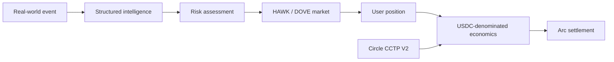
```mermaid
flowchart LR
    EVENT[Real-world event] --> INTEL[Structured intelligence]
    INTEL --> RISK[Risk assessment]
    RISK --> MARKET[HAWK / DOVE market]
    MARKET --> POSITION[User position]
    POSITION --> USDC[USDC-denominated economics]
    USDC --> ARC[Arc settlement]

    CCTP[Circle CCTP V2] --> USDC
```

The intended architecture keeps the blockchain underneath the user workflow rather than making chain mechanics the primary product experience.

---

## Reusable primitives

The RPC failover, Multicall batching, and model-fallback patterns used by the automation layer are also represented in:

[arc-onchain-agent-primitives](https://github.com/blocknine0/arc-onchain-agent-primitives)

---

## Implementation note

Geomacro is currently operating on **Arc Testnet**.

The repository and live application should distinguish clearly between:

- implemented functionality;
- active testnet functionality;
- production-hardening work;
- planned future functionality.

Testnet activity should not be represented as commercial adoption or production-scale economic activity.

The current system demonstrates the complete technical direction from event ingestion through intelligence, market participation, resolution, dispute handling, finalization, and settlement while retaining explicit visibility into incomplete or unavailable state.

---

Built by [@blocknine0](https://github.com/blocknine0) · [Live product](https://www.geomacro.live) · [Open an issue](https://github.com/blocknine0/geomacro/issues)
