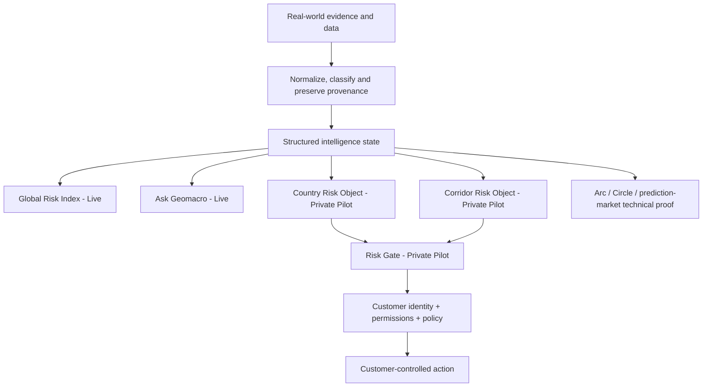
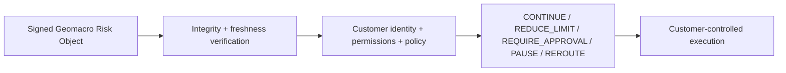
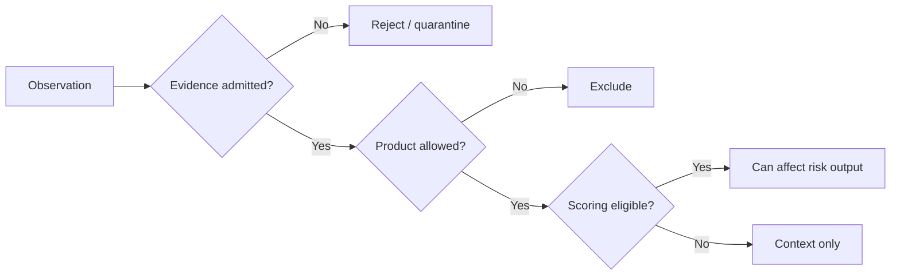

# Geomacro

**Geopolitical and macro risk intelligence infrastructure for human and machine decisions.**

[](https://geomacro.live)
[](https://testnet.arcscan.app/address/0x2F874FB07084a22D2bB314D0762Af57Cb1856868)
[](https://www.circle.com/usdc)
[](LICENSE.txt)

**Live product:** https://geomacro.live  
**Documentation:** https://geomacro.live/docs  
**Security policy:** [SECURITY.md](SECURITY.md)

Geomacro turns real-world geopolitical, macroeconomic and strategic-resource developments into structured, explainable risk intelligence. The core product is the intelligence layer: live event intelligence, the Global Risk Index (GRI), grounded research, machine-readable risk objects and pre-flight decision context.

Prediction markets, Arc Testnet contracts, USDC, Circle CCTP and swap flows are **secondary technical-proof and application layers**. They demonstrate how Geomacro intelligence can connect to programmable-finance workflows, but they are not the primary company identity.

---

## Current product status

| Surface | Status | Product truth |
|---|---|---|
| Risk Intelligence | **LIVE** | Public scored event intelligence with source context and timestamps |
| Global Risk Index | **LIVE** | Verified `gri-v1.2.0` snapshots with evidence, confidence, attribution and proof hashes |
| Ask Geomacro | **LIVE** | Grounded query interface over stored Geomacro intelligence and the canonical published GRI |
| Research / methodology | **LIVE** | Public methodology, provenance and technical documentation |
| Risk API | **PRIVATE PILOT** | Controlled machine-readable country/corridor risk delivery |
| Risk Gate | **PRIVATE PILOT** | Signed risk context plus fail-closed pre-flight policy evaluation |
| Professional intelligence packaging | **PLANNED COMMERCIAL DIRECTION** | Deeper history, alerts, exports and professional workflows as they are validated and shipped |
| Prediction markets / Arc / CCTP / Bridge & Swap | **TECHNICAL PROOF** | Testnet application and programmable-finance implementation |

`LIVE`, `PRIVATE PILOT`, `TECHNICAL PROOF`, `PLANNED` and `LEGACY` are intentionally distinct status labels. Code existence alone does not imply general availability, a production SLA, independent methodology validation, external security certification or customer adoption.

---

## Product architecture


```mermaid
graph TD;
    SOURCES["Real-world evidence and data"] --> STRUCTURE["Normalize, classify and preserve provenance"];
    STRUCTURE --> EVENTS["Structured intelligence state"];
    EVENTS --> GRI["Global Risk Index - Live"];
    EVENTS --> ASK["Ask Geomacro - Live"];
    EVENTS --> COUNTRY["Country Risk Object - Private Pilot"];
    EVENTS --> CORRIDOR["Corridor Risk Object - Private Pilot"];
    COUNTRY --> GATE["Risk Gate - Private Pilot"];
    CORRIDOR --> GATE;
    GATE --> POLICY["Customer identity + permissions + policy"];
    POLICY --> ACTION["Customer-controlled action"];
    EVENTS --> TECH["Arc / Circle / prediction-market technical proof"];
```

The architecture separates **risk intelligence** from **transaction execution**:

- public intelligence, GRI, Ask Geomacro and research do not require a wallet;
- Geomacro Risk Gate provides external risk context rather than custody or autonomous transaction authorization;
- customer identity, permissions, compliance policy and downstream execution remain separate from the risk calculation;
- `execution_authorized=false` remains the current Geomacro Risk Gate boundary;
- Arc contract state remains authoritative for the financial state of the secondary onchain application layer.

---

## Global Risk Index (GRI) v1.2

The current public GRI contract is **`gri-v1.2.0`**. Historical v1.0/v1.1 code is retained only where explicitly labelled for compatibility, replay or audit reproducibility.

GRI v1.2 is deterministic **after event classification and current-contract story assignment**. Severity and confidence are upstream model-produced inputs with versioned provenance; the numeric aggregate contains no discretionary manual adjustment and no LLM call.

### Current scoring domains

The current public GRI uses exactly three base domains:

```text
geopolitics = 1/3
macro       = 1/3
rare_earth  = 1/3
```

Crypto and other research/technical data streams may exist elsewhere in the broader Geomacro architecture, but they are **not current GRI v1.2 scoring domains**.

If an eligible domain has no evidence, it is excluded rather than treated as zero risk. Active weights are renormalized and coverage is reported separately.

### Evidence weighting

For eligible observation `i`:

```text
confidenceWeight = confidence_i / 100
decayWeight      = 2 ^ (-ageHours_i / 24)
rawWeight_i      = confidenceWeight * decayWeight
```

Current canonical controls include:

- trailing **72-hour** lookback;
- **24-hour** exponential half-life;
- per-source evidence concentration cap;
- immutable story grouping;
- story-level evidence concentration cap;
- versioned classification and story-correlation provenance;
- fail-closed current-contract eligibility checks.

The source cap prevents one publisher from dominating a domain through article volume. The story cap prevents many publishers repeating one underlying development from creating multiple independent evidence budgets.

### Score and change attribution

```text
categoryScore_c = weighted mean of eligible event severity after source + story caps
GRI_raw         = Σ(active normalized domain weight × categoryScore_c)
GRI_display     = round(GRI_raw)
```

Published snapshots retain the higher-precision raw score and contribution-level evidence. Change attribution reconciles current vs previous contribution values so a material score move can be traced to the observations and domain contributions that changed.

The public proof surface exposes, where available and verified:

- methodology version and methodology hash;
- input, evidence, calculation and proof hashes;
- current and previous raw scores;
- change attribution and reconciliation residuals;
- event, independent-story and source counts;
- evidence coverage and weighted confidence;
- immutable snapshot verification URLs.

GRI is an **evidence-weighted risk-intelligence measure**, not a market probability and not a guarantee of future outcomes.

Canonical commands:

```bash
bun run gri:compute
bun run gri:verify
bun run gri:validate
bun run gri:replay
```

See [docs/GRI_METHODOLOGY.md](docs/GRI_METHODOLOGY.md), [docs/GRI_ARCHITECTURE.md](docs/GRI_ARCHITECTURE.md) and [docs/GRI_TRANSPARENCY_REQUIREMENTS.md](docs/GRI_TRANSPARENCY_REQUIREMENTS.md).

---

## Ask Geomacro

Ask Geomacro is a public grounded-research interface over Geomacro's stored intelligence.

The current answer engine:

- retrieves from the stored event intelligence set;
- applies bounded deterministic relevance ranking;
- requires evidence to clear relevance thresholds;
- withholds interpretation when evidence is weak;
- uses the same fresh verified canonical GRI that other public surfaces use;
- does **not** compute a private fallback GRI;
- does **not** silently add open-web evidence;
- does **not** use an external LLM provider in the current answer engine;
- applies input validation, same-origin protection and application-level burst limiting.

The current request limiter is an abuse-control mechanism, not a durable distributed commercial quota system.

---

## Geomacro Risk Object and Risk Gate

Risk API and Risk Gate are **Private Pilot** capabilities.

The current repository implements a commercial backend foundation for country and directional corridor risk, including:

- versioned Geomacro Risk Objects (GROs);
- Ed25519 issuer signing and signature verification;
- persisted objects and read-back verification;
- fail-closed pre-flight evaluation;
- authenticated external requests;
- database-backed per-client rate limiting;
- immutable decision audit records;
- caller-owned execution after an explicit policy decision.

A simplified decision flow is:


```mermaid
graph LR;
    GRO["Signed Geomacro Risk Object"] --> VERIFY["Integrity + freshness verification"];
    VERIFY --> POLICY["Customer identity + permissions + policy"];
    POLICY --> DECISION["CONTINUE / REDUCE_LIMIT / REQUIRE_APPROVAL / PAUSE / REROUTE"];
    DECISION --> EXEC["Customer-controlled execution"];
```

Geomacro does not represent Risk Gate as a wallet custodian, autonomous transaction signer, sanctions-screening replacement or generally available production service.

### Current corridor scope

The current corridor methodology is a **directional endpoint-composed pilot**. It composes signed origin and destination country risk context to validate the subject, API, signing and policy architecture.

It does **not** claim full modelling of maritime routes, ports, intermediary jurisdictions, vessels, counterparties, transaction-specific sanctions exposure or complete logistics paths.

Commercial source eligibility is also a launch gate. Research-only, restricted or license-review-pending evidence must fail closed and remain outside paid machine delivery until the permitted use is confirmed.

See [docs/RISK_GATE.md](docs/RISK_GATE.md).

---

## Evidence, data and provenance

Geomacro separates raw evidence, structured intelligence, scoring eligibility and commercial eligibility.


```mermaid
graph LR;
    OBS["Observation"] --> EVIDENCE{"Evidence admitted?"};
    EVIDENCE -->|No| REJECT["Reject / quarantine"];
    EVIDENCE -->|Yes| PRODUCT{"Product allowed?"};
    PRODUCT -->|No| EXCLUDE["Exclude"];
    PRODUCT -->|Yes| SCORE{"Scoring eligible?"};
    SCORE -->|Yes| RISK["Can affect risk output"];
    SCORE -->|No| CONTEXT["Context only"];
```

Supabase provides the structured application read model and persistence layer. The separate private `blocknine0/geomacro-historical-data` repository is the historical research warehouse for governed historical ingestion and backfill work. Historical reconstruction is kept distinct from evidence that Geomacro actually emitted a score in real time.

Core product principles:

1. preserve source and calculation provenance;
2. expose confidence, freshness and missing coverage;
3. distinguish repeated reporting from independent underlying developments;
4. fail closed on incompatible methodology/provenance states;
5. never manufacture missing data for presentation;
6. keep commercial source rights separate from technical ingestability.

---

## Secondary Arc / Circle technical proof

Geomacro retains a substantial testnet application layer showing how intelligence can connect to programmable financial workflows.

Current technical-proof capabilities include:

- Arc Testnet smart contracts;
- V1 historical compatibility and V2 proxy routing;
- test-USDC prediction-market participation and claims;
- tentative resolution, disputes and five-role jury automation;
- Circle CCTP V2 bridge flows;
- Circle App Kit swap flows;
- wallet, transaction and reconciliation tooling;
- scheduled lifecycle/security operations.

These surfaces are explicitly secondary to the intelligence product and must not be interpreted as production mainnet, real-money institutional settlement or independent security certification.

### Current Arc Testnet deployment

| Component | Value |
|---|---|
| Network | Arc Testnet |
| Chain ID | `5042002` |
| V2 proxy | `0x2F874FB07084a22D2bB314D0762Af57Cb1856868` |
| V2 implementation | `0x96DDb29e27bdc3edf0c27bf885840Ebf8151DA7c` |
| V2 deployment block | `56797869` |
| V1 legacy contract | `0xC026fDFC40Dcd8F07b6ecFA21b2BF8400Db0FADe` |

New market creation uses the V2 proxy. V1 remains a legacy compatibility path for historical markets and claims. Do not introduce a V3 naming scheme unless a deliberate protocol generation is actually created.

---

## Security and resilience boundaries

Geomacro's launch standard is evidence-based. Repository tests and engineering controls are useful proof, but they are not substitutes for an independent review or production operating history.

The codebase includes controls such as:

- fail-closed Risk Object verification;
- API authentication and database-backed rate limiting;
- immutable Risk Gate audit persistence;
- server-side credential boundaries;
- migration-safety checks;
- explicit GRI methodology/proof verification;
- onchain upgrade/dispute security controls in the technical-proof layer;
- scheduled monitoring and reconciliation workflows.

Before external Early Access is represented as production-ready, the relevant system must also pass the planned security and resilience gates, including appropriately scoped security review, stress/resilience testing, remediation and re-testing of critical/high findings, incident/recovery procedures and evidence preservation.

Do not claim "unhackable", independent certification, third-party audit, production SLA or institutional validation unless it has actually been obtained and documented.

---

## Repository structure

```text
geomacro/
├── src/
│   ├── routes/                 # Public product + technical-proof routes
│   ├── components/             # UI and product components
│   └── lib/                    # GRI, Ask, Risk Gate, data and application logic
├── scripts/
│   ├── compute-gri-v12.js      # Current GRI computation
│   ├── verify-gri-snapshot-v12.js
│   ├── validate-gri-v12.js
│   ├── replay-gri-history-v12.js
│   └── ...                     # ingestion, lifecycle and operational tooling
├── supabase/
│   └── migrations/             # Versioned database contracts
├── contracts/                  # Arc Testnet Solidity implementation
├── script/                     # Foundry deployment/upgrade scripts
├── test/                       # Solidity tests
├── docs/                       # Canonical technical/product documentation
├── .github/workflows/          # CI, GRI publication and automation
├── SECURITY.md
└── package.json
```

---

## Local development

Prerequisites:

- Bun `1.4.2` (repository package-manager contract)
- Node-compatible runtime for operational scripts
- Foundry for Solidity work

```bash
git clone https://github.com/blocknine0/geomacro.git
cd geomacro
bun install
cp .env.example .env.local
bun run dev
```

Production build and application tests:

```bash
bun run test:app
bun run build
```

Database checks:

```bash
bun run db:safety
bun run db:target
bun run db:verify-core
```

Contract work:

```bash
forge build
forge test
```

Use `.env.example` only as a variable-name template. Never commit service-role credentials, private keys, signing material, wallet secrets or privileged RPC credentials.

---

## Technology stack

| Layer | Technology |
|---|---|
| Web application | TanStack Start, React 19, Vite 7, Tailwind CSS v4 |
| Data | Supabase / PostgreSQL |
| Risk calculation | Versioned deterministic Node/TypeScript/JavaScript tooling |
| Validation | Zod, Vitest, repository static contracts |
| Machine risk | Signed GRO + Risk Gate server/API foundation |
| Cryptographic signing | Ed25519 + SHA-256 payload integrity |
| Smart contracts | Solidity 0.8.20, OpenZeppelin upgradeable contracts, Foundry |
| Chain client | ethers v6 |
| Testnet execution | Arc Testnet, native USDC |
| Crosschain technical proof | Circle CCTP V2 |
| Swap technical proof | Circle App Kit |
| Automation | GitHub Actions |
| Production build target | Nitro / Cloudflare-compatible output |

---

## Documentation

Start with the public documentation at https://geomacro.live/docs or the repository contracts below:

- [Commercial intelligence](docs/COMMERCIAL_INTELLIGENCE.md)
- [GRI architecture](docs/GRI_ARCHITECTURE.md)
- [GRI methodology v1.2](docs/GRI_METHODOLOGY.md)
- [GRI transparency requirements](docs/GRI_TRANSPARENCY_REQUIREMENTS.md)
- [Risk Gate](docs/RISK_GATE.md)
- [Database schema ownership](docs/DATABASE_SCHEMA_OWNERSHIP.md)
- [Website information architecture](docs/WEBSITE_INFORMATION_ARCHITECTURE.md)
- [Security policy](SECURITY.md)

The live documentation also publishes a structured 52-page product/methodology reference covering evidence governance, reliability, source/story concentration controls, Risk Objects, commercial boundaries, corridor risk, historical intelligence and technical-proof layers.

---

## Commercialization and launch gates

Geomacro is early-stage and pre-revenue. The permanent objective is a production-grade global risk-intelligence product, not a one-off hackathon artifact.

Current priorities are:

1. keep website, docs and implementation on one source of truth;
2. harden current GRI/data reliability and commercial source eligibility;
3. harden Risk Object/Risk Gate security, privacy and operations;
4. complete scoped security and resilience testing before external Early Access launch;
5. validate a narrow country/corridor workflow with real design partners;
6. finalize Early Access pricing, support boundaries and customer terms;
7. only then create the permanent commercial demo and reusable master pitch deck.

Service levels, quotas, customer logos, revenue, independent validation and security certification must be represented only when supported by real evidence.

---

## Disclaimer

Geomacro provides information and risk-intelligence decision-support tooling. It does not provide financial, investment, legal, trading or sanctions-screening advice.

Risk scores, interpretations and machine-readable policy decisions are not guarantees of future outcomes. The user or customer remains responsible for identity, permissions, compliance obligations, policy and final action.

Testnet technical-proof functionality must not be interpreted as production real-money availability.

---

Built by [@blocknine0](https://github.com/blocknine0) · [Live product](https://geomacro.live) · [Issues](https://github.com/blocknine0/geomacro/issues)
