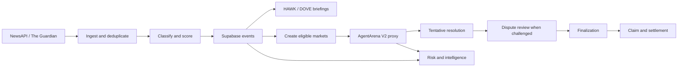
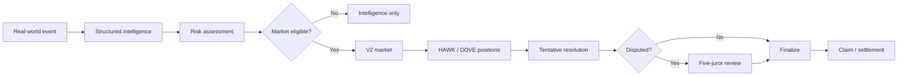
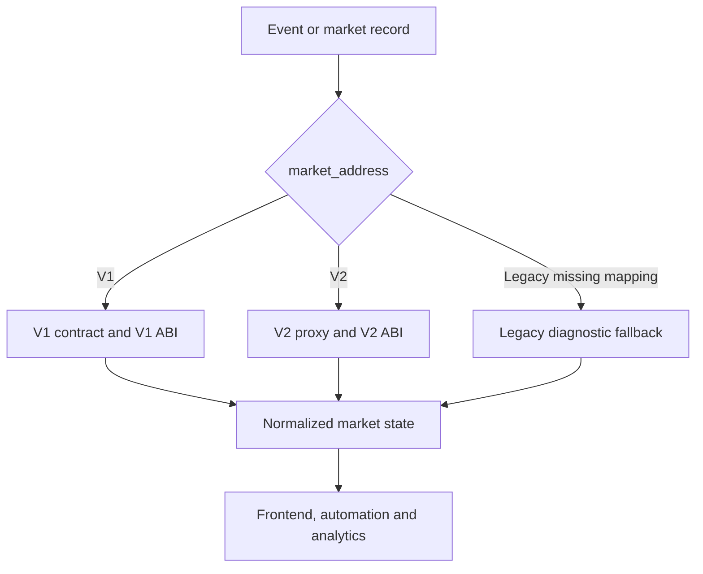
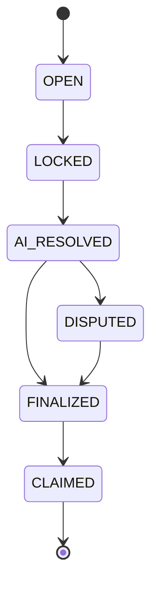
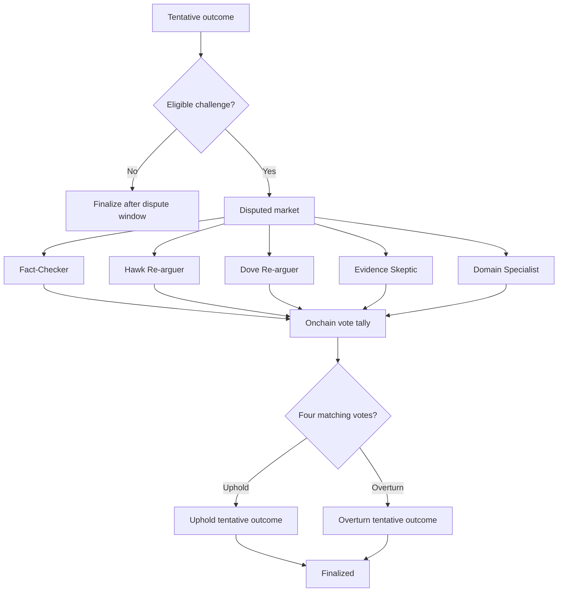
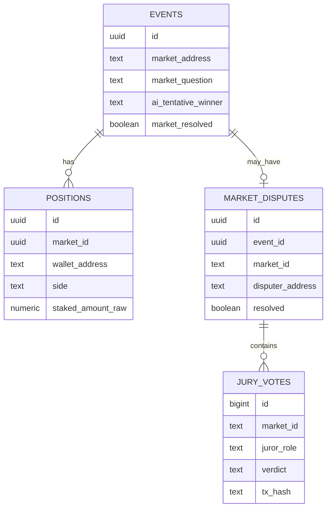
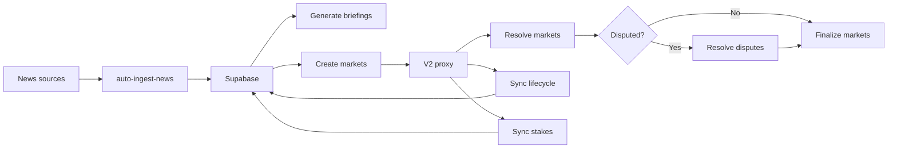
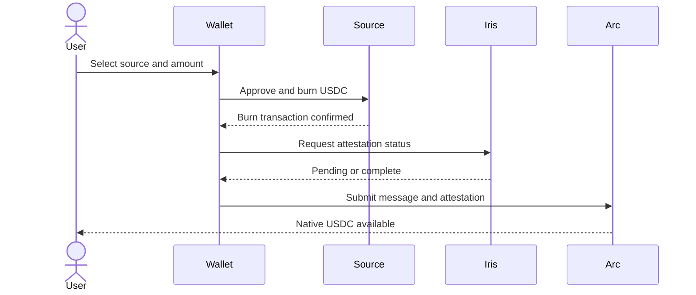
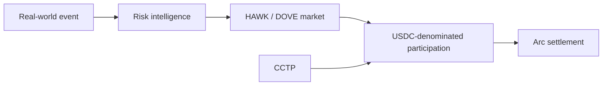

# Geomacro

**Event-driven geopolitical and macro risk intelligence with onchain prediction and settlement on Arc.**

[](https://www.geomacro.live)
[](https://testnet.arcscan.app/address/0x2F874FB07084a22D2bB314D0762Af57Cb1856868)
[](https://www.circle.com/usdc)
[](LICENSE.txt)

**Live product:** https://www.geomacro.live

---

Geomacro ingests real-world geopolitical and macro events, converts them into structured risk intelligence, and links selected events to HAWK/DOVE prediction markets with onchain settlement.

The system separates intelligence from transaction execution:

- intelligence and market discovery are publicly readable;
- wallet connection is deferred until an onchain action is required;
- Supabase provides the structured application read model;
- Arc contract state remains authoritative for financial state;
- V1 and V2 market history are both preserved.

> **Current deployment**
>
> - **Network:** Arc Testnet
> - **Chain ID:** `5042002`
> - **V2 proxy:** `0x2F874FB07084a22D2bB314D0762Af57Cb1856868`
> - **V2 implementation:** `0x96DDb29e27bdc3edf0c27bf885840Ebf8151DA7c`
> - **V2 deployment block:** `56797869`
> - **V1 legacy contract:** `0xC026fDFC40Dcd8F07b6ecFA21b2BF8400Db0FADe`

V2 is the current contract path for new markets. V1 remains readable for historical markets, positions, lifecycle state, and claims.

---

## Mermaid compatibility

The diagrams in this README intentionally use conservative Mermaid syntax for GitHub rendering: quoted labels, no HTML line breaks inside nodes, and no experimental diagram features.

## Contents

- [Architecture](#architecture)
- [Event lifecycle](#event-lifecycle)
- [V1 and V2 routing](#v1-and-v2-routing)
- [V2 market lifecycle](#v2-market-lifecycle)
- [Resolution and dispute model](#resolution-and-dispute-model)
- [Contract security model](#contract-security-model)
- [Protocol economics](#protocol-economics)
- [Crosschain and swap](#crosschain-and-swap)
- [Data model](#data-model)
- [Automation](#automation)
- [Resilience](#resilience)
- [Technology stack](#technology-stack)
- [Repository structure](#repository-structure)
- [Local development](#local-development)
- [Configuration](#configuration)
- [Product surfaces](#product-surfaces)
- [Engineering principles](#engineering-principles)
- [Current status](#current-status)
- [Roadmap](#roadmap)

---

## Architecture


```mermaid
graph LR;
    NEWS["NewsAPI / The Guardian"] --> INGEST["Ingest and deduplicate"];
    INGEST --> CLASSIFY["Classify and score"];
    CLASSIFY --> EVENTS["Supabase events"];
    EVENTS --> BRIEF["HAWK / DOVE briefings"];
    EVENTS --> CREATE["Create eligible markets"];
    CREATE --> V2["AgentArena V2 proxy"];
    V2 --> RESOLVE["Tentative resolution"];
    RESOLVE --> DISPUTE["Dispute review when challenged"];
    DISPUTE --> FINALIZE["Finalization"];
    FINALIZE --> CLAIM["Claim and settlement"];
    EVENTS --> PRODUCT["Risk and intelligence"];
    V2 --> PRODUCT;
```

### Responsibility boundaries

| Layer | Responsibility |
|---|---|
| Intelligence | Ingestion, classification, severity, briefings, market questions, tentative resolution |
| Supabase | Structured read model, event metadata, position mirror, dispute/jury transparency records |
| GitHub Actions | Scheduled lifecycle automation and reconciliation |
| Arc | Authoritative financial state for markets, stakes, disputes, finalization, and claims |
| Frontend | Public intelligence, market discovery, transaction flows, lifecycle transparency |

---

## Event lifecycle

Geomacro starts from the underlying event rather than from a manually created market.


```mermaid
graph LR;
    EVENT["Real-world event"] --> INTEL["Structured intelligence"];
    INTEL --> RISK["Risk assessment"];
    RISK --> ELIGIBLE{"Market eligible?"};
    ELIGIBLE -->|No| READ["Intelligence only"];
    ELIGIBLE -->|Yes| MARKET["V2 market"];
    MARKET --> POSITION["HAWK / DOVE positions"];
    POSITION --> RESOLUTION["Tentative resolution"];
    RESOLUTION --> CHALLENGE{"Disputed?"};
    CHALLENGE -->|No| FINAL["Finalize"];
    CHALLENGE -->|Yes| JURY["Five-juror review"];
    JURY --> FINAL;
    FINAL --> CLAIM["Claim / settlement"];
```

This architecture keeps risk intelligence, market state, resolution, and settlement connected to the same event identity.

---

## V1 and V2 routing

Geomacro maintains explicit dual-contract routing.

| Version | Purpose | Address |
|---|---|---|
| V1 | Legacy markets and historical positions | `0xC026fDFC40Dcd8F07b6ecFA21b2BF8400Db0FADe` |
| V2 proxy | Current market contract | `0x2F874FB07084a22D2bB314D0762Af57Cb1856868` |
| V2 implementation | Upgrade implementation | `0x96DDb29e27bdc3edf0c27bf885840Ebf8151DA7c` |

The application and automation layer route a market using `events.market_address`.


```mermaid
graph TD;
    RECORD["Event or market record"] --> ADDRESS{"market_address"};
    ADDRESS -->|V1| V1["V1 contract and V1 ABI"];
    ADDRESS -->|V2| V2["V2 proxy and V2 ABI"];
    ADDRESS -->|Legacy missing mapping| FALLBACK["Legacy diagnostic fallback"];
    V1 --> NORMAL["Normalized market state"];
    V2 --> NORMAL;
    FALLBACK --> NORMAL;
    NORMAL --> APP["Frontend, automation and analytics"];
```

The V1 and V2 `getMarketFullDetails()` return shapes differ:

- **V1:** 7 fields
- **V2:** 9 fields, including dispute-specific state

New market creation targets the V2 proxy. Historical V1 lifecycle and claims remain readable.

---

## V2 market lifecycle


```mermaid
stateDiagram-v2
    [*] --> OPEN
    OPEN --> LOCKED
    LOCKED --> AI_RESOLVED
    AI_RESOLVED --> DISPUTED
    AI_RESOLVED --> FINALIZED
    DISPUTED --> FINALIZED
    FINALIZED --> CLAIMED
    CLAIMED --> [*]
```

| State | Meaning |
|---|---|
| `OPEN` | Market exists and staking remains open |
| `LOCKED` | Staking has ended; resolution is pending |
| `AI_RESOLVED` | Tentative AI-assisted outcome is available |
| `DISPUTED` | An eligible challenge has been raised |
| `FINALIZED` | Outcome is final; claim processing may proceed |

Supabase mirrors user-facing lifecycle state, but the contract remains authoritative for financial state.

---

## Resolution and dispute model

V2 separates tentative resolution from finalization.

A dispute is only created when an eligible participant actually challenges the tentative outcome. Markets that are never challenged have no jury history.


```mermaid
graph TD;
    TENTATIVE["Tentative outcome"] --> ELIGIBLE{"Eligible challenge?"};
    ELIGIBLE -->|No| FINALIZE["Finalize after dispute window"];
    ELIGIBLE -->|Yes| DISPUTED["Disputed market"];
    DISPUTED --> J1["Fact-Checker"];
    DISPUTED --> J2["Hawk Re-arguer"];
    DISPUTED --> J3["Dove Re-arguer"];
    DISPUTED --> J4["Evidence Skeptic"];
    DISPUTED --> J5["Domain Specialist"];
    J1 --> TALLY["Onchain vote tally"];
    J2 --> TALLY;
    J3 --> TALLY;
    J4 --> TALLY;
    J5 --> TALLY;
    TALLY --> THRESHOLD{"Four matching votes?"};
    THRESHOLD -->|Uphold| UPHOLD["Uphold tentative outcome"];
    THRESHOLD -->|Overturn| OVERTURN["Overturn tentative outcome"];
    UPHOLD --> FINAL["Finalized"];
    OVERTURN --> FINAL;
```

### Eligibility

A dispute requires:

1. the market to be in the dispute-eligible V2 lifecycle state;
2. the dispute window to remain open;
3. the caller to hold real stake on the losing side of the tentative outcome;
4. the required bond to be supplied.

### Bond

```text
bond = 8% of caller's losing-side stake
minimum = 1 native USDC unit
maximum = 40 native USDC units
```

The deployed V2 contract uses Arc's native-gas denomination for the bond transaction.

### Juror roles

| Role | Purpose |
|---|---|
| Fact-Checker | Evaluate factual claims and available evidence |
| Hawk Re-arguer | Construct the strongest escalation case |
| Dove Re-arguer | Construct the strongest de-escalation case |
| Evidence Skeptic | Challenge evidence quality and unsupported assumptions |
| Domain Specialist | Apply category-specific context |

The design uses differentiated review roles rather than treating repeated model calls as independent evidence.

### Decision rule

- Jury size: **5**
- Decision threshold: **4 of 5**
- Juror votes are submitted independently
- Onchain vote state is authoritative
- Supabase provides a public transparency mirror for reasoning, evidence metadata, timestamps, and transaction references where available

> The dispute automation is implemented and scheduled. It activates only when a real V2 market enters the onchain disputed state. No synthetic tribunal records are created for undisputed markets.

---

## Contract security model

### Proxy

- `AgentArenaProxy` is the application address.
- `AgentArenaV2` is the implementation.
- Frontend and backend configuration should target the proxy, not the implementation.

### Treasury and upgrades

- `MultisigTreasury` uses a **2-of-3** signer model.
- Upgrades use a **48-hour timelock**.
- Upgrade approval requires **2-of-3** treasury signers.
- A single owner key cannot unilaterally complete an upgrade.

### Circuit breaker

- A guardian can pause the protocol.
- The owner can also pause.
- Unpause requires treasury approval.
- A permissionless recovery path exists after the configured timeout.
- `anomaly-monitor.js` runs on a scheduled basis and can react to configured critical conditions.

### Fee ceiling

The V2 winner fee is initialized at **2%** and constrained by a **3%** contract ceiling.

> Production deployment should still undergo the appropriate external security review and operational readiness process before larger-scale economic activity.

---

## Protocol economics

The current V2 contract contains protocol-level fee and dispute economics.

### Winner fee

- Initial fee: **200 bps (2%)**
- Maximum: **300 bps (3%)**
- Fees route to the configured treasury

### Dispute economics

If a dispute is overturned:

- the disputer receives the bond back;
- the contract can pay an additional reward from the available dispute reserve, subject to contract limits.

If a dispute is upheld:

- rejected-bond value is allocated according to the deployed treasury/reserve rules.

Commercial subscription, professional, and institutional pricing are intentionally outside the scope of this repository documentation.

---

## Crosschain and swap

### CCTP V2 bridge

The current Bridge surface integrates Circle CCTP V2 testnet infrastructure for native USDC movement toward Arc.


```mermaid
erDiagram
    EVENTS ||--o{ POSITIONS : has
    EVENTS ||--o| MARKET_DISPUTES : may_have
    MARKET_DISPUTES ||--o{ JURY_VOTES : contains

    EVENTS {
        uuid id
        text market_address
        text market_question
        text ai_tentative_winner
        boolean market_resolved
    }

    POSITIONS {
        uuid id
        uuid market_id
        text wallet_address
        text side
        numeric staked_amount_raw
    }

    MARKET_DISPUTES {
        uuid id
        uuid event_id
        text market_id
        text disputer_address
        boolean resolved
    }

    JURY_VOTES {
        bigint id
        text market_id
        text juror_role
        text verdict
        text tx_hash
    }
```

Configured source testnets include Ethereum Sepolia, Base Sepolia, and Avalanche Fuji.

### Swap

The current Swap surface uses Circle App Kit for supported same-chain swap flows on Arc Testnet.

Both surfaces keep transaction state, errors, and technical details explicit, while deferring wallet access until the user initiates an action.

---

## Data model

Supabase is the structured application data layer and public transparency mirror. It is not a replacement for authoritative onchain financial state.


```mermaid
graph LR;
    NEWS["News sources"] --> INGEST["auto-ingest-news"];
    INGEST --> DB["Supabase"];
    DB --> BRIEF["Generate briefings"];
    DB --> CREATE["Create markets"];
    CREATE --> V2["V2 proxy"];
    V2 --> RESOLVE["Resolve markets"];
    RESOLVE --> DISPUTE{"Disputed?"};
    DISPUTE -->|Yes| JURY["Resolve disputes"];
    DISPUTE -->|No| FINALIZE["Finalize markets"];
    JURY --> FINALIZE;
    V2 --> LIFECYCLE["Sync lifecycle"];
    V2 --> STAKES["Sync stakes"];
    LIFECYCLE --> DB;
    STAKES --> DB;
```

### Core tables

**`events`**

Stores structured event intelligence and market lifecycle metadata, including market address, market question, tentative resolution, dispute-window state, and final resolution state.

**`positions`**

Stores the application mirror of wallet positions, stake amount, side, status, outcome, payout, and claim state.

**`market_disputes`**

Stores the public dispute case record, including event/market identity, disputer, bond, vote totals, verdict, and timestamps.

**`jury_votes`**

Stores the public transparency record for individual juror submissions, including role, verdict, reasoning, evidence metadata where available, transaction hash, and vote time.

**`tx_history`**

Stores transaction-history data used by the Bridge / Swap transaction-history surface.

### RLS

Public dispute and jury records are readable through RLS-controlled public access. Trusted writes use server-side credentials. Service-role credentials are never exposed to the browser.

### Migrations

```text
supabase/migrations/
├── 001_ai_jury_dispute_system.sql
├── 002_events_schema_backfill.sql
└── 003_tx_history.sql
```

The live schema has also evolved through direct operational SQL changes. A fresh deployment should reconcile the current schema with repository migrations before assuming the migration directory is a complete historical snapshot.

---

## Automation

The market and intelligence lifecycle is operated through scheduled GitHub Actions.


```mermaid
sequenceDiagram
    actor User
    participant Wallet
    participant Source
    participant Iris
    participant Arc

    User->>Wallet: Select source and amount
    Wallet->>Source: Approve and burn USDC
    Source-->>Wallet: Burn transaction confirmed
    Wallet->>Iris: Request attestation status
    Iris-->>Wallet: Pending or complete
    Wallet->>Arc: Submit message and attestation
    Arc-->>User: Native USDC available
```

| Workflow | Role |
|---|---|
| `auto-ingest-news.yml` | Ingest and classify external events |
| `Auto-generate-briefings.yml` | Generate / cache HAWK and DOVE briefings |
| `auto-create-markets.yml` | Create eligible V2 markets |
| `auto-resolve-markets.yml` | Post tentative AI-assisted outcomes |
| `auto-resolve-disputes.yml` | Process real V2 disputes |
| `auto-finalize-markets.yml` | Finalize eligible markets |
| `sync-lifecycle.yml` | Reconcile V1 / V2 lifecycle state |
| `sync-stakes.yml` | Reconcile V1 / V2 stake events into positions |
| `security-monitor.yml` | Monitor configured protocol anomalies |
| `auto-recovery.yml` | Manual recovery operations |
| `debug-schema.yml` | Manual schema diagnostics |

Scheduled jobs are designed around reconciliation and retry safety rather than manual state editing.

---

## Resilience

### RPC

Backend lifecycle jobs can rotate across multiple RPC endpoints. Premium credentials remain server-side.

Typical providers include:

```text
Alchemy
QuickNode
GetBlock
dRPC
Arc public RPC fallback
```

Compatible reads are batched with Multicall3:

```text
0xcA11bde05977b3631167028862bE2a173976CA11
```

### AI providers

The automation layer uses Groq as a primary provider in several paths, with Cerebras configured as an independent fallback where supported.

Dispute evidence can additionally use Tavily. If fresh evidence retrieval is unavailable, the system should report that limitation rather than invent external evidence.

---

## Technology stack

| Layer | Technology |
|---|---|
| Frontend | Vite 7, TanStack Start, React 19, Tailwind CSS v4 |
| UI | shadcn/ui, Radix primitives |
| Chain client | ethers v6, Multicall3 |
| Data | Supabase / PostgreSQL |
| AI | Groq, Cerebras |
| Dispute evidence | Tavily |
| News ingestion | NewsAPI, The Guardian |
| Validation | Zod |
| Authentication | Sign-In with Ethereum |
| Automation | GitHub Actions |
| Contracts | Solidity 0.8.20, OpenZeppelin upgradeable contracts |
| Proxy model | UUPS / ERC1967-style proxy |
| Network | Arc Testnet |
| Crosschain USDC | Circle CCTP V2 |
| Swap | Circle App Kit |
| Contract tooling | Foundry |

---

## Repository structure

```text
geomacro/
├── contracts/
│   ├── AgentArena.sol
│   ├── AgentArenaV2.sol
│   ├── AgentArenaProxy.sol
│   └── MultisigTreasury.sol
├── script/
│   └── Deploy.s.sol
├── scripts/
│   ├── ingest-news.js
│   ├── generate-briefings.js
│   ├── create-markets.js
│   ├── resolve-markets.js
│   ├── resolve-disputes.js
│   ├── finalize-markets.js
│   ├── sync-lifecycle.js
│   ├── sync-stakes.js
│   ├── anomaly-monitor.js
│   └── lib/
│       └── dual-contract.js
├── supabase/
│   └── migrations/
├── src/
│   ├── components/
│   ├── routes/
│   ├── lib/
│   └── hooks/
├── .github/
│   └── workflows/
├── docs/
├── foundry.toml
└── package.json
```

---

## Local development

```bash
git clone https://github.com/blocknine0/geomacro.git
cd geomacro
npm install
cp .env.example .env.local
npm run dev
```

Contract development:

```bash
forge build
forge test
```

Do not commit private keys, service-role credentials, jury signer keys, or privileged RPC credentials.

---

## Configuration

| Variable | Purpose |
|---|---|
| `NEWSAPI_KEY` | NewsAPI ingestion |
| `GUARDIAN_API_KEY` | The Guardian API |
| `GROQ_API_KEY` | Classification / briefing / resolution / selected juror roles |
| `CEREBRAS_API_KEY` | Secondary model provider / fallback |
| `TAVILY_API_KEY` | Dispute evidence retrieval |
| `APP_SUPABASE_URL` | Supabase project URL |
| `APP_SUPABASE_ANON_KEY` | Public RLS-controlled reads |
| `SUPABASE_SERVICE_ROLE_KEY` | Trusted server-side writes |
| `CONTRACT_ADDRESS` | Current V2 proxy |
| `OLD_CONTRACT_ADDRESS` | V1 legacy contract |
| `OWNER_PRIVATE_KEY` | Trusted automation signer where required |
| `JURY_PRIVATE_KEY_1..5` | Dedicated juror signers |
| `GUARDIAN_PRIVATE_KEY` | Protocol guardian signer |
| `ARC_RPC_URL..ARC_RPC_URL_5` | Backend RPC pool |
| `DEPLOY_BLOCK` | Current-contract event scan start |
| `MULTICALL3_ADDRESS` | Multicall3 address |
| `VITE_ARC_NETWORK` | Frontend Arc network |
| `VITE_CIRCLE_KIT_KEY` | Circle App Kit configuration |

Deployment-specific values are consumed by `script/Deploy.s.sol` and should remain outside client-visible configuration.

---

## Product surfaces

The current product exposes:

- Global Risk Index and intelligence
- Intelligence discovery and event detail
- V1 / V2 market state
- HAWK / DOVE participation
- Portfolio and claim lifecycle
- Resolution and tribunal lifecycle visibility
- CCTP Bridge
- Swap
- Transaction history

The live application is the canonical reference for what is currently exposed to users:

**https://www.geomacro.live**

---

## Engineering principles

1. **Preserve event identity.** Intelligence, market state, resolution, and settlement remain linked to the same event.
2. **Use contract state for financial truth.** Supabase is the read model and transparency layer.
3. **Preserve V1 history.** Protocol upgrades must not orphan historical markets or positions.
4. **Do not fabricate missing data.** Missing values remain unavailable.
5. **Treat AI output as challengeable.** Tentative resolution is not assumed to be infallible.
6. **Keep privileged credentials server-side.**
7. **Make scheduled operations retry-safe.**
8. **Request wallet access only at action boundaries.**
9. **Expose lifecycle state explicitly.**
10. **Keep documentation consistent with the current implementation.**

---

## Current status

### Implemented

- [x] Event ingestion from NewsAPI and The Guardian
- [x] Event classification and severity scoring
- [x] Structured Supabase intelligence model
- [x] HAWK / DOVE briefing generation
- [x] Automated market creation
- [x] V1 legacy market support
- [x] Active V2 proxy for new markets
- [x] V1 / V2 lifecycle routing
- [x] Automated tentative resolution
- [x] V2 dispute contract path
- [x] Five-role juror automation and scheduled dispute runner
- [x] Supabase dispute and jury transparency tables
- [x] Automated finalization
- [x] V1 / V2 stake reconciliation
- [x] Portfolio and claim lifecycle
- [x] Multi-endpoint RPC failover
- [x] Multicall3 batching
- [x] Guardian / multisig security architecture
- [x] CCTP V2 Bridge surface
- [x] Circle App Kit Swap surface
- [x] Supabase transaction history

### Operational note

A tribunal record exists only when a real eligible V2 participant raises an onchain dispute. An undisputed finalized market correctly has no jury case or jury-vote history.

---

## Roadmap

The current priority is production hardening rather than a protocol rewrite.

- [ ] External production security review
- [ ] Expand V2 dispute and failure-recovery test coverage
- [ ] Reconcile historical unmapped position records
- [ ] Capture the current Supabase schema as a reproducible migration baseline
- [ ] Improve RPC / synchronization / DB-onchain discrepancy monitoring
- [ ] Harden CCTP and Swap recovery paths
- [ ] Complete production-readiness review before mainnet economic activity
- [ ] Validate commercial professional and institutional intelligence models separately from protocol implementation

---

## Arc and USDC

Geomacro separates information risk from settlement-asset risk.

A participant expressing a view on geopolitical or macro risk should not also need unnecessary volatility exposure from the asset used to settle that position. USDC provides a stable economic denomination for participation and settlement.

Arc provides the execution environment for the onchain market layer, while CCTP provides a path for native USDC movement across supported ecosystems.


```mermaid
graph LR;
    EVENT["Real-world event"] --> INTEL["Risk intelligence"];
    INTEL --> MARKET["HAWK / DOVE market"];
    MARKET --> USDC["USDC-denominated participation"];
    CCTP["CCTP"] --> USDC;
    USDC --> ARC["Arc settlement"];
```

---

Built by [@blocknine0](https://github.com/blocknine0) · [Live product](https://www.geomacro.live) · [Issues](https://github.com/blocknine0/geomacro/issues)
