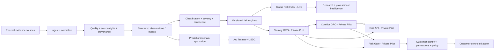
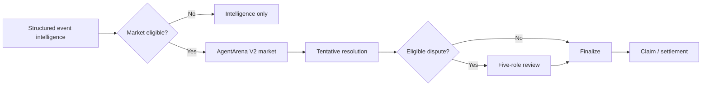

# Geomacro

**Geopolitical and macro risk intelligence for human and machine decisions.**

[](https://www.geomacro.live)
[](https://testnet.arcscan.app/address/0x2F874FB07084a22D2bB314D0762Af57Cb1856868)
[](https://www.circle.com/usdc)
[](LICENSE.txt)

**Live product:** https://www.geomacro.live

---

Geomacro converts real-world geopolitical, macroeconomic and critical-mineral developments into structured, explainable and machine-readable risk intelligence.

The core product is the **intelligence and decision-context layer**:

```text
real-world evidence
        ↓
structured observations
        ↓
classification + provenance
        ↓
risk calculation + attribution
        ↓
Global Risk Index / subject-specific Risk Objects
        ↓
research / API / Risk Gate / customer decision systems
```

Prediction markets, USDC settlement, Circle CCTP and swap flows remain working application and technical-proof layers. They are not the primary company identity.

Geomacro is currently a **live, pre-revenue product with Private Pilot institutional infrastructure**. Risk API and Risk Gate must not be described as generally available production services until the documented security, source-rights, operational and customer-validation gates are completed.

## Current product status

| Product layer | Status | Current scope |
|---|---|---|
| Public risk intelligence | Live | Event intelligence, source context, Global Risk Index and research surfaces |
| Global Risk Index | Live | Deterministic `gri-v1.2.0` publication with versioned proof and attribution |
| Ask Geomacro | Live | Interactive intelligence surface grounded in Geomacro context |
| Country Risk Object | Private Pilot | Versioned, persisted and cryptographically signed country risk context |
| Corridor Risk Object | Private Pilot | Directional endpoint-composed corridor pilot built from signed country Risk Objects |
| Risk API | Private Pilot | Authenticated machine-readable country/corridor risk delivery |
| Risk Gate | Private Pilot | Fail-closed pre-flight policy evaluation with immutable audit records |
| Event Risk Object | Product direction | Not represented as a current production contract |
| Prediction/onchain markets | Secondary application | Arc Testnet market, dispute, claim and settlement implementation |
| CCTP / Swap | Secondary technical layer | Circle CCTP V2 and Circle App Kit testnet implementation |

Pricing is intentionally not hard-coded into the repository before pilot packaging and customer validation are complete.

---

## Product principles

1. **Explain the risk, not only the score.** Risk outputs should expose evidence, confidence, freshness, methodology and change attribution.
2. **Keep machine outputs verifiable.** Versioned schemas, hashes, provenance and signatures are part of the decision-context contract.
3. **Separate risk from customer policy.** Geomacro supplies external risk context. The customer controls identity, permissions, policy and execution.
4. **Fail closed on uncertainty.** Stale, expired, unverifiable or commercially ineligible context must never silently become a trusted `CONTINUE` decision.
5. **Preserve source rights.** Public availability is not equivalent to commercial reuse permission.
6. **Treat Arc/Circle as execution and technical rails, not the company definition.** The intelligence layer is designed to stand on its own.
7. **Keep deployed truth distinct from roadmap intent.** Private Pilot, planned and live capabilities are labelled separately.

---

## Current deployment

### Arc Testnet market layer

- **Network:** Arc Testnet
- **Chain ID:** `5042002`
- **V2 proxy:** `0x2F874FB07084a22D2bB314D0762Af57Cb1856868`
- **V2 implementation:** `0x96DDb29e27bdc3edf0c27bf885840Ebf8151DA7c`
- **V2 deployment block:** `56797869`
- **V1 legacy contract:** `0xC026fDFC40Dcd8F07b6ecFA21b2BF8400Db0FADe`

V2 is the current path for new markets. V1 remains supported for historical markets, positions, claims, reconciliation and backward compatibility.

Arc contract state is authoritative for financial state in the onchain application layer. Supabase is the structured application read model and intelligence persistence layer.

---

## Architecture

### Intelligence-first architecture


```mermaid
graph LR;
    SOURCES["External evidence sources"] --> INGEST["Ingest + normalize"];
    INGEST --> PROV["Quality + source-rights + provenance"];
    PROV --> STRUCT["Structured observations / events"];
    STRUCT --> CLASSIFY["Classification + severity + confidence"];
    CLASSIFY --> RISK["Versioned risk engines"];

    RISK --> GRI["Global Risk Index - Live"];
    RISK --> COUNTRY["Country GRO - Private Pilot"];
    COUNTRY --> CORRIDOR["Corridor GRO - Private Pilot"];

    GRI --> HUMAN["Research + professional intelligence"];
    COUNTRY --> API["Risk API - Private Pilot"];
    CORRIDOR --> API;
    COUNTRY --> GATE["Risk Gate - Private Pilot"];
    CORRIDOR --> GATE;

    GATE --> POLICY["Customer identity + permissions + policy"];
    POLICY --> ACTION["Customer-controlled action"];

    STRUCT --> MARKET["Prediction/onchain application"];
    MARKET --> ARC["Arc Testnet + USDC"];
```

### Responsibility boundaries

| Layer | Responsibility |
|---|---|
| Evidence/data | Source acquisition, provenance, quality and commercial-eligibility metadata |
| Intelligence | Event structuring, classification, severity, confidence, historical context and attribution |
| GRI | Global three-domain deterministic risk aggregation and proof |
| Risk Objects | Subject-specific machine-readable risk context |
| Risk Gate | Risk verification plus customer-supplied policy evaluation, never execution authorization |
| Supabase | Structured read model, risk/audit persistence and application transparency |
| Arc | Authoritative financial state for the secondary onchain market layer |
| GitHub Actions | Scheduled ingestion, calculation, reconciliation, monitoring and lifecycle automation |
| Frontend/API | Human and machine delivery surfaces |

---

## Global Risk Index

### Current public contract

- **Methodology:** `gri-v1.2.0`
- **Proof envelope:** `gri-proof-v1.2.0`
- **Classifier:** `event-severity-v1.0.5`
- **Story correlation:** `story-correlation-v1.0.0`
- **Lookback:** 72 hours
- **Recency half-life:** 24 hours
- **Maximum public snapshot age:** 3 hours

The canonical code contract is `src/lib/gri-current-contract.ts`. Current compute, verify and validation commands route to the v1.2 stack.

### Three current scoring domains

GRI v1.2 uses three equal-base-weight domains:

- geopolitics `1/3`
- macro `1/3`
- rare earth / critical minerals `1/3`

Crypto data can exist elsewhere in Geomacro, but crypto is **not a current GRI v1.2 scoring domain**.

Missing domains are excluded rather than converted to zero risk. Active weights are renormalized and coverage is disclosed separately.

### Evidence weighting

For eligible observation `i`:

```text
ageHours_i       = (asOf - observedAt_i) / 1 hour
confidenceWeight = confidence_i / 100
decayWeight      = 2 ^ (-ageHours_i / 24)
rawWeight_i      = confidenceWeight * decayWeight
```

GRI then applies:

1. a per-source evidence cap so one publisher cannot dominate through volume;
2. a story-level cap so repetition of the same underlying development across publishers cannot multiply that development into several independent evidence budgets;
3. a weighted category score;
4. normalized active-category weights;
5. exact event contribution accounting.

```text
GRI_raw     = Σ(normalized active-category weight × categoryScore)
GRI_display = round(GRI_raw)
```

### Change attribution and proof

Every published snapshot persists versioned calculation/proof data. The contribution ledger is designed to reconcile the published raw score and the change from the previous comparable snapshot.

```text
GRI_change = Σ(current event contribution - previous event contribution)
```

Change records distinguish added, removed, rescored and reweighted effects. Source/story concentration changes can alter contribution even when event severity is unchanged.

Historical v1.0 and v1.1 implementations remain in explicitly versioned paths for reproducibility and compatibility. They are not the current public publication contract.

See:

- [`docs/GRI_METHODOLOGY.md`](docs/GRI_METHODOLOGY.md)
- [`docs/GRI_ARCHITECTURE.md`](docs/GRI_ARCHITECTURE.md)
- [`docs/GRI_TRANSPARENCY_REQUIREMENTS.md`](docs/GRI_TRANSPARENCY_REQUIREMENTS.md)

---

## Geomacro Risk Objects

A Geomacro Risk Object, or **GRO**, is the machine-readable subject-specific risk primitive used by the Private Pilot architecture.

A GRO is designed to carry:

- subject identity;
- current and previous risk state;
- delta and attribution;
- confidence;
- evidence summary;
- commercial-eligibility state;
- methodology/schema version;
- generated and expiry timestamps;
- calculation/integrity data;
- issuer signing metadata and signature.

Current GRO schemas and signing contracts are versioned in code. Documentation examples must not override the implemented schema.

### Signing

Current Private Pilot GRO signing uses Ed25519 issuer signatures. The implementation canonicalizes the signable payload, hashes it, signs it server-side and verifies the signature before delivery. Private signing keys must never be committed or exposed to the browser.

Signing implementation is meaningful integrity proof, but it is **not an external security certification**.

---

## Risk Gate

Risk Gate is a **Private Pilot** pre-flight decision-context layer.

The core flow is:

```text
Signed Geomacro Risk Object
        ↓
schema + signature + freshness checks
        ↓
customer identity + permissions + policy
        ↓
CONTINUE / REDUCE_LIMIT / REQUIRE_APPROVAL / PAUSE
        ↓
customer-controlled execution
```

The current Risk Gate contract deliberately returns:

```text
execution_authorized = false
```

Geomacro does not custody funds, sign customer wallet transactions, submit customer trades or replace sanctions/compliance screening.

### Current implemented Private Pilot controls

- authenticated bearer API clients;
- SHA-256 API-key storage rather than plaintext key storage;
- timing-safe hash comparison;
- enabled/disabled client state;
- database-backed request rate limiting;
- explicit JSON and subject validation;
- country and directional corridor requests;
- signed Risk Object verification;
- fail-closed policy evaluation;
- immutable request/response audit records;
- no-store API responses;
- explicit `execution_authorized=false` enforcement.

The external live-preflight boundary is being hardened so callers cannot select arbitrary historical risk state for a current action, malformed/oversized payloads are bounded, and malformed policy contracts fail as client errors rather than becoming ambiguous server failures.

### Country risk

Country Risk Objects are current Private Pilot infrastructure. Country methodology remains explicitly versioned as a pilot until source coverage, methodology validation and design-partner testing support stronger claims.

### Corridor risk

The current corridor implementation is a **directional endpoint-composed pilot**. It composes the origin and destination country Risk Objects under a versioned pilot rule.

It is **not** a full model of:

- maritime paths;
- ports and vessels;
- intermediary jurisdictions;
- counterparty-specific exposure;
- sanctions screening for a particular entity/transaction;
- complete logistics or supply-chain routes.

Those must not be implied until separately implemented and validated.

See [`docs/RISK_GATE.md`](docs/RISK_GATE.md).

---

## Commercial source eligibility

Commercial delivery must use only sources and derived intelligence eligible for the intended use.

Geomacro tracks source/data state separately from intelligence quality because a technically good source can still be commercially restricted.

The intended source-policy decision includes whether a source permits:

- analysis;
- derived intelligence;
- raw storage;
- redistribution;
- customer-facing evidence/citations;
- machine-readable commercial delivery.

A missing commercial status must fail closed. A new source is not considered commercially verified merely because it is public or technically accessible.

The product commercializes structured/derived risk intelligence, not unrestricted copies of third-party raw datasets.

---

## Historical data

Historical research and backfill infrastructure is maintained separately in `blocknine0/geomacro-historical-data`.

The historical repository is used for broader data ingestion, provenance-preserving archives and calibration/research pipelines. Historical replay must distinguish retrospective reconstruction from true historical live/out-of-sample operation.

The main product repository should consume curated historical outputs through explicit interfaces rather than duplicating the Python historical-ingestion architecture.

---

## Secondary prediction and onchain application

Geomacro retains a substantial Arc Testnet prediction/onchain implementation as an application and feedback layer.

### Event-to-market path


```mermaid
graph LR;
    EVENT["Structured event intelligence"] --> ELIGIBLE{"Market eligible?"};
    ELIGIBLE -->|No| INTEL["Intelligence only"];
    ELIGIBLE -->|Yes| MARKET["AgentArena V2 market"];
    MARKET --> RESOLVE["Tentative resolution"];
    RESOLVE --> DISPUTE{"Eligible dispute?"};
    DISPUTE -->|No| FINAL["Finalize"];
    DISPUTE -->|Yes| JURY["Five-role review"];
    JURY --> FINAL;
    FINAL --> CLAIM["Claim / settlement"];
```

### V1/V2 routing

| Version | Purpose | Address |
|---|---|---|
| V1 | Legacy markets, historical positions and claims | `0xC026fDFC40Dcd8F07b6ecFA21b2BF8400Db0FADe` |
| V2 proxy | Current market contract | `0x2F874FB07084a22D2bB314D0762Af57Cb1856868` |
| V2 implementation | Current implementation | `0x96DDb29e27bdc3edf0c27bf885840Ebf8151DA7c` |

Application and automation route each market using its associated `market_address`. New creation targets V2 while legacy V1 history remains readable and claimable.

### Disputes

V2 separates tentative AI-assisted resolution from finalization. A dispute exists only when an eligible participant actually challenges a tentative result.

Current design:

- jury size: 5;
- supermajority threshold: 4 of 5;
- differentiated roles rather than identical repeated model calls;
- onchain vote state authoritative;
- Supabase used for reasoning/evidence transparency where available.

### V2 security architecture

The current contract source includes:

- UUPS upgradeability;
- 48-hour upgrade timelock;
- multisig-governed upgrade controls;
- guardian emergency-pause support;
- owner pause controls;
- restricted recovery/unpause behavior;
- fixed-odds funded-liquidity support.

External production smart-contract review and full production-readiness testing remain launch requirements before larger-scale economic activity.

### Protocol economics

Current V2 source includes:

- base winner fee initialized at 200 bps with a 300 bps ceiling;
- fixed-odds winner fee of 150 bps on profit;
- default 500 bps losing-stake treasury allocation in the fixed-odds path;
- dispute bond based on losing-side stake with configured floor/cap behavior.

These are protocol/application economics, not Geomacro institutional intelligence pricing.

---

## Circle CCTP and Swap

### CCTP V2

The Bridge surface integrates Circle CCTP V2 testnet infrastructure for native USDC movement toward Arc.

Configured testnet source networks include Ethereum Sepolia, Base Sepolia, Avalanche Fuji, Arbitrum Sepolia, OP Sepolia, Polygon Amoy, Unichain Sepolia and Linea Sepolia.

### Swap

The Swap surface uses Circle App Kit for supported Arc Testnet swap flows.

Current implementation uses Circle App Kit `1.13.0`, `@circle-fin/adapter-ethers-v6` `1.11.1` and ethers `6.17.0` as pinned in `package.json`.

Circle/Arc technology is technical implementation proof and an optional programmable-finance delivery rail. It does not change the core identity of Geomacro as risk intelligence infrastructure.

---

## Data and audit model

Supabase is the structured product read model and trusted persistence layer. Service-role credentials remain server-side.

Important current data families include:

- structured events and evidence;
- GRI snapshots, contributions and proof metadata;
- story-correlation provenance;
- external source registry and commercial-eligibility metadata;
- country intelligence state;
- Geomacro Risk Objects;
- Risk Gate API clients, rate-limit state and immutable audit records;
- prediction-market lifecycle and position mirrors;
- dispute/jury transparency;
- transaction history.

Repository migrations are the deployable schema contract. Do not assume an old short migration list represents the current schema.

---

## Automation

Automation is separated by responsibility so ingestion, calculation, publication, market lifecycle and recovery can retry independently.

Representative workflows include:

- live news ingestion;
- GRI story clustering, validation and publication;
- market creation/resolution/finalization;
- dispute handling;
- stake/lifecycle reconciliation;
- database schema safety checks;
- security monitoring and recovery;
- V2 deployment/upgrade operations;
- historical-data ingestion in the separate repository.

Scheduled operations should be deterministic where practical, observable and retry-safe.

---

## Resilience and security

Current implementation includes meaningful safety architecture but is **not represented as fully audited production infrastructure**.

### Existing controls

- multi-endpoint RPC failover for supported backend operations;
- scheduled reconciliation rather than relying on one receipt poll;
- explicit V1/V2 routing;
- service-role isolation from browser code;
- Risk Object issuer signatures;
- Risk Gate authentication/rate limiting/auditing;
- fail-closed Risk Gate execution boundary;
- GRI freshness and proof validation;
- guardian/multisig/timelock controls in the V2 market layer.

### Required before Institutional Early Access claims

- complete focused security review of externally reachable Risk Gate/API surfaces;
- API-key lifecycle review and rotation/revocation procedure;
- signing-key lifecycle and compromise procedure;
- malformed/oversized/abuse-path tests;
- auth/rate-limit/audit-backend failure tests;
- load and stress/resilience testing;
- documented latency/error/recovery evidence;
- remediation and re-test of critical/high findings;
- commercially eligible source path verified;
- scoped external security review.

Do not use unsupported claims such as "unhackable" or imply third-party certification where none exists.

See [`SECURITY.md`](SECURITY.md).

---

## Technology stack

| Layer | Technology |
|---|---|
| Frontend | Vite 7, TanStack Start, React 19, Tailwind CSS v4 |
| UI | shadcn/ui, Radix primitives |
| Data | Supabase / PostgreSQL |
| Risk/API | TypeScript/Node server modules, deterministic versioned contracts |
| AI | Groq, Cerebras |
| Evidence retrieval | Source-specific pipelines, Tavily in selected dispute flows |
| Chain client | ethers v6, Multicall3 |
| Contracts | Solidity 0.8.20, OpenZeppelin upgradeable contracts |
| Contract tooling | Foundry |
| Network | Arc Testnet |
| Stablecoin/crosschain | Native USDC, Circle CCTP V2 |
| Swap | Circle App Kit |
| Automation | GitHub Actions |
| Runtime | Nitro / Cloudflare-compatible output |

---

## Repository structure

```text
geomacro/
├── contracts/                 # V1/V2 market smart contracts and proxy/treasury code
├── script/                    # Foundry deployment/upgrade scripts
├── test/                      # Solidity tests
├── scripts/                   # ingestion, GRI, risk, lifecycle and ops scripts
├── supabase/migrations/       # versioned database schema
├── src/
│   ├── components/            # product/UI surfaces
│   ├── routes/                # app and API routes
│   ├── lib/                   # GRI, GRO, Risk Gate, data and product logic
│   └── hooks/
├── docs/                      # methodology, architecture and product contracts
├── .github/workflows/         # scheduled and deployment automation
├── SECURITY.md
├── LICENSE.txt
└── package.json
```

`contracts/AgentArenaV2.sol` is the canonical V2 implementation source used by Foundry and deployment/upgrade tooling.

---

## Local development

```bash
git clone https://github.com/blocknine0/geomacro.git
cd geomacro
bun install
cp .env.example .env.local
bun run dev
```

Useful validation commands:

```bash
bun run build
bun run test:app
bun run db:safety
bun run db:verify-core
bun run gri:compute
bun run gri:verify
bun run gri:validate
forge build
forge test
```

Some operational commands require server-side environment variables and should not be run against production infrastructure casually.

Never commit:

- `.env` files containing real values;
- service-role credentials;
- API keys;
- wallet/private keys;
- GRO issuer signing private keys;
- juror/guardian/owner private keys;
- privileged RPC credentials.

---

## Configuration

Representative configuration families include:

| Variable family | Purpose |
|---|---|
| `NEWSAPI_KEY`, `GUARDIAN_API_KEY` | selected live evidence ingestion |
| `GROQ_API_KEY`, `CEREBRAS_API_KEY` | model-backed classification/intelligence workflows |
| `TAVILY_API_KEY` | selected dispute evidence retrieval |
| `APP_SUPABASE_*` | public RLS-controlled application reads |
| `SUPABASE_URL`, `SUPABASE_SERVICE_ROLE_KEY` | trusted server-side data operations |
| GRO signing/verification key configuration | issuer signing and verification-key registry |
| Risk Gate API-client configuration | Private Pilot authentication/rate controls |
| `CONTRACT_ADDRESS`, `OLD_CONTRACT_ADDRESS` | V2/V1 market routing |
| owner/jury/guardian signer variables | privileged onchain automation |
| `ARC_RPC_URL*` | backend Arc RPC pool |
| `VITE_ARC_NETWORK`, `VITE_CIRCLE_KIT_KEY` | client Arc/Circle configuration |

Use `.env.example` as a variable-name template only. Real credentials belong in protected environment/secret stores.

---

## Product surfaces

Current public product direction centers on:

- live Risk Intelligence;
- Global Risk Index;
- GRI proof/change attribution;
- Ask Geomacro;
- research and historical context;
- Risk API and Risk Gate as clearly labelled Private Pilot surfaces;
- institutional use cases and technical documentation.

Prediction/onchain markets, Bridge/Swap, portfolio/claims and legacy contract surfaces remain secondary applications or technical proof and should not displace the primary intelligence identity in commercial navigation or messaging.

The live application remains the canonical user-facing reference:

**https://www.geomacro.live**

---

## Current implementation status

### Intelligence and GRI

- [x] Structured event ingestion/classification foundation
- [x] Severity/confidence and model provenance
- [x] Current public `gri-v1.2.0` three-domain engine
- [x] Source concentration cap
- [x] Story-level concentration cap
- [x] Immutable/versioned GRI proof architecture
- [x] Change-attribution ledger
- [x] Current snapshot verification and validation tooling
- [x] Public GRI/read-model surfaces

### Risk Objects and Risk Gate

- [x] Versioned GRO contract
- [x] Country Risk Object Private Pilot
- [x] Ed25519 signing and verification
- [x] Persisted/read-back Risk Objects
- [x] Directional endpoint-composed corridor Risk Object pilot
- [x] Fail-closed Risk Gate policy engine
- [x] Agent/wallet pre-flight adapter
- [x] Authenticated external country/corridor API foundation
- [x] Database-backed rate limiting
- [x] Immutable Risk Gate audit records
- [x] `execution_authorized=false` boundary
- [ ] Full commercial source-rights verification
- [ ] Independent country/corridor methodology validation
- [ ] Production SLA/operational guarantees
- [ ] Full route/logistics/counterparty corridor model
- [ ] General availability

### Secondary onchain implementation

- [x] V1 legacy market compatibility
- [x] Active V2 proxy for new markets
- [x] V1/V2 routing and reconciliation
- [x] tentative resolution/dispute/finalization/claim lifecycle
- [x] five-role juror architecture
- [x] guardian/multisig/timelock controls
- [x] funded fixed-odds V2 path
- [x] CCTP V2 Bridge surface
- [x] Circle App Kit Swap surface

---

## Commercialization roadmap

The immediate priority is **proof and production hardening, not feature count**.

### P0 source of truth and data rights

- [ ] Finish public/repository current-contract consistency checks
- [ ] Verify every source currently marked commercially `VERIFIED` with evidence-backed policy metadata
- [ ] Keep unverified/restricted data out of paid Risk API/Risk Gate delivery
- [ ] Complete historical-data secret/history review

### P0 Risk Gate security and resilience

- [ ] Complete abuse/error regression tests
- [ ] Review authentication and API-key lifecycle
- [ ] Review issuer signing-key lifecycle
- [ ] Verify audit-backend and dependency-failure behavior
- [ ] Add structured health/dependency visibility
- [ ] Run load/stress/resilience tests
- [ ] Fix and re-test critical/high findings
- [ ] Obtain scoped external security review before Early Access launch claims

### P1 product validation

- [ ] Validate one country/corridor workflow with real design partners
- [ ] Define Institutional Early Access scope, support and permitted-use boundaries
- [ ] Define pilot pricing
- [ ] Collect willingness-to-pay evidence
- [ ] Convert a design partner into a controlled paid pilot

### P1 launch assets

Permanent commercial demo and reusable investor/customer decks should be produced **after** the product/source-of-truth, security evidence and pilot package are stable.

---

## Arc, USDC and programmable finance

Arc and Circle infrastructure remain strategically useful because Geomacro can supply external-world risk context to systems that already have programmable financial execution rails.

The target integration model is:

```text
real-world geopolitical / macro change
        ↓
Geomacro intelligence
        ↓
signed country / corridor Risk Object
        ↓
Risk Gate
        ↓
customer policy
        ↓
customer-controlled USDC / financial action
        ↓
optional Arc / Circle execution rail
```

This is different from making Arc settlement the definition of the company. Geomacro's risk intelligence should remain useful to institutions, professionals and machine systems whether or not a specific customer action ultimately settles on Arc.

The existing prediction-market, CCTP and swap implementations provide concrete programmable-finance technical proof while the commercial product remains intelligence-first.

---

## Intellectual property and security reporting

This repository is governed by the proprietary [`LICENSE.txt`](LICENSE.txt).

Security issues should be reported privately as described in [`SECURITY.md`](SECURITY.md), not through public issues or social media.

---

Built by [@blocknine0](https://github.com/blocknine0) · [Live product](https://www.geomacro.live) · [Issues](https://github.com/blocknine0/geomacro/issues)
