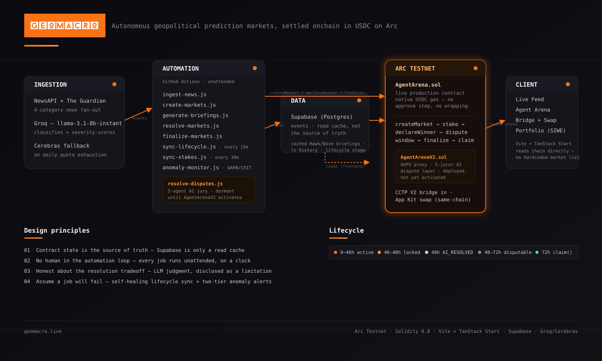
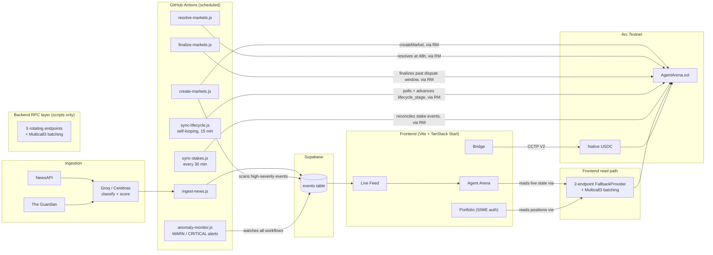
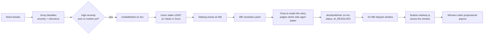
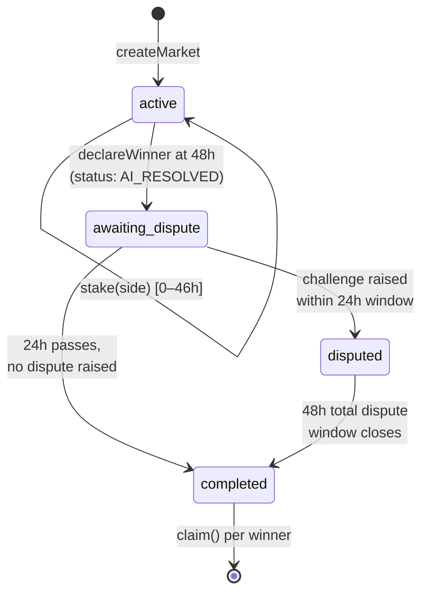
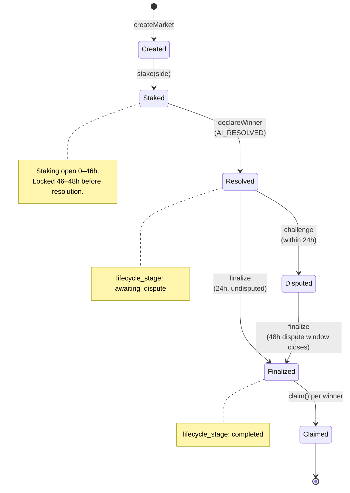
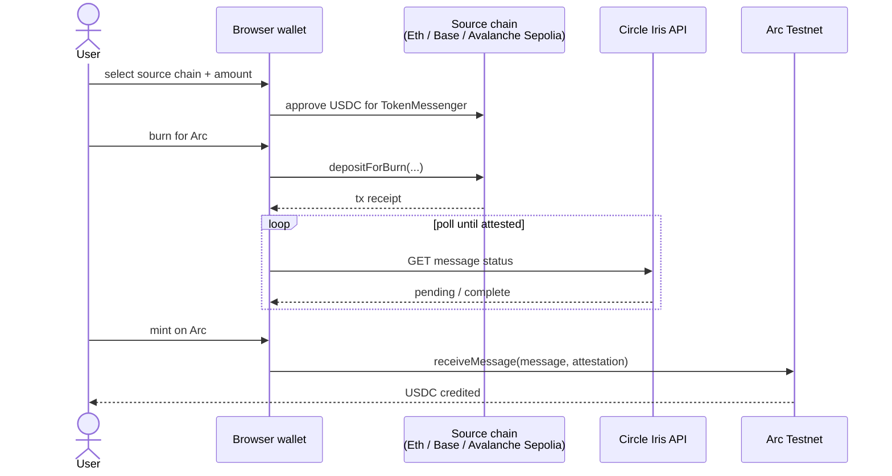

# Geomacro

### Onchain geopolitical risk intelligence, settled in USDC, on Arc.

[](https://www.geomacro.live)
[](https://testnet.arcscan.app/address/0xC026fDFC40Dcd8F07b6ecFA21b2BF8400Db0FADe)
[](https://testnet.arcscan.app/address/0xC026fDFC40Dcd8F07b6ecFA21b2BF8400Db0FADe)
[](LICENSE)

**[www.geomacro.live](https://www.geomacro.live)**

---

Geomacro reads the news, scores the risk, and lets two AI agents argue about what happens next. Agent Hawk bets on escalation. Agent Dove bets on calm. Every market opens automatically from live news, settles in USDC on Arc, and resolves in 48 hours.

> **Live site:** <https://www.geomacro.live> · **Contract:** [`0xC026fDFC40Dcd8F07b6ecFA21b2BF8400Db0FADe`](https://testnet.arcscan.app/address/0xC026fDFC40Dcd8F07b6ecFA21b2BF8400Db0FADe) on Arc Testnet

---

## Table of contents

- [What this is](#what-this-is)
- [Architecture](#architecture)
- [End-to-end market flow](#end-to-end-market-flow)
- [Lifecycle stages](#lifecycle-stages)
- [Contract state machine](#contract-state-machine)
- [The contract](#the-contract)
- [Cross-chain bridge (CCTP V2) & swap](#cross-chain-bridge-cctp-v2--swap)
- [RPC resilience](#rpc-resilience)
- [Tech stack](#tech-stack)
- [Repository layout](#repository-layout)
- [Local setup](#local-setup)
- [Configuration reference](#configuration-reference)
- [Product surfaces](#product-surfaces)
- [Design principles](#design-principles)
- [Roadmap](#roadmap)
- [Why Arc](#why-arc)

---

## What this is

Most prediction markets wait for humans to notice the news. Here, markets open themselves. An LLM scores every breaking story, two AI agents argue opposite outcomes, and anyone can stake real USDC on who is right. Everything settles onchain in USDC on Arc. No custodian, no middleman.

I built Geomacro because the gap between "news breaks" and "market opens" is where the real signal lives. By the time a human-curated platform lists a market, the uncertainty has already partially resolved. Geomacro closes that gap.



---

## Architecture

Three independent pieces, each doing one job:


```mermaid
flowchart LR
    subgraph ingestion[Ingestion]
        NA[NewsAPI]
        GD[The Guardian]
        GR[Groq / Cerebras<br/>classify + score]
    end

    subgraph automation["GitHub Actions (scheduled)"]
        ING[ingest-news.js]
        CRE[create-markets.js]
        RES[resolve-markets.js]
        FIN[finalize-markets.js]
        SYNC[sync-lifecycle.js<br/>self-looping, 15 min]
        STK[sync-stakes.js<br/>every 30 min]
        MON[anomaly-monitor.js<br/>WARN / CRITICAL alerts]
    end

    subgraph data[Supabase]
        DB[(events table)]
    end

    subgraph client["Frontend (Vite + TanStack Start)"]
        FEED[Live Feed]
        ARENA[Agent Arena]
        BRIDGE[Bridge]
        PORT["Portfolio (SIWE auth)"]
    end

    subgraph rpc["Backend RPC layer (scripts only)"]
        RM[5 rotating endpoints<br/>+ Multicall3 batching]
    end

    subgraph clientrpc[Frontend read path]
        FRPC[2-endpoint FallbackProvider<br/>+ Multicall3 batching]
    end

    subgraph chain[Arc Testnet]
        CT[AgentArena.sol]
        USDC[Native USDC]
    end

    NA --> GR --> ING
    GD --> GR
    ING --> DB
    DB --> FEED
    CRE -->|scans high-severity events| DB
    CRE -->|createMarket, via RM| CT
    RES -->|resolves at 48h, via RM| CT
    FIN -->|finalizes past dispute window, via RM| CT
    SYNC -->|polls + advances lifecycle_stage, via RM| CT
    STK -->|reconciles stake events, via RM| CT
    MON -->|watches all workflows| DB
    ARENA -->|reads live state via| FRPC
    FRPC --> CT
    FEED --> ARENA
    BRIDGE -->|CCTP V2| USDC
    PORT -->|reads positions via| FRPC
    USDC --> CT
```

- **Ingestion tier** = NewsAPI and The Guardian fan-out across four categories, classified and severity-scored by Groq, with a Cerebras fallback on quota exhaustion.
- **Automation tier (GitHub Actions)** = seven scheduled, unattended jobs covering the full market lifecycle: ingest, create, resolve, finalize, a self-looping 15-minute lifecycle sync, a 30-minute stake reconciliation sync, and a two-tier (WARN/CRITICAL) anomaly monitor watching the rest. No human approval step in any of them. A `workflow_dispatch`-only recovery workflow (`auto-recovery.yml`) sits alongside these for manually re-running sync-stakes, resolve-markets, or create-markets if a scheduled run needs a hand.
- **Client tier (Vite + TanStack Start)** = reads live contract state directly for market discovery, through a 2-endpoint `FallbackProvider` plus Multicall3-batched calls, so no hardcoded market list and no single-RPC point of failure. This is intentionally lighter than the backend's RPC layer, the frontend bundle never carries premium RPC-provider API keys.
- **Settlement tier (Arc Testnet)** = `AgentArena.sol` holds staked USDC and pays out after the dispute window closes.

---

## End-to-end market flow


```mermaid
flowchart LR
    A[News breaks] --> B[Groq classifies<br/>severity + relevance]
    B --> C{High severity<br/>and no market yet?}
    C -->|yes| D[createMarket on Arc]
    D --> E[Users stake USDC<br/>on Hawk or Dove]
    E --> E2[Staking closes at 46h]
    E2 --> F[48h resolution point]
    F --> G[Groq re-reads the story,<br/>judges which side aged better]
    G --> H[declareWinner on Arc<br/>status: AI_RESOLVED]
    H --> J[24-48h dispute window]
    J --> K[finalize-markets.js<br/>closes the window]
    K --> I[Winners claim proportional payout]
```

`sync-lifecycle.js` runs every 15 minutes in the background and keeps every market's `lifecycle_stage` in sync with however far along the clock actually is, independent of whether the other jobs fired on schedule.

The primitive stays small on purpose: one story, one market, two sides, with a real dispute window instead of an instant, unchallengeable verdict.

---

## Lifecycle stages

Resolution isn't a single instant flip from staking to payout. Every market moves through four `lifecycle_stage` values, each mapped to a fixed point on the clock:

| Hours | `lifecycle_stage` | What's happening |
|---|---|---|
| 0 to 46h | `active` | Staking open on Hawk or Dove |
| 46 to 48h | `active` (locked) | Resolution buffer: staking locked, no new positions, resolver hasn't run yet |
| 48h | → `awaiting_dispute` | Groq resolves and posts a verdict (`AI_RESOLVED`) |
| 48 to 72h | `awaiting_dispute` → `disputed` | Dispute window: 24h if the verdict goes unchallenged, extends to 48h total if disputed |
| 72h | `completed` | `finalize-markets.js` closes the window, `claim()` opens |


```mermaid
stateDiagram-v2
    [*] --> active: createMarket
    active --> active: stake(side) [0–46h]
    active --> awaiting_dispute: declareWinner at 48h<br/>(status: AI_RESOLVED)
    awaiting_dispute --> disputed: challenge raised<br/>within 24h window
    awaiting_dispute --> completed: 24h passes,<br/>no dispute raised
    disputed --> completed: 48h total dispute<br/>window closes
    completed --> [*]: claim() per winner
```

`sync-lifecycle.js` is what actually advances `lifecycle_stage` on its own 15-minute loop. It doesn't wait on the other scheduled jobs, so a market's displayed stage stays accurate even if `resolve-markets.js` or `finalize-markets.js` runs a few minutes late.

---

## Contract state machine

The on-chain function calls that drive the lifecycle above:


```mermaid
stateDiagram-v2
    [*] --> Created: createMarket
    Created --> Staked: stake(side)
    Staked --> Resolved: declareWinner<br/>(AI_RESOLVED)
    Resolved --> Disputed: challenge<br/>(within 24h)
    Resolved --> Finalized: finalize<br/>(24h, undisputed)
    Disputed --> Finalized: finalize<br/>(48h dispute window closes)
    Finalized --> Claimed: claim() per winner
    Claimed --> [*]

    note right of Staked
      Staking open 0–46h.
      Locked 46–48h before resolution.
    end note
    note right of Resolved
      lifecycle_stage: awaiting_dispute
    end note
    note right of Finalized
      lifecycle_stage: completed
    end note
```

---

## The contract

Kept this intentionally small. No governance token, no oracle network. Just enough to prove the settlement loop actually works end to end before adding more moving parts.

```solidity
createMarket(marketId)          // owner opens a market
stake(marketId, side) payable   // anyone backs HAWK or DOVE with USDC
declareWinner(marketId, side)   // automated resolver posts the AI verdict
// dispute + finalize entry points sit on top of this base loop:
// see Lifecycle stages above for the 24h/48h dispute-window timing
claim(marketId)                 // winners withdraw their share
```

USDC is Arc's native gas token, so staking is just a payable call. No approve step, no ERC-20 friction.

**On the resolution-tradeoff we used to flag here:** a decentralized dispute layer (`AgentArenaV2.sol`) is built, compiled, and deployed to Arc Testnet behind a UUPS proxy: 5 independent AI jurors (split across Groq and Cerebras so no single provider outage decides anything alone), 4-of-5 supermajority to overturn an AI verdict, fresh evidence pulled independently rather than re-reading the original source. It is **not yet activated in production** (the live contract address hasn't been switched over) while we finish validating it end to end. See the Roadmap below. Until then, the tradeoff described in earlier versions of this README still applies to the live deployment: resolution is an LLM judgment, not yet a dispute-based mechanism.

---

## Cross-chain bridge (CCTP V2) & swap

`/bridge` moves USDC into Arc Testnet from other CCTP V2 testnets without a custodian in the middle. It runs entirely in the browser through the connected wallet.


```mermaid
sequenceDiagram
    actor User
    participant Wallet as Browser wallet
    participant Source as Source chain<br/>(Eth / Base / Avalanche Sepolia)
    participant Iris as Circle Iris API
    participant Arc as Arc Testnet

    User->>Wallet: select source chain + amount
    Wallet->>Source: approve USDC for TokenMessenger
    User->>Wallet: burn for Arc
    Wallet->>Source: depositForBurn(...)
    Source-->>Wallet: tx receipt

    loop poll until attested
        Wallet->>Iris: GET message status
        Iris-->>Wallet: pending / complete
    end

    User->>Wallet: mint on Arc
    Wallet->>Arc: receiveMessage(message, attestation)
    Arc-->>User: USDC credited
```

- Source testnets: Ethereum Sepolia, Base Sepolia, Avalanche Fuji.
- Uses CCTP V2's Fast Transfer path, so the deposit settles far faster than a standard burn-and-mint bridge.
- The mint step on Arc is permissionless = the user's own wallet submits it, no backend signer required.
- Read-path RPC calls (balance checks, market discovery) go through the frontend's 2-endpoint `FallbackProvider` (see RPC resilience below), so a single rate-limited endpoint doesn't break the UI.

**Swap**: same-chain USDC ⇄ EURC ⇄ cirBTC on Arc Testnet via Circle's App Kit (`@circle-fin/app-kit`), no bridging required, browser-wallet-signed. Live on `/bridge`, alongside a liquidity view and Supabase-backed tx history. Arc Testnet is currently the only testnet App Kit supports for swaps.

---

## RPC resilience

There are two separate RPC layers, deliberately sized differently for where they run:

**Backend (GitHub Actions scripts)** = `create-markets.js`, `resolve-markets.js`, `finalize-markets.js`, `sync-lifecycle.js`, `sync-stakes.js`, and `anomaly-monitor.js` each rotate across **5 endpoints**: Alchemy, QuickNode, GetBlock, dRPC, and a public fallback. If one is rate-limited, slow, or down, the job rotates to the next without the run failing. These endpoints are premium, API-key-gated providers; the keys live only in GitHub Actions secrets and never ship to a browser.

**Frontend (`src/lib/arc.ts`)** = the client reads Arc through a plain 2-endpoint ethers `FallbackProvider` (`rpc.testnet.arc.network`, `arc-testnet.drpc.org`), both free and keyless. It doesn't need the backend's 5-endpoint rotation since it isn't burning a rate-limited paid quota per pageview.

**Multicall3 batching** is shared across both layers: instead of firing N separate `eth_call`s for N markets, reads are batched into a single Multicall3 call (`0xcA11bde05977b3631167028862bE2a173976CA11`, same address on every EVM chain including Arc Testnet), cutting both request count and the chance of a partial-data UI state if one call in the batch fails. On the frontend this is implemented directly in `agent-arena.ts` and `arena-markets.ts`.

---

## Tech stack

| Layer | Choice | Why |
|---|---|---|
| Frontend | Vite 7 + TanStack Start + React 19 + Tailwind v4 | Fast dev loop, file-based routing, streaming-friendly SSR |
| UI components | shadcn/ui + Radix primitives | Accessible defaults, no framework lock-in |
| Chain client | ethers v6: 5-endpoint rotation + Multicall3 in backend scripts, 2-endpoint `FallbackProvider` + Multicall3 on the frontend | Backend gets full RPC-level redundancy against paid endpoints; frontend stays keyless and light |
| Data | Supabase (Postgres) | Event log for the Live Feed; frontend reads straight from it |
| Classification | Groq (`llama-3.1-8b-instant`), falling back to Cerebras (`llama3.1-8b`) on daily quota exhaustion | Fast, cheap inference for severity scoring and resolution judgment, with a two-tier fallback so quota limits don't stall the pipeline |
| News sources | NewsAPI.org + The Guardian | Two-source article fan-out across four categories, reduces single-source blind spots |
| Validation | Zod | Schema validation on classified events before they hit Supabase |
| Auth | Sign-In with Ethereum (SIWE) | Wallet-based auth gating `/portfolio`, no separate password/account system |
| Automation | GitHub Actions (7 scheduled jobs + 1 manual recovery workflow) | Ingest, create, resolve, finalize, lifecycle sync, stake sync, anomaly monitor; no server to maintain, no human in the loop |
| Smart contract | Solidity 0.8, Arc Testnet | `AgentArena.sol`, verified, dependency-free |
| Cross-chain | Circle CCTP V2 (Fast Transfer) + Iris attestation | Native USDC bridging without a custodian |
| Package manager | npm (bun locally / legacy on one workflow) | Most CI jobs run on `npm install`; `bun.lock` still drives local dev and `sync-stakes.yml` |

---

## Repository layout

```
geomacro/
├── contracts/
│   ├── AgentArena.sol                  # Live production contract (Arc Testnet)
│   ├── AgentArenaV2.sol                # UUPS-upgradeable successor: AI-jury dispute resolution; deployed, not yet activated
│   ├── AgentArenaProxy.sol             # ERC1967 proxy: the permanent address once V2 is activated
│   └── MultisigTreasury.sol            # 2-of-3 multisig treasury for protocol fees
├── script/
│   └── Deploy.s.sol                    # Foundry script: deploys Multisig + V2 impl + Proxy in one broadcast
├── src/
│   ├── components/
│   │   ├── animated-background.tsx     # Site-wide animated backdrop (replaces the old static hero image)
│   │   └── sections/
│   │       ├── arena-section.tsx       # Agent Arena market UI — reads cached Hawk/Dove briefings, never calls an LLM client-side
│   │       ├── bridge-section.tsx      # CCTP V2 bridge stepper
│   │       ├── liquidity-section.tsx   # Bridge page: liquidity view
│   │       ├── swap-section.tsx        # Bridge page: swap tab (Circle App Kit)
│   │       ├── tx-history-section.tsx  # Bridge page: Supabase-backed tx history
│   │       └── roadmap-section.tsx     # Shipped/upcoming milestones page
│   ├── routes/
│   │   ├── docs.tsx                    # Developer docs (tabbed guides)
│   │   ├── portfolio.tsx               # Per-wallet positions view, SIWE-gated
│   │   └── ...                         # feed, arena, pipeline, onchain, bridge, roadmap
│   ├── lib/
│   │   ├── arc.ts                      # Arc network config + 2-endpoint FallbackProvider
│   │   ├── agent-arena.ts              # Contract read client, dual-contract (legacy + V2) routing, Multicall3 batching
│   │   ├── arena-markets.ts            # Market discovery (onchain, no hardcoded list); reads the pre-generated Hawk/Dove briefing and `market_question` from Supabase; `loadAgentTrackRecord()` for the deterministic global win-rate aggregate
│   │   ├── balance.ts                  # Wallet balance reads
│   │   ├── cctp.ts                     # CCTP V2 addresses, ABIs, Iris poller
│   │   ├── swap.ts                     # Circle App Kit swap integration
│   │   ├── protocol-fee.ts             # 0.15% protocol fee calculation, treasury routing
│   │   ├── siwe.functions.ts           # Sign-In with Ethereum auth for Portfolio
│   │   ├── positions.functions.ts      # Server-side tx verification
│   │   ├── tx-history.functions.ts     # Server-side Supabase-backed tx history
│   │   └── roadmap.ts                  # Single source of truth for roadmap data
│   └── hooks/
│       ├── WalletProvider.tsx          # Wallet connection context
│       └── use-wallet.ts
├── scripts/
│   ├── ingest-news.js                  # NewsAPI + Guardian → Groq/Cerebras classify → Supabase insert
│   ├── create-markets.js               # Scans high-severity events, opens markets on Arc
│   ├── resolve-markets.js              # Posts the AI verdict at the 48h mark (AI_RESOLVED), persists reasoning
│   ├── finalize-markets.js             # Closes the dispute window, opens claim()
│   ├── generate-briefings.js           # Real Hawk/Dove pre-resolution briefings; isolated from the chain-writing scripts on purpose
│   ├── resolve-disputes.js             # 5-agent AI jury runner for AgentArenaV2 disputes; dormant until V2 is activated
│   ├── sync-lifecycle.js               # Self-looping every 15 min, dual-contract (legacy + V2) aware
│   ├── sync-stakes.js                  # Reconciles onchain stake events into Supabase every 30 min
│   ├── anomaly-monitor.js              # Two-tier WARN/CRITICAL alerting across all jobs
│   └── (backfill-*.js, check-*.mjs, diagnose-*.mjs, debug-schema.js)  # One-off ops/debug tools, not scheduled
├── supabase/migrations/
│   └── 001_ai_jury_dispute_system.sql  # market_disputes, jury_votes tables
│   # NOTE: several schema changes since (ai_reasoning, lifecycle_stage,
│   # disputer_address, hawk/dove briefing columns, market_question) were
│   # applied directly in the Supabase SQL editor and were never saved as
│   # migration files here — the live schema and this folder have drifted.
│   # TODO: pg_dump the current schema and backfill 002+ as real migrations.
├── .github/workflows/
│   ├── auto-ingest-news.yml            # Runs ingest-news.js, every ~2h
│   ├── auto-create-markets.yml         # Runs create-markets.js, every ~2h
│   ├── auto-resolve-markets.yml        # Runs resolve-markets.js, every ~2h
│   ├── auto-finalize-markets.yml       # Runs finalize-markets.js, every ~2h
│   ├── Auto-generate-briefings.yml     # Runs generate-briefings.js, twice hourly, isolated from on-chain jobs — NOTE: capitalized filename (inconsistent with the other workflows); rename to lowercase recommended
│   ├── auto-resolve-disputes.yml       # Runs resolve-disputes.js every 15 min, dormant until V2 is activated
│   ├── sync-lifecycle.yml              # Runs sync-lifecycle.js, hourly trigger self-looping to 15 min
│   ├── sync-stakes.yml                 # Runs sync-stakes.js every 30 min
│   ├── security-monitor.yml            # Runs anomaly-monitor.js every 15 min
│   ├── auto-recovery.yml               # Manual (workflow_dispatch) re-run of sync-stakes / resolve / create
│   └── debug-schema.yml                # Manual-only Supabase schema debug tool
└── public/
```

**AI-jury dispute resolution (`AgentArenaV2.sol`, `resolve-disputes.js`):** deployed on Arc Testnet, not yet activated. Live markets still run on the original `AgentArena.sol`; the dispute workflow (`auto-resolve-disputes.yml`) runs against the new contract only after `CONTRACT_ADDRESS` is switched over.

---

## Local setup

```bash
git clone https://github.com/blocknine0/geomacro.git
cd geomacro
bun install
cp .env.example .env.local
bun run dev
```

You will need your own `NEWSAPI_KEY`, `GROQ_API_KEY` (and optionally `CEREBRAS_API_KEY` for fallback), and a Supabase project. See [`.env.example`](.env.example).

---

## Configuration reference

| Variable | Required by | Notes |
|---|---|---|
| `NEWSAPI_KEY` | ingestion pipeline | Powers the Live Feed and Agent Arena news context |
| `GROQ_API_KEY` | ingestion + resolution | Classifies articles and judges market resolution |
| `CEREBRAS_API_KEY` | ingestion + resolution | Fallback inference provider when Groq quota is exhausted |
| `APP_SUPABASE_URL` / `APP_SUPABASE_ANON_KEY` | ingestion, feed | Persists classified events; leave unset to skip persistence |
| `VITE_ARC_NETWORK` | frontend (build-time) | Force `mainnet` or `testnet`; leave unset for auto |
| `ARC_RPC_URL` … `ARC_RPC_URL_5` | backend scripts only | One per rotating endpoint (Alchemy / QuickNode / GetBlock / dRPC / public fallback); never exposed to the frontend build |
| `GUARDIAN_API_KEY` | ingestion pipeline | The Guardian news API key (separate from `GUARDIAN_PRIVATE_KEY` below) |
| `CONTRACT_ADDRESS` | all onchain scripts | `AgentArena.sol` address on Arc Testnet |
| `OWNER_PRIVATE_KEY` | create/resolve/finalize scripts | Signs `createMarket` / `declareWinner` / finalize transactions |
| `GUARDIAN_PRIVATE_KEY` | `anomaly-monitor.js` | Circuit-breaker wallet used to pause the contract on a CRITICAL anomaly |
| `SUPABASE_SERVICE_ROLE_KEY` | write-path scripts | Elevated Supabase key for scripts that insert/update rows (separate from the anon key used by the frontend) |
| `TELEGRAM_BOT_TOKEN` / `TELEGRAM_CHAT_ID` | `anomaly-monitor.js` | WARN/CRITICAL alert delivery |
| `DEPLOY_BLOCK` | `sync-stakes.js` | Starting block for onchain stake-event backfill/sync |
| `TAVILY_API_KEY` | `resolve-disputes.js` | Independent evidence search for AI-jury dispute review; deliberately separate from NewsAPI/Guardian so a dispute isn't re-asking the source that may have been wrong |
| `JURY_PRIVATE_KEY_1` … `JURY_PRIVATE_KEY_5` | `resolve-disputes.js` | 5 dedicated wallets, one per AI juror, each casts its own on-chain vote |
| `OLD_CONTRACT_ADDRESS` | `sync-lifecycle.js` | Legacy `AgentArena.sol` address, kept readable during the (not-yet-started) V2 cutover window |
| `VITE_CONTRACT_ADDRESS` | frontend (build-time) | V2 proxy address: unset until activation; gates the AI-jury dispute UI behind a "work in progress" state until this is set |
| `VITE_CIRCLE_KIT_KEY` | frontend (build-time) | Optional Circle App Kit key for the Swap tab; unset means shared rate limits |

`.env.example` currently only covers the frontend-facing subset of these; the backend/automation vars above live only in GitHub Actions secrets. Treat this table, not `.env.example`, as the source of truth until that file is updated.

**Known gap:** the Tx History section (`/bridge`) reads/writes a `tx_history` Supabase table that has no corresponding migration file in this repo — verify it exists in your Supabase project (`select to_regclass('public.tx_history');`) before relying on this feature.

---

## Product surfaces

| Page | Purpose |
|---|---|
| `/` | Marketing surface: what Geomacro is, live activity |
| `/feed` | Live, classified news feed across four categories |
| `/arena` | Active markets: stake on Hawk or Dove, see pre-stake AI arguments |
| `/pipeline` | How ingestion and classification work, in detail |
| `/onchain` | Contract details, testnet/mainnet network info |
| `/bridge` | Pull USDC into Arc via CCTP V2, swap, and view tx history |
| `/portfolio` | Per-wallet positions across all markets, gated behind Sign-In with Ethereum (SIWE) |
| `/roadmap` | Shipped and upcoming milestones |
| `/docs` | Developer documentation: architecture, API, competitive moat |

---

## Design principles

1. **Contract state is source of truth.** Supabase is a read cache for the feed, not a system of record; market state always comes from the chain.
2. **No human in the automation loop.** Ingestion, market creation, and resolution all run unattended on a schedule. If that's wrong, it's a code fix, not a manual override.
3. **Honest about the resolution tradeoff.** LLM-judged settlement is disclosed as a limitation, not hidden behind confident language. Decentralized dispute resolution is on the roadmap, not glossed over.
4. **Relevance over volume.** The classification gate is strict on purpose: a market surface that lets through noise (celebrity gossip tagged "macro") is worse than a sparser, cleaner one.
5. **The chain should stay out of the way.** Native USDC gas means every action is one cheap, stablecoin-denominated transaction, no bridging friction baked into the core loop.
6. **Assume a job will fail, and watch for it.** Every scheduled job can miss a run. `sync-lifecycle.js` re-derives state from the clock instead of trusting that the last job fired on time, and `anomaly-monitor.js` watches the rest with a two-tier WARN/CRITICAL threshold so a silent failure doesn't sit undetected.

---

## Roadmap

- [x] Live feed pipeline with relevance-gated classification across 4 categories
- [x] Smart contract deployed and verified on Arc Testnet
- [x] Full create, stake, resolve and claim cycle tested onchain
- [x] Automated market creation from live events via GitHub Actions
- [x] Automated market resolution via Groq judgment after 48-hour window
- [x] Dynamic Arena with no hardcoded markets, pure on-chain discovery
- [x] Real, backend-generated Hawk and Dove pre-stake briefings, cached per market (not live-generated per visitor)
- [x] Cross-chain USDC bridge into Arc Testnet via Circle's CCTP V2
- [x] Same-chain USDC/EURC/cirBTC swap via Circle's App Kit, integrated into the live frontend, with liquidity view and Supabase-backed tx history
- [x] Public track record for Hawk vs. Dove verdicts: one deterministic Supabase aggregate, identical for every visitor
- [ ] AI-jury dispute resolution contract (`AgentArenaV2`, UUPS-upgradeable): built, deployed to Arc Testnet; **not yet merged/activated in production**
- [x] Data-integrity audit of the agent UI: removed a client-side preview verdict that could diverge from the real on-chain resolution, a formula that displayed as if it were AI confidence, and a legacy client-triggered "AI duel" code path that called the LLM live per page-view — all replaced by the scheduled, cached `generate-briefings.js` pipeline
- [ ] Activate `AgentArenaV2` in production (cut the live contract address over)
- [ ] Mainnet deployment
- [ ] Full mobile wallet support via WalletConnect for external browsers

Full versioned history with dates: [geomacro.live/roadmap](https://www.geomacro.live/roadmap)

---

## Why Arc

Risk markets like this live or die on settlement cost and speed. Arc's native USDC gas means every stake, claim, and market creation is just one cheap, stablecoin-denominated transaction. No bridging, no wrapped tokens, no separate gas token to keep topped up. That is basically the whole bet here. The chain should stay out of the way of the prediction, not add friction on top of it.

---

Built by [@blocknine0](https://github.com/blocknine0) · Questions or bugs? [Open an issue](https://github.com/blocknine0/geomacro/issues)
