# Geomacro

**Global geopolitical and macro risk intelligence infrastructure, with prediction and onchain markets as an application and feedback layer.**

[](https://www.geomacro.live)
[](https://testnet.arcscan.app/address/0x2F874FB07084a22D2bB314D0762Af57Cb1856868)
[](https://www.circle.com/usdc)
[](LICENSE.txt)

**Live product:** https://www.geomacro.live

---

Geomacro ingests real-world geopolitical, macroeconomic, critical-mineral, commodity, and crypto events and converts them into structured, machine-readable risk intelligence for research, monitoring, professional decision-making, and downstream applications.

**The intelligence layer is the core product.** Prediction markets, onchain probabilities, USDC settlement, CCTP and swap flows are application and feedback layers built on top of that intelligence infrastructure; they are not the primary company identity.

The product architecture deliberately separates intelligence from transaction execution:

- public intelligence, research, risk signals, source context and market discovery are readable without a wallet;
- wallet connection is deferred until an explicit onchain action is required;
- Supabase provides the structured application read model and historical intelligence store;
- Arc contract state remains authoritative for financial state;
- V1 and V2 market history are both preserved;
- historical and current markets are routed using their own contract address;
- new market creation uses the current V2 proxy.

Commercially, Geomacro is being built around three layers: an accessible public intelligence funnel; recurring professional intelligence products with deeper analytics, research/history, alerts and advanced Ask Geomacro workflows; and institutional/enterprise delivery through structured data exports, partner/API access, monitoring, persistent alerts, team workspaces, permissions/SSO, provenance/audit tooling and custom integrations as those capabilities ship. Current vs planned capabilities are intentionally distinguished in the product and documentation.

> **Current deployment**
>
> - **Network:** Arc Testnet
> - **Chain ID:** `5042002`
> - **V2 proxy:** `0x2F874FB07084a22D2bB314D0762Af57Cb1856868`
> - **V2 implementation:** `0x96DDb29e27bdc3edf0c27bf885840Ebf8151DA7c`
> - **V2 deployment block:** `56797869`
> - **V1 legacy contract:** `0xC026fDFC40Dcd8F07b6ecFA21b2BF8400Db0FADe`

V2 is the current contract path for new markets.

V1 remains part of the application architecture for historical markets, positions, lifecycle state, claims, analytics, reconciliation, and backward compatibility.

---

## Mermaid compatibility

The diagrams in this README intentionally use conservative Mermaid syntax for GitHub rendering: quoted labels, no HTML line breaks inside nodes, and no experimental diagram features.

---

## Contents

- [Commercial product architecture](#commercial-product-architecture)
- [Architecture](#architecture)
- [Event lifecycle](#event-lifecycle)
- [V1 and V2 routing](#v1-and-v2-routing)
- [V2 market lifecycle](#v2-market-lifecycle)
- [Resolution and dispute model](#resolution-and-dispute-model)
- [Contract security model](#contract-security-model)
- [Protocol economics](#protocol-economics)
- [Crosschain and swap](#crosschain-and-swap)
- [Data model](#data-model)
- [Automation](#automation)
- [Resilience](#resilience)
- [Technology stack](#technology-stack)
- [Repository structure](#repository-structure)
- [Local development](#local-development)
- [Configuration](#configuration)
- [Product surfaces](#product-surfaces)
- [Engineering principles](#engineering-principles)
- [Current status](#current-status)
- [Roadmap](#roadmap)
- [Arc and USDC](#arc-and-usdc)

---

## Commercial product architecture

Geomacro's commercialization does not depend on turning every intelligence user into a market participant. The intelligence product is designed to stand on its own.

| Layer | Role | Current direction |
|---|---|---|
| Public intelligence | Live | Global Risk Index, live intelligence, event research and source context |
| Ask Geomacro | Live | Interactive intelligence query surface grounded in Geomacro risk context |
| Professional intelligence | Commercial direction | Deeper analytics, history, research and advanced intelligence workflows as capabilities ship |
| Risk API | Private Pilot | Machine-readable geopolitical and macro risk intelligence delivery |
| Risk Gate | Private Pilot | Verifiable pre-flight risk context for customer-controlled policy decisions |
| Prediction / onchain application | Secondary | Experimental prediction markets, USDC settlement, dispute lifecycle, CCTP and swap |

Professional and enterprise capabilities are only described as live when they exist in the current product. Planned commercial capabilities are labelled as planned. Pricing is intentionally not hard-coded into the technical repository before product packaging and customer validation are complete.

The repository should therefore be evaluated as both a risk intelligence infrastructure and a programmable execution stack, not as a prediction-market-only codebase.


### Commercial product contracts

- [Commercial Intelligence Contract](docs/COMMERCIAL_INTELLIGENCE.md)
- [Risk Gate v1 Contract](docs/RISK_GATE.md)

Risk API and Risk Gate are **Private Pilot** capabilities. These documents define the commercial, technical and product-truth boundaries without implying general availability.

### Commercial decision-context architecture

The following path defines the Risk API and Risk Gate **Private Pilot** architecture. It does not imply general availability.

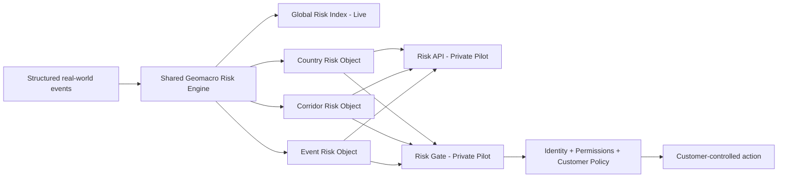
```mermaid
graph LR;
    EVENTS["Structured real-world events"] --> ENGINE["Shared Geomacro Risk Engine"];
    ENGINE --> GRI["Global Risk Index - Live"];
    ENGINE --> COUNTRY["Country Risk Object"];
    ENGINE --> CORRIDOR["Corridor Risk Object"];
    ENGINE --> EVENTRISK["Event Risk Object"];
    COUNTRY --> API["Risk API - Private Pilot"];
    CORRIDOR --> API;
    EVENTRISK --> API;
    COUNTRY --> GATE["Risk Gate - Private Pilot"];
    CORRIDOR --> GATE;
    EVENTRISK --> GATE;
    GATE --> POLICY["Identity + Permissions + Customer Policy"];
    POLICY --> ACTION["Customer-controlled action"];
```

Risk Gate uses subject-specific risk context rather than treating the global GRI score as a universal transaction rule. The shared architecture provides provenance, attribution, evidence, confidence, methodology and verification primitives across these risk views.

### Global Risk Index audit model

GRI `gri-v1.0.0` is deterministic after event classification. Eligible observations use severity as the risk signal, confidence and exponential recency decay as evidence weights, a 72-hour lookback, a per-source cap, and equal base weights across the four supported risk domains. Missing domains reduce disclosed coverage rather than being treated as zero risk.

`scripts/compute-gri.js` persists versioned snapshots and exact event-level contribution points after migration `004_gri_audit_system.sql` is applied. Each published snapshot carries methodology, input and calculation hashes plus a mathematically reconciling 24-hour change attribution. See `docs/GRI_METHODOLOGY.md` and `docs/GRI_TRANSPARENCY_REQUIREMENTS.md`.

## Architecture

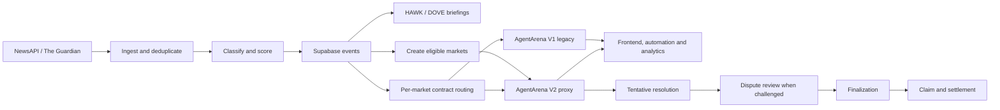
```mermaid
graph LR;
    NEWS["NewsAPI / The Guardian"] --> INGEST["Ingest and deduplicate"];
    INGEST --> CLASSIFY["Classify and score"];
    CLASSIFY --> EVENTS["Supabase events"];

    EVENTS --> BRIEF["HAWK / DOVE briefings"];
    EVENTS --> CREATE["Create eligible markets"];
    CREATE --> V2["AgentArena V2 proxy"];

    EVENTS --> ROUTER["Per-market contract routing"];
    ROUTER --> V1["AgentArena V1 legacy"];
    ROUTER --> V2;

    V1 --> PRODUCT["Frontend, automation and analytics"];
    V2 --> PRODUCT;

    V2 --> RESOLVE["Tentative resolution"];
    RESOLVE --> DISPUTE["Dispute review when challenged"];
    DISPUTE --> FINALIZE["Finalization"];
    FINALIZE --> CLAIM["Claim and settlement"];
```

### Responsibility boundaries

| Layer | Responsibility |
|---|---|
| Intelligence | Ingestion, classification, severity, briefings, market questions, tentative resolution |
| Supabase | Structured read model, event metadata, market routing metadata, position mirror, dispute/jury transparency |
| GitHub Actions | Scheduled lifecycle automation, reconciliation, monitoring, and recovery |
| Arc | Authoritative financial state for markets, stakes, disputes, finalization, and claims |
| Frontend | Public intelligence, market discovery, V1/V2 transaction routing, wallet flows, lifecycle transparency |

The application therefore treats Supabase as a structured read and routing layer while treating Arc as the source of truth for financial state.

---

## Event lifecycle

Geomacro starts from the underlying real-world event rather than from a manually created market.

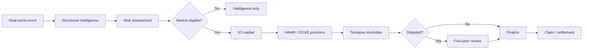
```mermaid
graph LR;
    EVENT["Real-world event"] --> INTEL["Structured intelligence"];
    INTEL --> RISK["Risk assessment"];
    RISK --> ELIGIBLE{"Market eligible?"};

    ELIGIBLE -->|No| READ["Intelligence only"];
    ELIGIBLE -->|Yes| MARKET["V2 market"];

    MARKET --> POSITION["HAWK / DOVE positions"];
    POSITION --> RESOLUTION["Tentative resolution"];

    RESOLUTION --> CHALLENGE{"Disputed?"};
    CHALLENGE -->|No| FINAL["Finalize"];
    CHALLENGE -->|Yes| JURY["Five-juror review"];

    JURY --> FINAL;
    FINAL --> CLAIM["Claim / settlement"];
```

This architecture keeps risk intelligence, market state, resolution, and settlement connected to the same event identity.

---

## V1 and V2 routing

Geomacro maintains explicit dual-contract compatibility.

| Version | Purpose | Address |
|---|---|---|
| V1 | Legacy markets, historical positions and claims | `0xC026fDFC40Dcd8F07b6ecFA21b2BF8400Db0FADe` |
| V2 proxy | Current market contract | `0x2F874FB07084a22D2bB314D0762Af57Cb1856868` |
| V2 implementation | Upgrade implementation | `0x96DDb29e27bdc3edf0c27bf885840Ebf8151DA7c` |

The application and automation layer route each market using `events.market_address`.

### Routing rules

- **New market creation:** targets the V2 proxy.
- **Existing market reads:** use the contract associated with that market.
- **Existing market actions:** use the market-specific contract address.
- **Historical V1 markets:** remain readable and claimable.
- **Current V2 markets:** use the current proxy path.
- **Legacy records without `market_address`:** use the V1 compatibility fallback where required.
- **Position transaction verification:** accepts either canonical V1 or V2 as a valid Arena destination and validates the transaction contents.
- **Lifecycle reconciliation:** preserves both V1 and V2.
- **Stake reconciliation:** preserves both V1 and V2.
- **Historical backfills:** scan or route across both contract generations where applicable.
- **Dispute and jury functionality:** belongs to the V2 architecture.

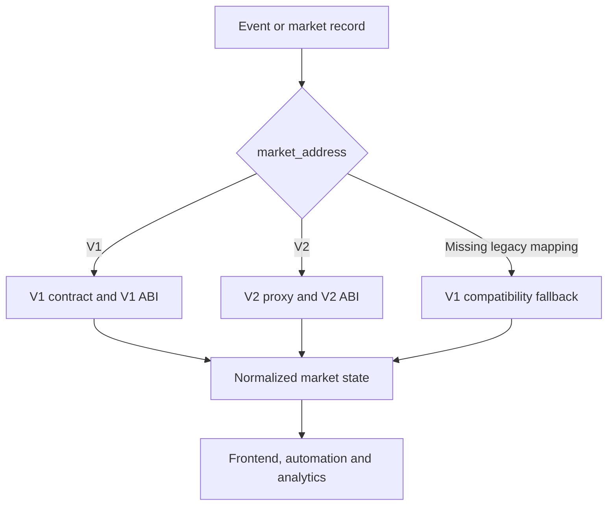
```mermaid
graph TD;
    RECORD["Event or market record"] --> ADDRESS{"market_address"};

    ADDRESS -->|V1| V1["V1 contract and V1 ABI"];
    ADDRESS -->|V2| V2["V2 proxy and V2 ABI"];
    ADDRESS -->|Missing legacy mapping| FALLBACK["V1 compatibility fallback"];

    V1 --> NORMAL["Normalized market state"];
    V2 --> NORMAL;
    FALLBACK --> NORMAL;

    NORMAL --> APP["Frontend, automation and analytics"];
```

The V1 and V2 `getMarketFullDetails()` return shapes differ:

- **V1:** 7 fields
- **V2:** 9 fields, including dispute-specific state

The application therefore selects the correct ABI and contract address before normalizing the result into the frontend data model.

New market creation targets V2 while historical V1 lifecycle state, positions, claims, and analytics remain accessible.

---

## V2 market lifecycle

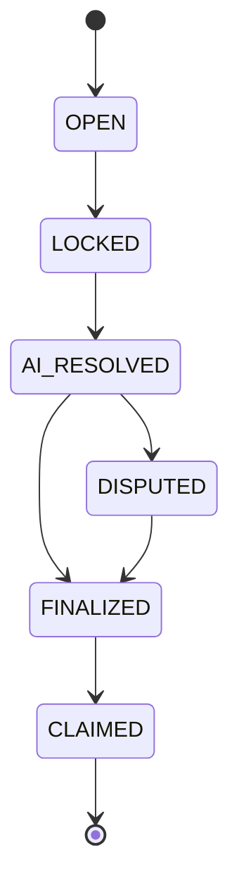
```mermaid
stateDiagram-v2
    [*] --> OPEN
    OPEN --> LOCKED
    LOCKED --> AI_RESOLVED
    AI_RESOLVED --> DISPUTED
    AI_RESOLVED --> FINALIZED
    DISPUTED --> FINALIZED
    FINALIZED --> CLAIMED
    CLAIMED --> [*]
```

| State | Meaning |
|---|---|
| `OPEN` | Market exists and staking remains open |
| `LOCKED` | Staking has ended; resolution is pending |
| `AI_RESOLVED` | Tentative AI-assisted outcome is available |
| `DISPUTED` | An eligible challenge has been raised |
| `FINALIZED` | Outcome is final; claim processing may proceed |

Supabase mirrors user-facing lifecycle state, while the contract remains authoritative for financial state.

### Fixed-odds funded liquidity

Fixed-odds funded liquidity is implemented as part of the **V2 proxy architecture** rather than as a separate application contract generation.

The upgradeable contract uses OpenZeppelin initializer/reinitializer semantics to extend V2 storage and economics while keeping the V2 proxy as the application-facing contract address.

The current fixed-odds path includes:

- funded market liquidity;
- deterministic winner-side payout logic;
- a protocol fee applied to profit;
- treasury accounting;
- compatibility with the existing V2 market lifecycle.

---

## Resolution and dispute model

V2 separates tentative AI-assisted resolution from finalization.

A dispute is created only when an eligible participant actually challenges the tentative outcome. Markets that are never challenged do not fabricate tribunal or jury records.

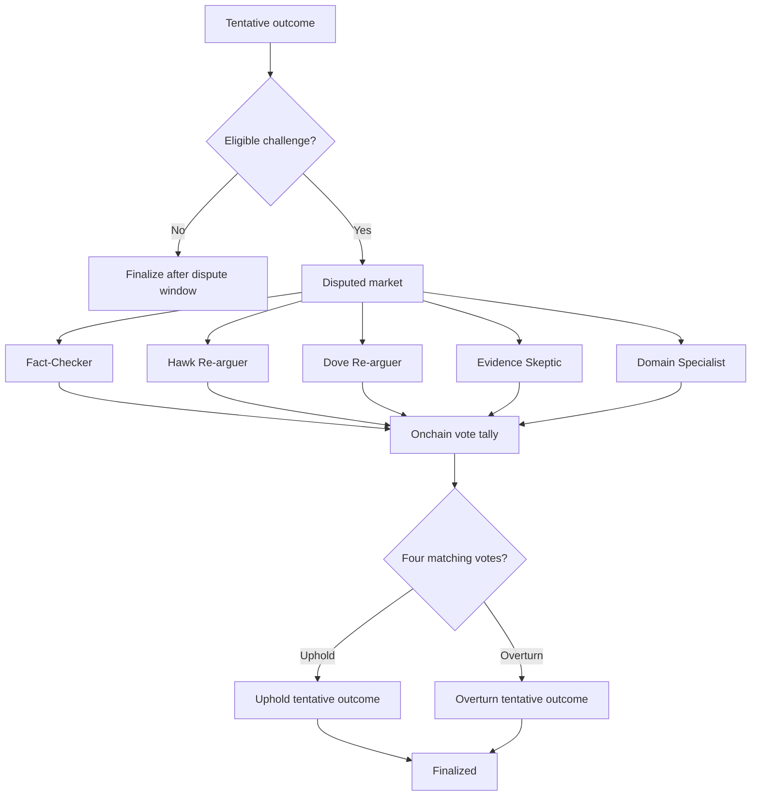
```mermaid
graph TD;
    TENTATIVE["Tentative outcome"] --> ELIGIBLE{"Eligible challenge?"};

    ELIGIBLE -->|No| FINALIZE["Finalize after dispute window"];
    ELIGIBLE -->|Yes| DISPUTED["Disputed market"];

    DISPUTED --> J1["Fact-Checker"];
    DISPUTED --> J2["Hawk Re-arguer"];
    DISPUTED --> J3["Dove Re-arguer"];
    DISPUTED --> J4["Evidence Skeptic"];
    DISPUTED --> J5["Domain Specialist"];

    J1 --> TALLY["Onchain vote tally"];
    J2 --> TALLY;
    J3 --> TALLY;
    J4 --> TALLY;
    J5 --> TALLY;

    TALLY --> THRESHOLD{"Four matching votes?"};

    THRESHOLD -->|Uphold| UPHOLD["Uphold tentative outcome"];
    THRESHOLD -->|Overturn| OVERTURN["Overturn tentative outcome"];

    UPHOLD --> FINAL["Finalized"];
    OVERTURN --> FINAL;
```

### Eligibility

A dispute requires:

1. the market to be in the dispute-eligible V2 lifecycle state;
2. the dispute window to remain open;
3. the caller to hold real stake on the losing side of the tentative outcome;
4. the required bond to be supplied.

### Bond

```text
bond = 8% of caller's losing-side stake
minimum = 1 native USDC unit
maximum = 40 native USDC units
```

The V2 source defines:

- `DISPUTE_BOND_BPS = 800`
- `DISPUTE_BOND_FLOOR = 1 * 10**18`
- `DISPUTE_BOND_CAP = 40 * 10**18`

The deployed V2 contract uses Arc's native-gas denomination for the dispute transaction.

### Juror roles

| Role | Purpose |
|---|---|
| Fact-Checker | Evaluate factual claims and available evidence |
| Hawk Re-arguer | Construct the strongest escalation case |
| Dove Re-arguer | Construct the strongest de-escalation case |
| Evidence Skeptic | Challenge evidence quality and unsupported assumptions |
| Domain Specialist | Apply category-specific context |

The design intentionally uses differentiated review roles rather than treating repeated model calls as independent evidence.

### Decision rule

- Jury size: **5**
- Decision threshold: **4 of 5**
- Juror votes are submitted independently
- Onchain vote state is authoritative
- Supabase provides a public transparency mirror for reasoning, evidence metadata, timestamps, and transaction references where available

> Dispute automation is implemented and scheduled. It activates only when a real V2 market enters the onchain disputed state.

---

## Contract security model

### Proxy

- `AgentArenaProxy` is the application-facing V2 address.
- `AgentArenaV2` is the implementation.
- Frontend and backend configuration should target the proxy rather than the implementation.
- The implementation uses OpenZeppelin UUPS upgradeability.

### Treasury and upgrades

The V2 source includes:

- **48-hour upgrade timelock**
- multisig-governed upgrade controls
- explicit upgrade staging
- separate implementation deployment and upgrade-proposal workflows

The repository includes:

```text
deploy-v2-implementation.yml
propose-v2-upgrade.yml
execute-v2-upgrade.yml
fund-v2-liquidity.yml
```

### Guardian and pause controls

The V2 security architecture includes:

- guardian-based emergency pause support;
- owner pause support;
- restricted unpause behavior;
- multisig involvement in protocol recovery;
- a configured self-heal delay;
- scheduled anomaly monitoring.

The current source defines:

```text
UPGRADE_TIMELOCK = 48 hours
AUTO_UNPAUSE_DELAY = 6 hours
```

### Jury threshold

```text
JURY_SIZE = 5
JURY_THRESHOLD = 4
```

### Fee ceiling

The V2 winner fee is initialized at **2%** and constrained by a hard **3%** ceiling.

```text
winnerFeeBps = 200
MAX_WINNER_FEE_BPS = 300
```

### Operational security

Production deployment should still undergo appropriate external smart-contract review, infrastructure review, privileged-key review, and operational readiness testing before larger-scale economic activity.

---

## Protocol economics

The current V2 contract contains protocol-level fee, funded-liquidity, and dispute economics.

### Base winner fee

- Initial fee: **200 bps (2%)**
- Maximum fee: **300 bps (3%)**
- Fees route according to configured treasury logic

### Fixed-odds winner fee

The funded fixed-odds path uses a separate **1.5% winner fee on profit** (`fixedOddsWinnerFeeBps = 150`).

This is intentionally separate from the legacy/base pool-style V2 `winnerFeeBps = 200`, so activating fixed odds does not retroactively change the fee math for markets created before `initializeFixedOddsV2()`. Fixed-odds markets also route **5% of losing stake** to treasury by default (`lossTreasuryBps = 500`).

### Dispute economics

The dispute bond is proportional to the caller's losing-side stake:

```text
8%
minimum 1 USDC
maximum 40 USDC
```

If a dispute overturns the tentative outcome:

- the disputer receives the bond back;
- the contract may pay an additional reward from the available dispute reserve, subject to contract limits.

If a dispute is rejected:

- rejected-bond value is allocated between treasury and dispute-reserve logic according to the deployed contract rules.

The current source defines a **50% treasury share** for rejected dispute bonds.

Commercial packaging and pricing are documented as a product layer rather than embedded in protocol economics. The technical fee model below applies only to the onchain application layer.

---

## Crosschain and swap

### CCTP V2 bridge

The Bridge surface integrates Circle CCTP V2 testnet infrastructure for native USDC movement toward Arc.

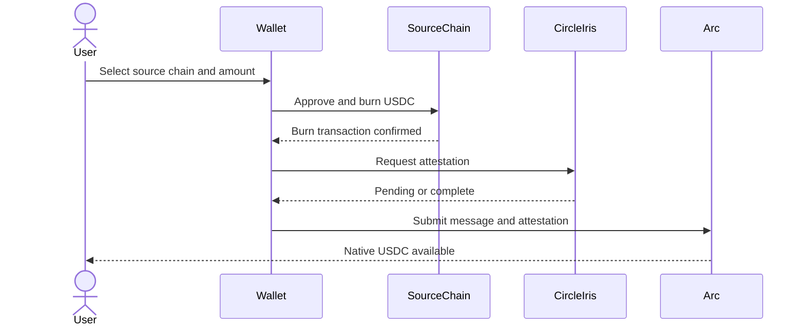
```mermaid
sequenceDiagram
    actor User
    participant Wallet
    participant SourceChain
    participant CircleIris
    participant Arc

    User->>Wallet: Select source chain and amount
    Wallet->>SourceChain: Approve and burn USDC
    SourceChain-->>Wallet: Burn transaction confirmed
    Wallet->>CircleIris: Request attestation
    CircleIris-->>Wallet: Pending or complete
    Wallet->>Arc: Submit message and attestation
    Arc-->>User: Native USDC available
```

Configured CCTP testnet sources include:

- Ethereum Sepolia
- Base Sepolia
- Avalanche Fuji
- Arbitrum Sepolia
- OP Sepolia
- Polygon Amoy
- Unichain Sepolia
- Linea Sepolia

### Swap

The Swap surface uses Circle App Kit for supported same-chain swap flows on Arc Testnet.

Both Bridge and Swap expose transaction state, errors, and technical details while deferring wallet access until the user initiates an action.

---

## Data model

Supabase is the structured application data layer and public transparency mirror.

It is not a replacement for authoritative onchain financial state.

### Relationships

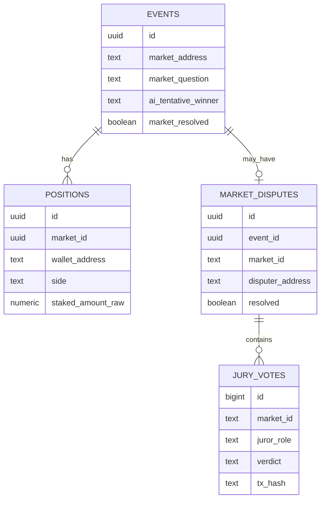
```mermaid
erDiagram
    EVENTS ||--o{ POSITIONS : has
    EVENTS ||--o| MARKET_DISPUTES : may_have
    MARKET_DISPUTES ||--o{ JURY_VOTES : contains

    EVENTS {
        uuid id
        text market_address
        text market_question
        text ai_tentative_winner
        boolean market_resolved
    }

    POSITIONS {
        uuid id
        uuid market_id
        text wallet_address
        text side
        numeric staked_amount_raw
    }

    MARKET_DISPUTES {
        uuid id
        uuid event_id
        text market_id
        text disputer_address
        boolean resolved
    }

    JURY_VOTES {
        bigint id
        text market_id
        text juror_role
        text verdict
        text tx_hash
    }
```

### Operational data flow

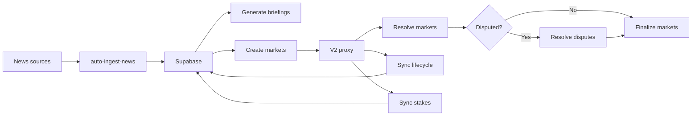
```mermaid
graph LR;
    NEWS["News sources"] --> INGEST["auto-ingest-news"];
    INGEST --> DB["Supabase"];

    DB --> BRIEF["Generate briefings"];
    DB --> CREATE["Create markets"];

    CREATE --> V2["V2 proxy"];
    V2 --> RESOLVE["Resolve markets"];

    RESOLVE --> DISPUTE{"Disputed?"};
    DISPUTE -->|Yes| JURY["Resolve disputes"];
    DISPUTE -->|No| FINALIZE["Finalize markets"];
    JURY --> FINALIZE;

    V2 --> LIFECYCLE["Sync lifecycle"];
    V2 --> STAKES["Sync stakes"];

    LIFECYCLE --> DB;
    STAKES --> DB;
```

### Core tables

**`events`**

Stores structured event intelligence and market lifecycle metadata, including:

- `market_address`
- market question
- tentative resolution
- dispute-window state
- final resolution state

`market_address` is also the main application-level routing key between legacy V1 markets and current V2 markets.

**`positions`**

Stores the application mirror of wallet positions, including:

- market
- wallet
- side
- raw stake amount
- status
- resolved outcome
- payout
- claim state

**`market_disputes`**

Stores the public dispute case record, including:

- event/market identity
- disputer
- bond
- vote totals
- verdict
- timestamps

**`jury_votes`**

Stores the transparency record for individual juror submissions, including:

- role
- verdict
- reasoning
- evidence metadata where available
- transaction hash
- vote time

**`tx_history`**

Stores transaction-history data used by Bridge / Swap transaction-history surfaces.

### RLS

Public dispute and jury records are readable through RLS-controlled access.

Trusted writes use server-side credentials.

Service-role credentials are never exposed to the browser.

### Migrations

```text
supabase/migrations/
├── 001_ai_jury_dispute_system.sql
├── 002_events_schema_backfill.sql
└── 003_tx_history.sql
```

The live schema has also evolved through direct operational SQL changes.

A fresh deployment should reconcile the current live schema with repository migrations before assuming the migration directory represents every historical schema transition.

---

## Automation

The market and intelligence lifecycle is operated through scheduled GitHub Actions.

Jobs are separated by responsibility so ingestion, market creation, resolution, dispute handling, finalization, reconciliation, monitoring, and recovery can fail and retry independently.

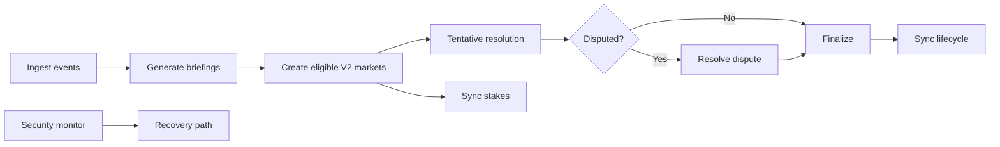
```mermaid
graph LR;
    INGEST["Ingest events"] --> BRIEF["Generate briefings"];
    BRIEF --> CREATE["Create eligible V2 markets"];
    CREATE --> RESOLVE["Tentative resolution"];

    RESOLVE --> DISPUTE{"Disputed?"};
    DISPUTE -->|Yes| JURY["Resolve dispute"];
    DISPUTE -->|No| FINALIZE["Finalize"];

    JURY --> FINALIZE;

    CREATE --> STAKES["Sync stakes"];
    FINALIZE --> LIFE["Sync lifecycle"];

    MONITOR["Security monitor"] --> RECOVERY["Recovery path"];
```

| Workflow | Role |
|---|---|
| `auto-ingest-news.yml` | Ingest and classify external events |
| `Auto-generate-briefings.yml` | Generate / cache HAWK and DOVE briefings |
| `auto-create-markets.yml` | Create eligible V2 markets |
| `auto-resolve-markets.yml` | Post tentative AI-assisted outcomes |
| `auto-resolve-disputes.yml` | Process real V2 disputes |
| `auto-finalize-markets.yml` | Finalize eligible markets |
| `sync-lifecycle.yml` | Reconcile V1 / V2 lifecycle state |
| `sync-stakes.yml` | Reconcile V1 / V2 stake events into positions |
| `security-monitor.yml` | Monitor configured protocol anomalies |
| `auto-recovery.yml` | Recovery operations |
| `debug-schema.yml` | Manual schema diagnostics |
| `deploy-v2-implementation.yml` | Deploy a new V2 implementation |
| `propose-v2-upgrade.yml` | Propose/approve a specific deployed V2 implementation |
| `execute-v2-upgrade.yml` | Execute the timelocked V2 upgrade and atomically call `initializeFixedOddsV2()` |
| `fund-v2-liquidity.yml` | Fund the V2 underwriting reserve after upgrade initialization |

Scheduled jobs are designed around reconciliation and retry safety rather than manual state editing.

---

## Resilience

### RPC

Backend lifecycle jobs can rotate across multiple RPC endpoints.

Premium credentials remain server-side.

Typical providers include:

```text
Alchemy
QuickNode
GetBlock
dRPC
Arc public RPC fallback
```

Compatible reads can be batched with Multicall3:

```text
0xcA11bde05977b3631167028862bE2a173976CA11
```

### Dual-contract resilience

Historical state is not discarded when the application advances to V2.

Compatibility behavior includes:

- V1 lifecycle reads
- V1 claim routing
- V1/V2 stake reconciliation
- V1/V2 transaction verification
- per-market address routing
- dual-contract historical backfills
- missing-address legacy fallback where required

### Transaction reconciliation

User-facing transaction submission does not depend entirely on a single RPC receipt poll.

The application records transaction hashes promptly and scheduled reconciliation scripts provide a backstop for:

- stake synchronization
- lifecycle synchronization
- position recovery
- transaction-hash backfill
- anomaly monitoring

### AI providers

The automation layer uses Groq as a primary provider in several paths, with Cerebras configured as an independent fallback where supported.

Dispute evidence can additionally use Tavily.

If fresh evidence retrieval is unavailable, the system should report the limitation rather than invent external evidence.

---

## Technology stack

| Layer | Technology |
|---|---|
| Frontend | Vite 7, TanStack Start, React 19, Tailwind CSS v4 |
| UI | shadcn/ui, Radix primitives |
| Shared frontend states | Foundation async, data, risk, and onchain components |
| Chain client | ethers v6, Multicall3 |
| Data | Supabase / PostgreSQL |
| AI | Groq, Cerebras |
| Dispute evidence | Tavily |
| News ingestion | NewsAPI, The Guardian |
| Validation | Zod |
| Authentication | Sign-In with Ethereum |
| Automation | GitHub Actions |
| Contracts | Solidity 0.8.20, OpenZeppelin upgradeable contracts |
| Proxy model | UUPS / ERC1967-style proxy |
| Network | Arc Testnet |
| Settlement | Native USDC |
| Crosschain USDC | Circle CCTP V2 |
| Swap | Circle App Kit |
| Contract tooling | Foundry |
| Production runtime | Nitro / Cloudflare-compatible output |

---

## Repository structure

```text
geomacro/
├── contracts/
│   ├── AgentArena.sol
│   ├── AgentArenaV2.sol
│   ├── AgentArenaProxy.sol
│   └── MultisigTreasury.sol
├── script/
│   ├── Deploy.s.sol
│   └── DeployAgentArenaV2Implementation.s.sol
├── test/
│   ├── AgentArena.t.sol
│   └── AgentArenaV2FixedOdds.t.sol
├── scripts/
│   ├── ingest-news.js
│   ├── generate-briefings.js
│   ├── create-markets.js
│   ├── resolve-markets.js
│   ├── resolve-disputes.js
│   ├── finalize-markets.js
│   ├── sync-lifecycle.js
│   ├── sync-stakes.js
│   ├── anomaly-monitor.js
│   ├── backfill-positions.js
│   ├── backfill-tx-hashes.js
│   ├── ops/
│   │   ├── verify-market-economics.js
│   │   ├── fund-liquidity.js
│   │   └── verify-jury.js
│   └── lib/
│       └── dual-contract.js
├── supabase/
│   └── migrations/
├── src/
│   ├── components/
│   │   └── foundation/
│   │       ├── async-states.tsx
│   │       ├── data.tsx
│   │       ├── onchain.tsx
│   │       └── risk.tsx
│   ├── routes/
│   ├── lib/
│   │   └── notify.ts
│   └── hooks/
├── .github/
│   └── workflows/
├── docs/
├── foundry.toml
└── package.json
```

> `contracts/AgentArenaV2.sol` is the canonical V2 implementation source used by Foundry, deployment scripts, and upgrade workflows. The duplicate root-level `AgentArenaV2.sol` was removed to prevent source drift.

---

## Local development

```bash
git clone https://github.com/blocknine0/geomacro.git
cd geomacro
bun install
cp .env.example .env.local
bun run dev
```

Production build:

```bash
bun run build
```

Contract development:

```bash
forge build
forge test
```

Do not commit:

- private keys
- service-role credentials
- jury signer keys
- guardian keys
- privileged RPC credentials

---

## Configuration

| Variable | Purpose |
|---|---|
| `NEWSAPI_KEY` | NewsAPI ingestion |
| `GUARDIAN_API_KEY` | The Guardian API |
| `GROQ_API_KEY` | Classification / briefing / resolution / selected juror roles |
| `CEREBRAS_API_KEY` | Secondary model provider / fallback |
| `TAVILY_API_KEY` | Dispute evidence retrieval |
| `APP_SUPABASE_URL` | Public app Supabase project URL |
| `APP_SUPABASE_ANON_KEY` | Public RLS-controlled reads |
| `SUPABASE_URL` | Server-side Supabase URL used by ingestion jobs |
| `SUPABASE_SERVICE_ROLE_KEY` | Trusted server-side writes |
| `CONTRACT_ADDRESS` | Current V2 proxy |
| `OLD_CONTRACT_ADDRESS` | V1 legacy contract |
| `OWNER_PRIVATE_KEY` | Trusted automation signer where required |
| `JURY_PRIVATE_KEY_1..5` | Dedicated juror signers |
| `GUARDIAN_PRIVATE_KEY` | Protocol guardian signer |
| `ARC_RPC_URL..ARC_RPC_URL_5` | Backend RPC pool |
| `DEPLOY_BLOCK` | Event scan start block |
| `MULTICALL3_ADDRESS` | Multicall3 address |
| `VITE_ARC_NETWORK` | Frontend Arc network |
| `VITE_CIRCLE_KIT_KEY` | Circle App Kit configuration |

### News-ingestion controls

`scripts/ingest-news.js` uses The Guardian as the primary source and NewsAPI as fallback, then applies freshness, deduplication, precision-oriented allow/deny gates, LLM relevance classification, severity/confidence thresholds, and Groq quota-aware throttling before trusted Supabase insertion. Its runtime knobs (model selection, batch size, quota headroom, article age, candidate cap, and thresholds) are documented in `.env.example`. See `docs/NEWS_INGESTION.md` for the operational contract. Newly accepted events also carry classification provider/model/version/prompt provenance used by the GRI audit layer.

Deployment-specific values are consumed by deployment and automation tooling and should remain outside client-visible configuration.

---

## Product surfaces

The current product exposes:

- Global Risk Index and intelligence
- intelligence discovery
- event detail
- market probability context
- V1 / V2 market state
- HAWK / DOVE participation
- portfolio
- claim lifecycle
- tentative-resolution visibility
- tribunal / dispute lifecycle visibility
- CCTP Bridge
- Swap
- transaction history
- technical transaction disclosures
- wallet network-state handling

The live application is the canonical reference for what is currently exposed to users:

**https://www.geomacro.live**

---

## Engineering principles

1. **Preserve event identity.** Intelligence, market state, resolution, and settlement remain linked to the same event.
2. **Use contract state for financial truth.** Supabase is the read model and transparency layer.
3. **Preserve V1 history.** Protocol upgrades must not orphan historical markets, positions, or claims.
4. **Route by market identity.** Existing-market actions use that market's contract address.
5. **Use V2 for new market creation.**
6. **Do not fabricate missing data.** Missing values remain unavailable.
7. **Treat AI output as challengeable.** Tentative resolution is not assumed to be infallible.
8. **Keep privileged credentials server-side.**
9. **Make scheduled operations retry-safe.**
10. **Request wallet access only at action boundaries.**
11. **Expose lifecycle and transaction state explicitly.**
12. **Keep documentation consistent with the current implementation.**

---

## Current status

### Implemented

- [x] Event ingestion from NewsAPI and The Guardian
- [x] Event classification and severity scoring
- [x] Structured Supabase intelligence model
- [x] HAWK / DOVE briefing generation
- [x] Automated market creation
- [x] V1 legacy market support
- [x] Active V2 proxy for new markets
- [x] Per-market `market_address` routing
- [x] V1 / V2 lifecycle routing
- [x] V1 / V2 stake reconciliation
- [x] V1 / V2 transaction verification
- [x] Historical dual-contract backfill support
- [x] Automated tentative resolution
- [x] V2 dispute contract path
- [x] Five-role juror automation
- [x] Scheduled dispute runner
- [x] Supabase dispute and jury transparency tables
- [x] Automated finalization
- [x] Portfolio and claim lifecycle
- [x] Historical V1 claim compatibility
- [x] Multi-endpoint RPC failover
- [x] Multicall3 batching
- [x] Guardian / multisig security architecture
- [x] 48-hour upgrade timelock
- [x] CCTP V2 Bridge surface
- [x] Circle App Kit Swap surface
- [x] Supabase transaction history
- [x] Shared foundation UI for async, data, risk, and onchain states
- [x] Explicit wallet action boundaries
- [x] Wrong-network handling
- [x] Transaction progress feedback
- [x] Vite client production build
- [x] SSR production build
- [x] Nitro / Cloudflare production bundle

### Operational note

A tribunal record exists only when a real eligible V2 participant raises an onchain dispute.

An undisputed finalized market correctly has no jury case or jury-vote history.

The repository currently preserves historical V1 compatibility while directing new market creation to V2.

---

## Roadmap

The current priority is production hardening rather than a protocol rewrite.

- [ ] External production smart-contract security review
- [ ] Expand V2 dispute and failure-recovery test coverage
- [ ] Reconcile any remaining historical unmapped position records
- [ ] Capture the current Supabase schema as a reproducible migration baseline
- [ ] Improve RPC / synchronization / DB-onchain discrepancy monitoring
- [ ] Harden CCTP and Swap recovery paths
- [ ] Improve production transaction monitoring and alerting
- [ ] Improve wallet and onboarding UX
- [ ] Expand sustained funded-liquidity testing
- [ ] Measure repeat market participation and claim behavior
- [ ] Complete production-readiness review before mainnet economic activity
- [ ] Validate professional and institutional intelligence models separately from protocol implementation

---

## Arc and USDC

Geomacro separates information risk from settlement-asset risk.

A participant expressing a view on geopolitical or macro risk should not also need unnecessary volatility exposure from the asset used to settle that position.

USDC provides a stable economic denomination for participation and settlement.

Arc provides the execution environment for the programmable market layer, while Circle infrastructure provides the stablecoin and crosschain components used by the product.

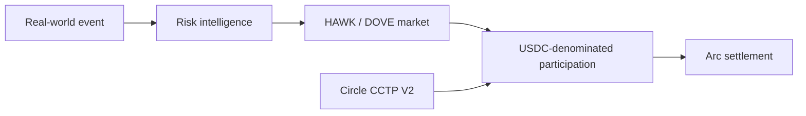
```mermaid
graph LR;
    EVENT["Real-world event"] --> INTEL["Risk intelligence"];
    INTEL --> MARKET["HAWK / DOVE market"];
    MARKET --> USDC["USDC-denominated participation"];
    CCTP["Circle CCTP V2"] --> USDC;
    USDC --> ARC["Arc settlement"];
```

Geomacro's target architecture connects:

```text
real-world intelligence
        ↓
structured event data
        ↓
AI-assisted scenario analysis
        ↓
probability and risk signals
        ↓
programmable prediction markets
        ↓
USDC-denominated settlement on Arc
```

---

Built by [@blocknine0](https://github.com/blocknine0) · [Live product](https://www.geomacro.live) · [Issues](https://github.com/blocknine0/geomacro/issues)
