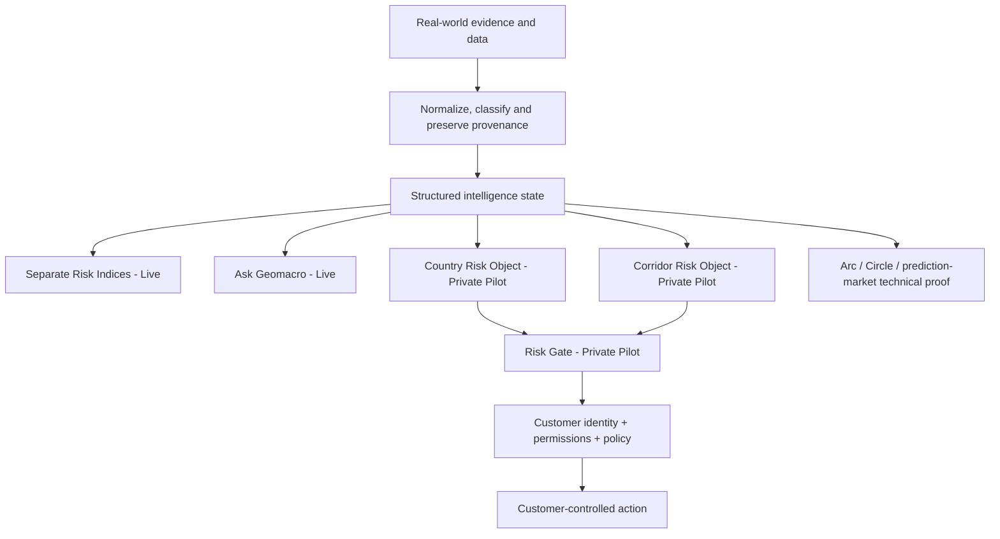

# 1. What is Geomacro?

Geomacro is a geopolitical and macro risk-intelligence platform for human and machine decisions.

It converts fragmented real-world events and structured evidence into explainable risk intelligence: scores, evidence, confidence, change attribution and machine-readable decision context.

Geomacro began with geopolitical prediction-market experimentation. Building that system exposed a more fundamental problem: before a market, institution, application or autonomous agent acts on risk, it needs a reliable and auditable way to understand that risk.

That intelligence layer is now the primary product direction.

The current public product is Risk Intelligence, the separate Geopolitical, Macroeconomic and Critical Minerals Risk Indices, and Ask Geomacro. The indices preserve the versioned GRI v1.2 parent methodology and verified proof lineage without presenting the historical combined GRI as a second live headline score.

Country and directional corridor Risk Objects plus Risk Gate are Private Pilot capabilities. Geomacro supplies external risk context; the customer retains identity, permissions, policy, funds and final execution control, and the current Risk Gate boundary remains `execution_authorized=false`.

Data & API provides access to the same underlying intelligence architecture, while Research and Documentation explain the evidence, methodology and proof. They do not maintain separate versions of reality.

Prediction markets, Arc, Circle, USDC, CCTP, Bridge & Swap and other onchain work remain accessible as **secondary technical proof and application layers**. They are not Geomacro's primary commercial identity.
