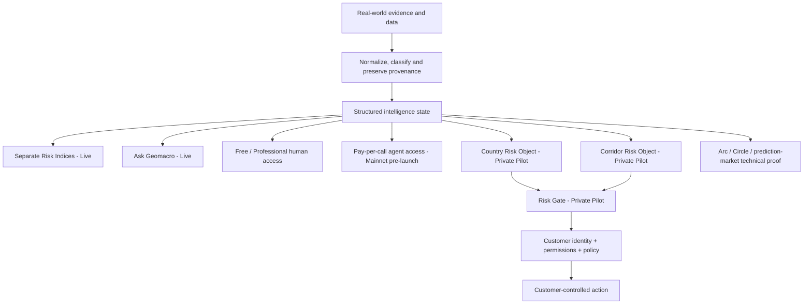

# 1. What is Geomacro?

Geomacro is a geopolitical, macroeconomic and critical-mineral risk-intelligence platform for human and machine decisions.

It converts fragmented real-world events and structured evidence into explainable risk intelligence: scores, evidence, confidence, change attribution and machine-readable decision context.

Geomacro began with geopolitical prediction-market experimentation. Building that system exposed a more fundamental problem: before a trader, institution, application or autonomous agent acts on risk, it needs a reliable and auditable way to understand that risk.

That intelligence layer is now the primary product.

The current public product is Risk Intelligence, the separate Geopolitical, Macroeconomic and Critical Minerals Risk Indices, Ask Geomacro and the Free Explorer experience. The indices preserve the audited GRI v1.2 parent methodology and proof lineage without presenting the historical combined GRI as a second live headline score.

Geomacro's commercial access ladder adds depth and delivery options without changing the underlying risk engine:

- **Free Explorer — LIVE** for public research and evaluation;
- **Professional intelligence — FOUNDING PILOT** for deeper human workflows;
- **AI-agent pay per call — MAINNET PRE-LAUNCH** for occasional machine requests after deliberate production activation;
- **API + Risk Gate — PRIVATE / FOUNDING PILOT** for recurring governed machine workflows;
- **Institutional — CONTRACTED / PILOT-LED** for agreed volume, coverage, controls and support.

Country and directional corridor Risk Objects plus Risk Gate are Private Pilot capabilities. Geomacro supplies external risk context; the customer retains identity, permissions, policy, funds and final execution control, and the current Risk Gate boundary remains `execution_authorized=false`.

Data & API provides access to the same underlying intelligence architecture, while Research and Documentation explain the evidence, methodology and proof. They do not maintain separate versions of reality.

Prediction markets, Arc, Circle, USDC, CCTP, Bridge & Swap and other onchain work remain accessible as **secondary technical proof and application layers**. Prediction markets remain permanently Testnet-only and are not Geomacro's primary commercial identity.
