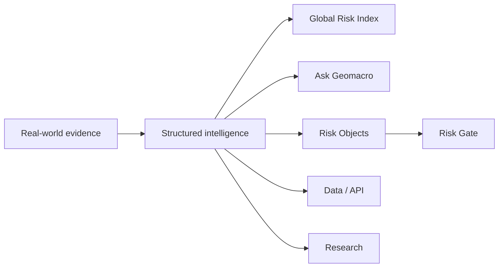

# 1. What is Geomacro?

Geomacro is a geopolitical and macro risk-intelligence platform for human and machine decisions.

It converts fragmented real-world events and structured evidence into explainable risk intelligence: scores, evidence, confidence, change attribution and machine-readable decision context.

Geomacro began with geopolitical prediction-market experimentation. Building that system exposed a more fundamental problem: before a market, institution, application or autonomous agent acts on risk, it needs a reliable and auditable way to understand that risk.

That intelligence layer is now the primary product direction.

Prediction markets, Arc, CCTP, Bridge & Swap and other onchain work remain accessible as **secondary technical proof and application layers**. They are not Geomacro's primary commercial identity.
