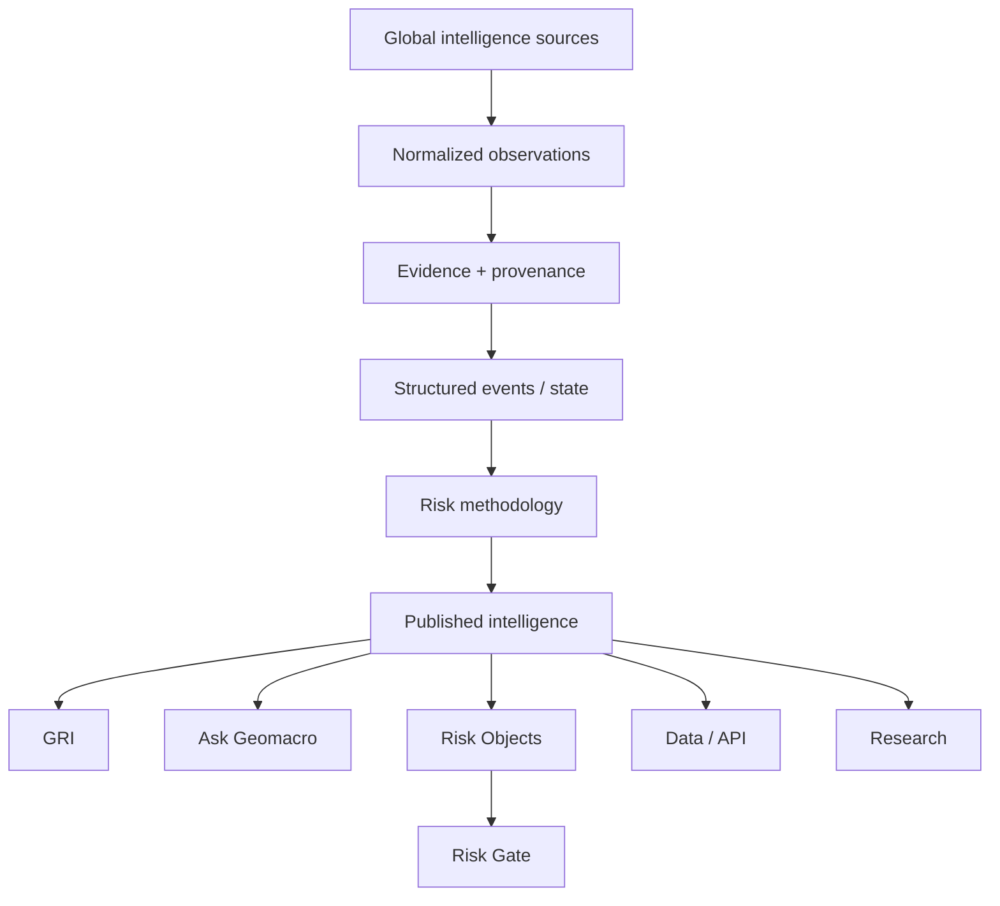
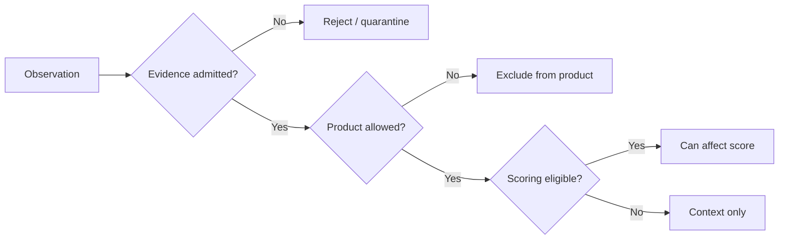

# 2. Product Architecture

Geomacro uses a shared evidence and provenance foundation with product-specific admission and decision policies. Public intelligence, GRI, Ask Geomacro and machine interfaces should not maintain conflicting versions of the same underlying fact.

## Policy layers

Geomacro separates several decisions that are easy to confuse:

- **Evidence admission** — is an observation credible and sufficiently attributable?
- **Product admission** — which product surface may use it?
- **Scoring admission** — can it affect a numeric score?
- **Commercial eligibility** — may it enter a paid/commercial delivery path?
- **Persistence** — what durable structured evidence should be retained?

The architecture is intentionally fail-closed where missing provenance, freshness, verification or commercial eligibility would otherwise create an unsafe inference.
