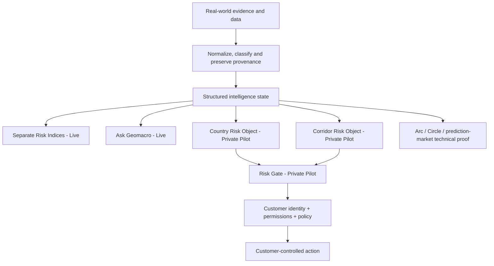
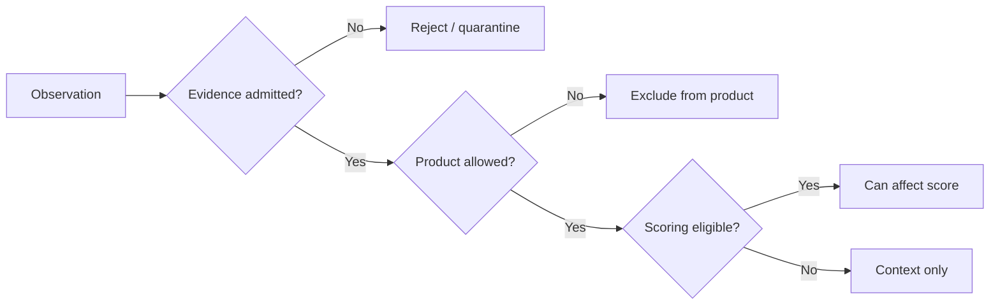

# 2. Product Architecture

Geomacro uses one shared evidence and provenance foundation. Public Risk Intelligence, separate Risk Indices, Ask Geomacro, Private Pilot Risk Objects and Risk Gate must not maintain conflicting versions of the same underlying risk state.

The canonical current architecture is:

This architecture preserves three boundaries:

- **Live public intelligence**: Risk Intelligence, the separate Geopolitical, Macroeconomic and Critical Minerals Risk Indices, and Ask Geomacro expose the current shared intelligence state for human use.
- **Private Pilot machine decisions**: current signed Risk Object and Risk Gate delivery is scoped to country and directional corridor risk. Risk Gate supplies external risk context; the customer keeps identity, permissions, policy, funds and final execution control.
- **Technical proof**: Arc, Circle, USDC, CCTP, Bridge & Swap and prediction-market functionality demonstrate programmable-finance integration. They are not the primary commercial product or a production-mainnet claim. **Prediction markets are permanently Arc Testnet-only and are excluded from Geomacro's production/mainnet commercialization path.**

The public Risk Indices preserve the versioned `gri-v1.2.0` parent methodology and verified `gri-proof-v1.2.0` proof lineage. Historical combined-GRI snapshots remain versioned audit records; the historical combined GRI is not a second current headline product.

`execution_authorized=false` remains the current Risk Gate execution boundary. Event-specific Risk Objects may be explored in the broader architecture, but they are not part of the current country/corridor Private Pilot contract unless a separately implemented and verified production contract says otherwise.

The customer owns the identity, permissions and policy layer shown downstream of Risk Gate. An integration may supply a customer-owned policy profile to a bounded Risk Gate request, but that is an evaluation input only: Geomacro does not own or enforce the customer's policy and does not authorize the customer's downstream action.

Data & API is an access and delivery surface over this architecture. Research and documentation are evidence, methodology and trust surfaces. Neither should create a second risk engine or a conflicting copy of product truth.

### One data foundation, multiple delivery adapters

Browser, authenticated API, Testnet pay-per-call and agent/x402 surfaces may use different authentication, entitlement, payment, response-shaping and audit adapters, but they still resolve from the same governed intelligence foundation and canonical product services. Pay-per-call changes access and settlement; it does not create a separate dataset, score engine, Risk Object path or Risk Gate implementation.

“Same data” means the same governed evidence/provenance foundation and relevant canonical service contract. Product-specific rules may still differ: the versioned GRI v1.2 lineage has its own scoring admission, the current public Risk Indices expose its domains separately, Risk Objects have subject/verification rules, and Risk Gate can evaluate bounded caller context. Those are documented derived uses of shared intelligence, not conflicting copies of reality.

The repository-wide invariant for adding any new delivery or payment rail is documented in `docs/CANONICAL_DELIVERY_ARCHITECTURE.md`: reuse canonical intelligence first, then add only the access, transport, entitlement, policy-input or settlement adapter required by that surface while preserving the customer-control boundary. Production/mainnet promotion must also satisfy `docs/MAINNET_PRODUCTION_READINESS.md`.

## Policy layers

Geomacro separates several decisions that are easy to confuse:

- **Evidence admission** — is an observation credible and sufficiently attributable?
- **Product admission** — which product surface may use it?
- **Scoring admission** — can it affect a numeric score?
- **Commercial eligibility** — may it enter a paid/commercial delivery path?
- **Persistence** — what durable structured evidence should be retained?

The architecture is intentionally fail-closed where missing provenance, freshness, verification or commercial eligibility would otherwise create an unsafe inference.
