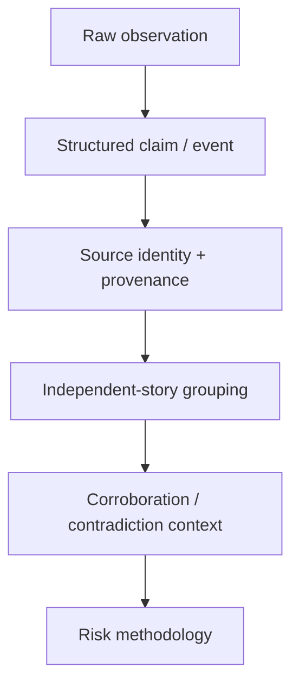

# 4. Global Evidence Mesh

**Status: FOUNDATION / IN DEVELOPMENT**

The Global Evidence Mesh is Geomacro's provenance-aware evidence architecture. The objective is not to mirror the internet or archive complete third-party articles. It is to retain the structured evidence needed to reproduce, challenge and defend a risk assessment.

## Durable evidence primitives

Depending on the source and product policy, Geomacro can retain:

- canonical events or observations
- country and entity attribution
- event/story-family identifiers
- observation and publication timestamps
- source identity and references
- confidence and freshness
- classification provenance
- source-access/commercial-eligibility state
- methodology and calculation references
- content, input or provenance hashes where appropriate

## What Geomacro is not building

Geomacro does not need to persist full third-party article bodies, publisher images or mirrored pages to produce structured intelligence. Commercial source rights and redistribution rights are separate from ingestion capability.
