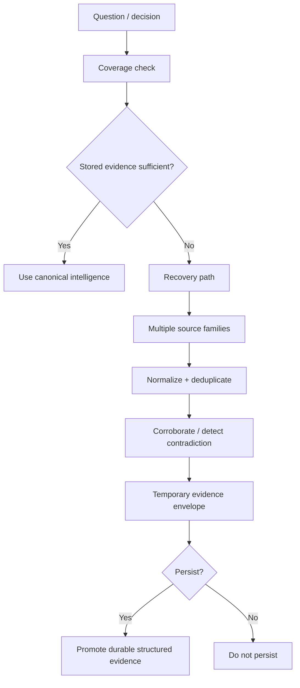

# 5. Live Evidence Recovery

**Status: IN DEVELOPMENT**

Not every current event should be stored permanently. Geomacro's longer-term architecture includes on-demand evidence recovery when durable stored intelligence is insufficient.

> **Current product boundary:** the live Ask Geomacro implementation is grounded in stored Geomacro intelligence and does not currently invoke a general live-web evidence recovery path when evidence is missing.

The design principle is: **hot evidence can remain recoverable; durable intelligence should remain structured and attributable.**
