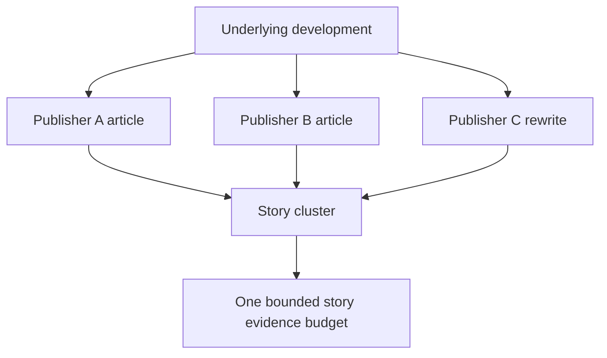

# 6. Source Independence

Raw article count is not the same as independent evidence.

Geomacro's current GRI v1.2 methodology addresses concentration at two levels:

1. **Source concentration:** evidence from one source has a capped weight budget.
2. **Story concentration:** multiple articles describing the same underlying development share one independent-story budget.

```text
20 URLs ≠ 20 independent confirmations
```



The public GRI proof package exposes both evidence-article count and independent-story count so readers can judge concentration instead of relying on URL volume alone.
