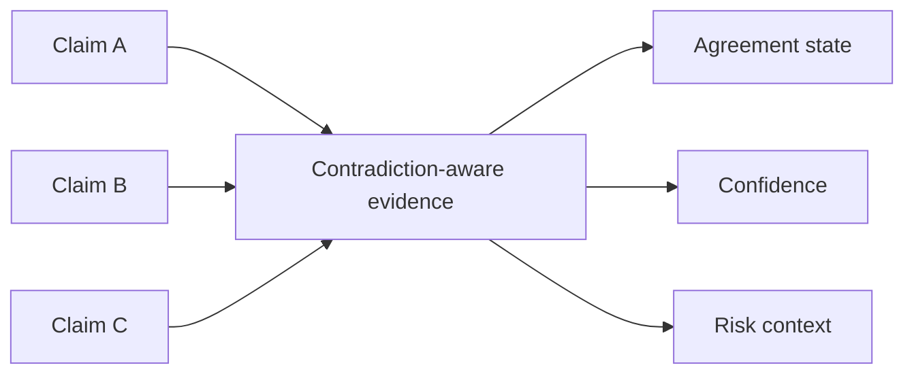

# 7. Contradiction Handling

**Status: PARTIAL FOUNDATION / FURTHER HARDENING PLANNED**

Real-world reporting can conflict. Geomacro's product principle is to preserve uncertainty or disagreement rather than silently convert contradictory evidence into false precision.

Future contradiction-aware evidence envelopes can expose:

- reported range
- source-family disagreement
- official versus unofficial confirmation
- best-supported estimate where defensible
- confidence
- freshness
- unresolved contradiction state

Contradicted evidence is not the same as missing evidence, and neither should be silently interpreted as zero risk.
