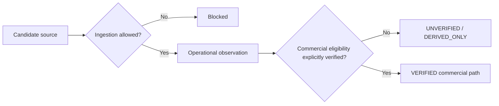

# 9. Source Governance

Geomacro separates ingestion capability from commercial eligibility.

A source or observation can be available for research or operational ingestion without being cleared for paid redistribution or commercial machine delivery.

Current observation-level commercial states include:

- `UNVERIFIED`
- `VERIFIED`
- `DERIVED_ONLY`
- `BLOCKED`

Additional review-required context can be recorded in source policy/provenance without pretending that review itself is commercial approval.

The intended default is fail-closed: an unknown or newly integrated source should not enter a paid/commercial delivery path merely because an adapter exists.

Detailed provider configuration can remain internal while public documentation explains the governance rules and applicable limitations.
